# SUPERSeded / Archived

This document is superseded by `docs/architecture.md` as of 2025-08-10.

- HeavyDB is deprecated; end-state is Parquet → Arrow → GPU.
- Please update and consult `docs/architecture.md` for the canonical architecture.

---

# Market Regime Master Framework - Brownfield Enhancement Architecture

**Project**: Market Regime Master Framework v2.0  
**Type**: Brownfield Enhancement - Complex Quantitative Trading System  
**Date**: 2025-08-10  
**Architecture**: Winston (System Architect)  

---

## Executive Summary

This document outlines the comprehensive architecture for enhancing the existing Market Regime Master Framework with an advanced 8-component adaptive learning system. The enhancement integrates HeavyDB real-time data processing with Google Vertex AI machine learning capabilities while maintaining backward compatibility with the existing backtester_v2 system.

### Key Enhancement Objectives
- **Adaptive Learning Framework**: 8 specialized components with continuous weight optimization
- **ML Integration**: Google Vertex AI for advanced pattern recognition and model training
- **Performance Targets**: <800ms processing time, <3.7GB memory usage, >85% accuracy
- **Zero Downtime Migration**: Seamless integration with existing backtester infrastructure

---

## Project Context & Current State Analysis

### Existing System Overview
The current backtester_v2 system provides:
- **Established Infrastructure**: Robust HeavyDB integration with 32GB+ historical data
- **Strategy Framework**: Multi-strategy backtesting with Excel-based configuration (600+ parameters)
- **UI System**: Comprehensive React-based frontend with real-time monitoring
- **Data Pipeline**: Real-time market data processing with sub-3 second latency

### Current Implementation Status
**Located at**: `/Users/maruth/projects/market_regime/backtester_v2/ui-centralized/strategies/market_regime/`

#### Implemented Components
- ✅ **Base Market Regime Strategy**: Core strategy framework with Excel integration
- ✅ **HeavyDB Integration**: Connection and query optimization systems
- ✅ **Triple Straddle Analysis**: Partial implementation with ATM/ITM1/OTM1 components
- ✅ **Greek Sentiment Integration**: Basic Greeks analysis with volume weighting
- ⚠️ **Configuration System**: Excel-based parameter management (requires enhancement)

#### Components Requiring Implementation
- ❌ **OI-PA Trending Analysis**: Cumulative ATM ±7 strikes approach
- ❌ **IV Skew Analysis**: Dual DTE framework with adaptive learning
- ❌ **ATR-EMA-CPR Integration**: Dual asset analysis system
- ❌ **Correlation Framework**: 30x30 matrix with 774 optimized features
- ❌ **Support/Resistance Logic**: Dynamic level detection system
- ❌ **DTE-Adaptive Master Integration**: Final integration layer

---

## Enhancement Scope & Strategic Approach

### Primary Enhancement Areas

#### 1. 8-Component Adaptive Learning Framework

```mermaid
graph TD
    A[Market Data Input] --> B[8-Component Parallel Analysis]
    
    B --> C[Component 1: Triple Rolling Straddle]
    B --> D[Component 2: Greeks Sentiment Analysis] 
    B --> E[Component 3: OI-PA Trending Analysis]
    B --> F[Component 4: IV Skew Analysis]
    B --> G[Component 5: ATR-EMA-CPR Integration]
    B --> H[Component 6: Correlation Framework]
    B --> I[Component 7: Support/Resistance Logic]
    
    C --> J[🧠 ADAPTIVE LEARNING ENGINE 🧠]
    D --> J
    E --> J
    F --> J
    G --> J
    H --> J
    I --> J
    
    J --> K[Component 8: DTE-Adaptive Master Integration]
    K --> L[8-Regime Strategic Classification]
    L --> M[LVLD • HVC • VCPE • TBVE • TBVS • SCGS • PSED • CBV]
```


#### 2. Vertex AI ML Integration
- **Model Training Pipeline**: Automated feature engineering and model optimization
- **Real-time Inference**: Sub-200ms ML predictions for regime classification
- **Adaptive Learning**: Continuous model retraining with performance feedback
- **Feature Store**: BigQuery-based feature management and versioning

#### 3. Enhanced Data Architecture
- **Hybrid Storage**: HeavyDB for real-time, BigQuery for ML training
- **ETL Pipeline**: Automated data preparation for ML model training
- **Feature Engineering**: Automated generation of 774 optimized correlation features
- **Data Quality**: Comprehensive validation and monitoring systems

### Architectural Principles

#### Preservation & Enhancement
- **Zero Breaking Changes**: Maintain all existing APIs and functionality
- **Graceful Degradation**: System operates with partial component failures
- **Performance Preservation**: Maintain existing sub-3 second processing requirements
- **Configuration Compatibility**: Preserve 600+ Excel configuration parameters

#### Innovation & Scale
- **Adaptive Intelligence**: Dynamic weight optimization based on performance
- **ML-First Design**: Native integration with Vertex AI capabilities
- **Cloud-Native**: Designed for Google Cloud infrastructure scalability
- **Real-time Learning**: Continuous adaptation to market structure changes

---

## Technology Stack Integration

### Core Infrastructure
```yaml
Data Layer:
  Primary: HeavyDB (Real-time data, sub-second queries)
  ML Training: BigQuery (Feature engineering, model training data)
  Caching: Redis (Component weights, regime classifications)
  Storage: Google Cloud Storage (Model artifacts, historical data)

Processing Layer:
  Real-time: Python 3.9+ with asyncio for concurrent component processing
  ML Training: Vertex AI Pipelines with KFP for automated training
  Feature Engineering: Apache Beam on Dataflow for scalable processing
  API Layer: FastAPI with async endpoints for low-latency responses

ML & Analytics:
  Training: Vertex AI Training with custom containers
  Serving: Vertex AI Prediction for real-time inference
  Feature Store: Vertex AI Feature Store with BigQuery backend
  Monitoring: Vertex AI Model Monitoring for drift detection

Existing Integration:
  UI: React-based frontend (preserve existing)
  Configuration: Excel-based parameter management (enhance)
  Authentication: Existing JWT-based auth system
  Orchestration: BMAD deployment system integration
```

### Enhanced Component Architecture

#### Component 1: Triple Rolling Straddle System
**Location**: `strategies/market_regime/enhanced_triple_straddle_system.py`
```python
class EnhancedTripleStraddleSystem:
    """
    Revolutionary straddle price technical analysis with adaptive learning
    """
    def __init__(self):
        self.components = {
            'atm_straddle': AdaptiveStraddleAnalyzer('ATM'),
            'itm1_straddle': AdaptiveStraddleAnalyzer('ITM1'), 
            'otm1_straddle': AdaptiveStraddleAnalyzer('OTM1')
        }
        self.learning_engine = DTESpecificLearningEngine()
        self.weight_optimizer = DynamicWeightOptimizer()
    
    async def analyze_market_regime(self, market_data: MarketData) -> StraddleAnalysisResult:
        """Analyze market regime using rolling straddle prices"""
        # 10-component dynamic weighting with DTE-specific learning
        # Target: <150ms processing time
```

#### Component 2: Greeks Sentiment Analysis
**Location**: `strategies/market_regime/enhanced_greeks_sentiment_system.py`
```python
class EnhancedGreeksSentimentSystem:
    """
    Volume-weighted Greeks with corrected gamma weighting and second-order Greeks
    """
    def __init__(self):
        self.weights = {
            'delta': 1.0,
            'gamma': 1.5,  # CORRECTED from 0.0 - critical for pin risk detection
            'theta': 0.8,
            'vega': 1.2,
            'vanna': 0.7,  # Second-order Greeks
            'charm': 0.6,
            'volga': 0.5
        }
        self.adaptive_thresholds = AdaptiveSentimentThresholds()
        self.volume_weighting = VolumeWeightedAnalysis()
```

#### Component 3: OI-PA Trending Analysis
**Location**: `strategies/market_regime/oi_pa_trending_system.py`
```python
class OIPATrendingSystem:
    """
    Cumulative ATM ±7 strikes approach for institutional flow detection
    """
    def __init__(self):
        self.strike_analyzer = CumulativeStrikeAnalyzer(base_range=7)
        self.flow_detector = InstitutionalFlowDetector()
        self.timeframe_weights = {
            '5min': 0.35,  # Primary analysis
            '15min': 0.20, # Validation
            '3min': 0.15,  # Fast momentum
            '10min': 0.30  # Medium-term structure
        }
```

#### Component 4: IV Skew Analysis
**Location**: `strategies/market_regime/iv_skew_analysis_system.py`
```python
class IVSkewAnalysisSystem:
    """
    Dual DTE framework with adaptive skew threshold learning
    """
    def __init__(self):
        self.dte_analyzer = DualDTEAnalyzer()
        self.skew_calculator = ComprehensiveSkewCalculator()
        self.threshold_learner = AdaptiveThresholdLearner()
        self.pattern_recognizer = VolatilityPatternRecognizer()
```

#### Component 5: ATR-EMA-CPR Integration
**Location**: `strategies/market_regime/atr_ema_cpr_system.py`
```python
class ATREMACPRSystem:
    """
    Dual asset analysis: straddle prices AND underlying prices
    """
    def __init__(self):
        self.straddle_analyzer = StraddlePriceATRAnalyzer()
        self.underlying_analyzer = UnderlyingPriceAnalyzer()
        self.cross_validator = DualAssetValidator()
        self.timeframe_manager = MultiTimeframeManager()
```

#### Component 6: Correlation Framework
**Location**: `strategies/market_regime/correlation_framework_system.py`
```python
class CorrelationFrameworkSystem:
    """
    Ultra-comprehensive 30x30 correlation matrix with 774 optimized features
    """
    def __init__(self):
        self.feature_optimizer = ExpertFeatureSelector(target_features=774)
        self.correlation_engine = UltraComprehensiveCorrelationEngine()
        self.breakdown_detector = CorrelationBreakdownDetector()
        self.ml_integration = VertexAICorrelationModels()
    
    async def analyze_correlations(self, component_data: Dict) -> CorrelationResult:
        """Analyze cross-component correlations with ML-enhanced patterns"""
        # Target: <180ms processing with 774 features
```

#### Component 7: Support/Resistance Logic
**Location**: `strategies/market_regime/support_resistance_system.py`
```python
class SupportResistanceSystem:
    """
    Dynamic level detection for straddle and underlying prices
    """
    def __init__(self):
        self.level_detector = DynamicLevelDetector()
        self.confluence_analyzer = MultiMethodConfluenceAnalyzer()
        self.performance_tracker = LevelPerformanceTracker()
        self.adaptive_weights = AdaptiveLevelWeights()
```

#### Component 8: DTE-Adaptive Master Integration
**Location**: `strategies/market_regime/dte_adaptive_master_system.py`
```python
class DTEAdaptiveMasterSystem:
    """
    Final integration layer combining all 7 components
    """
    def __init__(self):
        self.component_integrator = ComponentIntegrator()
        self.regime_classifier = EightRegimeClassifier()
        self.weight_optimizer = MasterWeightOptimizer()
        self.ml_ensemble = VertexAIEnsembleModel()
    
    async def classify_regime(self, component_results: Dict) -> RegimeClassification:
        """Classify market regime using all component inputs"""
        # Target: <100ms final classification
        # Output: LVLD, HVC, VCPE, TBVE, TBVS, SCGS, PSED, CBV
```

---

## Data Models & Schema Integration

### Enhanced Market Data Schema
```sql
-- HeavyDB Schema Extensions
CREATE TABLE market_regime_components (
    timestamp TIMESTAMP,
    symbol TEXT,
    dte INT,
    component_1_score FLOAT,
    component_2_score FLOAT,
    component_3_score FLOAT,
    component_4_score FLOAT,
    component_5_score FLOAT,
    component_6_score FLOAT,
    component_7_score FLOAT,
    component_8_score FLOAT,
    final_regime TEXT,
    confidence FLOAT,
    processing_time_ms INT
) WITH (shard_count=32);

-- Component-specific data tables
CREATE TABLE component_weights (
    component_id INT,
    dte INT,
    weights_json TEXT,
    performance_score FLOAT,
    last_updated TIMESTAMP
) WITH (shard_count=8);

CREATE TABLE regime_performance (
    regime_name TEXT,
    accuracy_score FLOAT,
    trade_count INT,
    success_rate FLOAT,
    avg_return FLOAT,
    max_drawdown FLOAT,
    last_updated TIMESTAMP
) WITH (shard_count=4);
```

### BigQuery ML Training Schema
```sql
-- BigQuery Feature Store for ML Training
CREATE TABLE `ml_features.component_features` (
    feature_timestamp TIMESTAMP,
    symbol STRING,
    dte INT,
    
    -- Component 1 Features (10 features)
    atm_straddle_ema_score FLOAT64,
    itm1_straddle_vwap_score FLOAT64,
    otm1_straddle_pivot_score FLOAT64,
    
    -- Component 2 Features (8 features) 
    greeks_delta_weighted FLOAT64,
    greeks_gamma_weighted FLOAT64,
    greeks_sentiment_classification STRING,
    
    -- Component 3 Features (6 features)
    oi_cumulative_ce_flow FLOAT64,
    oi_cumulative_pe_flow FLOAT64,
    institutional_flow_score FLOAT64,
    
    -- Component 4-8 Features (continuing pattern)
    -- ... additional 750 engineered features
    
    -- Target Variables
    future_regime STRING,
    regime_transition_probability FLOAT64,
    performance_score FLOAT64
)
PARTITION BY DATE(feature_timestamp)
CLUSTER BY symbol, dte;
```

### Configuration Data Models
```python
@dataclass
class ComponentConfig:
    """Enhanced component configuration"""
    component_id: int
    name: str
    enabled: bool
    weight: float
    dte_specific_weights: Dict[int, float]
    learning_parameters: Dict[str, Any]
    ml_model_config: Optional[Dict[str, Any]]
    performance_thresholds: Dict[str, float]

@dataclass
class RegimeClassificationResult:
    """Enhanced regime classification output"""
    regime: str  # LVLD, HVC, VCPE, TBVE, TBVS, SCGS, PSED, CBV
    confidence: float
    component_scores: Dict[str, float]
    component_weights: Dict[str, float]
    processing_time_ms: int
    ml_predictions: Dict[str, float]
    adaptive_insights: Dict[str, Any]
```

---

## API Design & Integration Strategy

### Enhanced API Architecture

#### V2 API Endpoints (New)
```python
# Enhanced Market Regime Analysis
@app.post("/api/v2/market-regime/analyze")
async def analyze_market_regime_enhanced(request: MarketRegimeRequest) -> MarketRegimeResponse:
    """
    Enhanced 8-component market regime analysis with ML integration
    """
    # Process through all 8 components
    # Apply adaptive learning weights
    # Return comprehensive analysis with component-level insights

@app.get("/api/v2/market-regime/components/{component_id}/health")
async def get_component_health(component_id: int) -> ComponentHealthResponse:
    """
    Individual component health and performance metrics
    """

@app.post("/api/v2/market-regime/weights/adapt")
async def adapt_component_weights(request: WeightAdaptationRequest) -> WeightResponse:
    """
    Trigger adaptive weight optimization based on performance feedback
    """

# ML Integration Endpoints
@app.post("/api/v2/ml/models/train")
async def trigger_ml_training(request: MLTrainingRequest) -> TrainingJobResponse:
    """
    Trigger Vertex AI model training with latest feature data
    """

@app.get("/api/v2/ml/models/{model_id}/predictions")
async def get_ml_predictions(model_id: str, features: MLFeatures) -> PredictionResponse:
    """
    Get real-time ML predictions from Vertex AI models
    """
```

#### V1 API Compatibility (Preserved)
```python
# Existing API endpoints maintained for backward compatibility
@app.post("/api/v1/market-regime/classify")
async def classify_market_regime_v1(request: LegacyRequest) -> LegacyResponse:
    """
    Legacy market regime classification - routes to enhanced system
    """
    # Convert legacy request format
    # Process through enhanced system
    # Convert response to legacy format
```

### Integration Points

#### HeavyDB Integration Enhancement
```python
class EnhancedHeavyDBConnector:
    """Enhanced HeavyDB connector with connection pooling and optimization"""
    
    def __init__(self):
        self.connection_pool = ConnectionPool(
            host=os.getenv('HEAVYDB_HOST', '173.208.247.17'),
            port=int(os.getenv('HEAVYDB_PORT', '6274')),
            user=os.getenv('HEAVYDB_USER', 'admin'),
            password=os.getenv('HEAVYDB_PASSWORD', ''),
            database=os.getenv('HEAVYDB_DATABASE', 'heavyai'),
            pool_size=20,
            max_overflow=30
        )
    
    async def execute_optimized_query(self, query: str, params: Dict) -> pd.DataFrame:
        """Execute optimized queries with connection pooling"""
        # GPU acceleration for complex calculations
        # Optimized query plans for <1 second response time
```

#### Vertex AI Integration
```python
class VertexAIIntegration:
    """Native Vertex AI integration for ML training and inference"""
    
    def __init__(self):
        self.client = aiplatform.Client(project=PROJECT_ID, location=REGION)
        self.feature_store = FeatureStore(project=PROJECT_ID)
        
    async def train_regime_models(self, training_data: pd.DataFrame) -> TrainingJob:
        """Train adaptive regime classification models"""
        # Automated hyperparameter tuning
        # Multi-model ensemble training
        # Continuous learning pipeline
    
    async def get_real_time_predictions(self, features: Dict) -> Dict[str, float]:
        """Get real-time ML predictions for regime classification"""
        # Sub-200ms inference time
        # Ensemble model predictions
        # Confidence scoring
```

---

## Source Tree Integration Strategy

### Directory Structure Enhancement
```
/Users/maruth/projects/market_regime/
├── backtester_v2/                    # Existing system (preserve)
│   ├── ui-centralized/
│   │   └── strategies/
│   │       └── market_regime/        # Enhanced implementations
│   │           ├── components/       # NEW: 8-component implementations
│   │           │   ├── component_1_triple_straddle.py
│   │           │   ├── component_2_greeks_sentiment.py
│   │           │   ├── component_3_oi_pa_trending.py
│   │           │   ├── component_4_iv_skew.py
│   │           │   ├── component_5_atr_ema_cpr.py
│   │           │   ├── component_6_correlation.py
│   │           │   ├── component_7_support_resistance.py
│   │           │   └── component_8_dte_master.py
│   │           ├── ml_integration/   # NEW: Vertex AI integration
│   │           │   ├── vertex_ai_connector.py
│   │           │   ├── feature_engineering.py
│   │           │   ├── model_training.py
│   │           │   └── real_time_inference.py
│   │           ├── adaptive_learning/ # NEW: Learning engine
│   │           │   ├── weight_optimization.py
│   │           │   ├── performance_tracking.py
│   │           │   └── dte_specific_learning.py
│   │           └── enhanced_strategy.py # Enhanced main strategy
├── docs/
│   ├── market_regime/               # Component specifications (preserve)
│   ├── architecture/                # NEW: Architecture documentation
│   │   ├── component_integration.md
│   │   ├── ml_pipeline_design.md
│   │   └── deployment_strategy.md
│   └── api/                         # NEW: API documentation
│       ├── v2_api_specification.md
│       └── ml_endpoints.md
└── ml_pipeline/                     # NEW: ML training pipeline
    ├── feature_engineering/
    ├── model_training/
    ├── deployment/
    └── monitoring/
```

### File Integration Strategy

#### Enhanced Market Regime Strategy
**File**: `backtester_v2/ui-centralized/strategies/market_regime/enhanced_market_regime_strategy.py`
```python
class EnhancedMarketRegimeStrategy(MarketRegimeStrategy):
    """
    Enhanced Market Regime Strategy with 8-component adaptive learning
    Extends existing MarketRegimeStrategy for backward compatibility
    """
    
    def __init__(self, config: Dict[str, Any]):
        super().__init__(config)
        
        # Initialize 8 components
        self.components = self._initialize_components()
        self.ml_integration = VertexAIIntegration()
        self.learning_engine = AdaptiveLearningEngine()
        
        # Preserve existing configuration compatibility
        self.legacy_compatibility = True
    
    async def analyze_market_regime(self, market_data: MarketData) -> RegimeAnalysisResult:
        """
        Enhanced market regime analysis with 8-component system
        """
        # Run all 8 components in parallel
        component_results = await asyncio.gather(*[
            component.analyze(market_data) for component in self.components
        ])
        
        # Apply adaptive learning weights
        weighted_results = self.learning_engine.apply_weights(component_results)
        
        # ML-enhanced final classification
        ml_predictions = await self.ml_integration.predict(weighted_results)
        
        # Final regime classification
        final_regime = self._classify_regime(weighted_results, ml_predictions)
        
        return RegimeAnalysisResult(
            regime=final_regime,
            confidence=self._calculate_confidence(component_results),
            component_scores=weighted_results,
            processing_time_ms=self._get_processing_time(),
            ml_enhanced=True
        )
```

#### Configuration System Enhancement
**File**: `backtester_v2/ui-centralized/strategies/market_regime/enhanced_config_manager.py`
```python
class EnhancedConfigManager(ExcelBasedConfigManager):
    """
    Enhanced configuration manager preserving Excel compatibility
    """
    
    def __init__(self, config_file: str):
        super().__init__(config_file)
        
        # Add ML configuration support
        self.ml_config = self._load_ml_configuration()
        self.component_configs = self._load_component_configurations()
        
    def load_configuration(self, config_file: str) -> EnhancedConfig:
        """
        Load configuration with backward compatibility and ML enhancements
        """
        # Load existing Excel configuration (preserve 600+ parameters)
        base_config = super().load_configuration(config_file)
        
        # Add enhanced configuration options
        enhanced_config = EnhancedConfig(
            base_config=base_config,
            ml_enabled=self.ml_config.get('enabled', True),
            adaptive_learning_enabled=True,
            component_configs=self.component_configs,
            vertex_ai_config=self._get_vertex_ai_config()
        )
        
        return enhanced_config
```

---

## Infrastructure & Deployment Architecture

### Google Cloud Infrastructure
```yaml
# Vertex AI Configuration
Vertex_AI_Setup:
  Project: market-regime-ml-project
  Region: us-central1
  
  Training:
    - Custom Training Jobs for ensemble models
    - AutoML for automated feature engineering
    - Hyperparameter Tuning for weight optimization
    
  Serving:
    - Vertex AI Endpoints for real-time inference
    - Batch Prediction for historical analysis
    - A/B Testing for model comparison
    
  Feature_Store:
    - Online serving for real-time features
    - Offline serving for model training
    - Feature lineage and versioning

# BigQuery Data Warehouse
BigQuery_Setup:
  Datasets:
    - ml_features: Feature store for training data
    - regime_analytics: Historical regime analysis
    - performance_metrics: Model and component performance
    
  ML_Models:
    - Component-specific models (8 models)
    - Ensemble regime classifier
    - Performance prediction models
    
  Scheduled_Queries:
    - Feature engineering pipelines
    - Model training data preparation
    - Performance metric aggregation

# Cloud Storage
Storage_Architecture:
  Buckets:
    - model-artifacts: Trained models and weights
    - historical-data: Long-term data storage
    - feature-cache: Cached feature computations
    - configuration-backup: Configuration versioning
```

### Deployment Pipeline
```yaml
# CI/CD Pipeline with BMAD Integration
Deployment_Pipeline:
  Development:
    - Local development with Docker containers
    - Unit testing for each component
    - Integration testing with sample data
    
  Staging:
    - Full system deployment to staging environment
    - End-to-end testing with production-like data
    - Performance validation (<800ms target)
    - ML model validation
    
  Production:
    - Blue-green deployment with BMAD orchestration
    - Gradual rollout with performance monitoring
    - Automatic rollback on performance degradation
    - Zero-downtime deployment strategy

# Monitoring & Alerting
Monitoring_Stack:
  Application_Monitoring:
    - Component-level performance tracking
    - API response time monitoring
    - Error rate and success rate tracking
    - Resource utilization monitoring
    
  ML_Monitoring:
    - Model drift detection
    - Feature distribution monitoring
    - Prediction quality tracking
    - Automated retraining triggers
    
  Infrastructure_Monitoring:
    - HeavyDB connection health
    - Vertex AI service availability
    - BigQuery query performance
    - Cloud storage access patterns
```

### Scalability Architecture
```python
# Horizontal Scaling Design
class ScalableComponentProcessor:
    """
    Horizontally scalable component processing with load balancing
    """
    
    def __init__(self):
        self.component_pool = ComponentPool(
            min_workers=8,  # One per component
            max_workers=32, # Scale based on load
            auto_scale=True
        )
        self.load_balancer = ComponentLoadBalancer()
        
    async def process_market_data(self, market_data: MarketData) -> ProcessingResult:
        """
        Distribute component processing across multiple workers
        """
        # Intelligent load balancing based on component complexity
        # Auto-scaling based on processing queue length
        # Fault tolerance with component failover
```

---

## Security Integration & Compliance

### Enhanced Security Framework
```python
# Security Integration with Existing Auth System
class EnhancedSecurityManager:
    """
    Enhanced security manager integrating with existing JWT auth
    """
    
    def __init__(self):
        self.auth_manager = ExistingJWTAuthManager()  # Preserve existing
        self.ml_security = VertexAISecurityManager()
        self.data_encryption = DataEncryptionManager()
        
    async def authenticate_ml_request(self, request: MLRequest) -> AuthResult:
        """
        Authenticate ML-specific requests with enhanced security
        """
        # Validate JWT token (existing flow)
        auth_result = await self.auth_manager.validate_token(request.token)
        
        # Add ML-specific permission checks
        ml_permissions = await self.ml_security.check_permissions(
            user=auth_result.user,
            action=request.action,
            resources=request.resources
        )
        
        return AuthResult(
            authenticated=auth_result.authenticated,
            ml_authorized=ml_permissions.authorized,
            permissions=ml_permissions.permissions
        )

# Data Privacy & Protection
Data_Protection:
  Encryption:
    - Data at rest: AES-256 encryption for all stored data
    - Data in transit: TLS 1.3 for all API communications
    - Model artifacts: Encrypted storage in Cloud Storage
    
  Access_Control:
    - IAM roles for fine-grained access control
    - Service accounts for ML pipeline authentication
    - Audit logging for all data access
    
  Compliance:
    - Data residency controls for regulatory compliance
    - Automated PII detection and masking
    - Retention policies for training data and models
```

### Audit & Compliance Framework
```python
class ComplianceManager:
    """
    Comprehensive compliance management for quantitative trading
    """
    
    def __init__(self):
        self.audit_logger = AuditLogger()
        self.compliance_checker = ComplianceChecker()
        
    async def log_regime_classification(self, 
                                      classification: RegimeClassification,
                                      user_context: UserContext) -> AuditRecord:
        """
        Log regime classifications for compliance and audit
        """
        audit_record = AuditRecord(
            timestamp=datetime.utcnow(),
            user_id=user_context.user_id,
            action='regime_classification',
            regime=classification.regime,
            confidence=classification.confidence,
            components_used=classification.component_scores.keys(),
            ml_models_used=classification.ml_predictions.keys(),
            processing_time=classification.processing_time_ms,
            data_sources=classification.data_sources,
            compliance_flags=await self.compliance_checker.check(classification)
        )
        
        await self.audit_logger.log(audit_record)
        return audit_record
```

---

## Testing Strategy & Quality Assurance

### Comprehensive Testing Framework

#### Component Testing
```python
# Individual Component Testing
class ComponentTestFramework:
    """
    Comprehensive testing framework for individual components
    """
    
    async def test_component_performance(self, component: Component) -> TestResult:
        """
        Test individual component performance and accuracy
        """
        test_data = self.generate_test_data(component.type)
        
        # Performance testing
        start_time = time.time()
        result = await component.analyze(test_data)
        processing_time = (time.time() - start_time) * 1000
        
        # Accuracy testing against known outcomes
        expected_result = self.get_expected_result(test_data)
        accuracy = self.calculate_accuracy(result, expected_result)
        
        return TestResult(
            component=component.name,
            processing_time_ms=processing_time,
            accuracy=accuracy,
            passed=processing_time < component.max_processing_time and accuracy > component.min_accuracy
        )

# Integration Testing
class IntegrationTestSuite:
    """
    End-to-end integration testing with real market data
    """
    
    async def test_full_system_integration(self) -> IntegrationTestResult:
        """
        Test complete 8-component system integration
        """
        # Load historical market data with known regime outcomes
        test_scenarios = self.load_test_scenarios()
        
        results = []
        for scenario in test_scenarios:
            # Run full analysis
            analysis_result = await self.enhanced_strategy.analyze_market_regime(scenario.data)
            
            # Validate against expected outcome
            validation_result = self.validate_result(analysis_result, scenario.expected)
            results.append(validation_result)
        
        return IntegrationTestResult(
            total_scenarios=len(test_scenarios),
            passed_scenarios=sum(1 for r in results if r.passed),
            average_accuracy=np.mean([r.accuracy for r in results]),
            average_processing_time=np.mean([r.processing_time for r in results]),
            component_breakdown=self._analyze_component_performance(results)
        )
```

#### ML Model Testing
```python
class MLModelTestFramework:
    """
    ML model testing and validation framework
    """
    
    def __init__(self):
        self.vertex_ai_client = aiplatform.Client()
        self.test_data_generator = TestDataGenerator()
        
    async def test_model_performance(self, model_name: str) -> ModelTestResult:
        """
        Comprehensive ML model testing
        """
        # Generate test dataset
        test_data = self.test_data_generator.generate_regime_test_data()
        
        # Model predictions
        predictions = await self.vertex_ai_client.predict(
            endpoint=model_name,
            instances=test_data.features
        )
        
        # Performance metrics
        metrics = ModelPerformanceMetrics(
            accuracy=accuracy_score(test_data.labels, predictions),
            precision=precision_score(test_data.labels, predictions, average='weighted'),
            recall=recall_score(test_data.labels, predictions, average='weighted'),
            f1_score=f1_score(test_data.labels, predictions, average='weighted'),
            confusion_matrix=confusion_matrix(test_data.labels, predictions)
        )
        
        return ModelTestResult(
            model_name=model_name,
            metrics=metrics,
            passed=metrics.accuracy > 0.85,  # Target accuracy
            inference_time_ms=self._measure_inference_time(model_name),
            feature_importance=self._analyze_feature_importance(model_name)
        )

# Performance Testing
Performance_Testing_Strategy:
  Load_Testing:
    - Concurrent user simulation (100+ simultaneous requests)
    - Peak load testing (1000 requests/minute)
    - Sustained load testing (24-hour continuous operation)
    
  Latency_Testing:
    - Component-level latency measurement
    - End-to-end processing time validation
    - Network latency impact assessment
    
  Scalability_Testing:
    - Horizontal scaling validation
    - Resource utilization under load
    - Auto-scaling behavior validation
    
  Reliability_Testing:
    - Component failure simulation
    - Network partition testing
    - Database connection failure handling
```

### Quality Gates & Validation
```python
# Quality Gate Framework
Quality_Gates:
  Performance_Gates:
    - Total processing time < 800ms (hard requirement)
    - Memory usage < 3.7GB (hard requirement)
    - Component processing time targets (per component)
    - ML inference time < 200ms
    
  Accuracy_Gates:
    - Overall regime classification accuracy > 85%
    - Component-level accuracy thresholds
    - ML model accuracy > 85%
    - Cross-validation accuracy > 88%
    
  Reliability_Gates:
    - System uptime > 99.9%
    - Error rate < 0.1%
    - Successful API response rate > 99.5%
    - Component failure recovery < 30 seconds
    
  Integration_Gates:
    - Backward compatibility validation
    - Configuration system integrity
    - Database schema compatibility
    - API contract compliance
```

---

## Migration Strategy & Risk Mitigation

### Phased Implementation Approach

#### Phase 1: Foundation (Weeks 1-2)
```yaml
Foundation_Phase:
  Objectives:
    - Set up Vertex AI infrastructure
    - Establish BigQuery data pipeline
    - Implement basic ML integration framework
    - Create enhanced configuration system
    
  Deliverables:
    - Vertex AI project setup and authentication
    - BigQuery datasets and ML feature tables
    - Enhanced configuration manager with ML support
    - Basic ML training pipeline
    
  Success_Criteria:
    - Vertex AI models can be trained and deployed
    - BigQuery feature pipeline operational
    - Configuration system preserves Excel compatibility
    - No disruption to existing backtester functionality
    
  Risk_Mitigation:
    - Parallel development alongside existing system
    - Comprehensive backup of existing configurations
    - Rollback procedures documented and tested
    - Feature flags for gradual activation
```

#### Phase 2: Core Components (Weeks 3-6)
```yaml
Core_Components_Phase:
  Objectives:
    - Implement Components 1-4 with adaptive learning
    - Establish component testing framework
    - Integrate with existing data pipeline
    - Validate performance requirements
    
  Deliverables:
    - Enhanced Triple Straddle System (Component 1)
    - Enhanced Greeks Sentiment Analysis (Component 2)
    - OI-PA Trending Analysis System (Component 3)
    - IV Skew Analysis System (Component 4)
    - Component testing and validation framework
    
  Success_Criteria:
    - All components meet processing time requirements
    - Accuracy improvements over baseline demonstrated
    - Integration with HeavyDB optimized
    - ML feature generation operational
    
  Risk_Mitigation:
    - Component-by-component activation
    - A/B testing against existing system
    - Performance monitoring and alerting
    - Automatic fallback mechanisms
```

#### Phase 3: Advanced Integration (Weeks 7-10)
```yaml
Advanced_Integration_Phase:
  Objectives:
    - Implement Components 5-8
    - Complete ML integration and training
    - Establish adaptive learning engine
    - Optimize system performance
    
  Deliverables:
    - ATR-EMA-CPR Integration System (Component 5)
    - Ultra-Comprehensive Correlation Framework (Component 6)
    - Support/Resistance Formation Logic (Component 7)
    - DTE-Adaptive Master Integration (Component 8)
    - Complete ML training and inference pipeline
    - Adaptive learning engine with performance feedback
    
  Success_Criteria:
    - Full 8-regime classification operational
    - System meets all performance targets
    - Adaptive learning demonstrates improvement
    - ML models achieve target accuracy
    
  Risk_Mitigation:
    - Gradual weight increase for new components
    - Extensive integration testing
    - Performance regression monitoring
    - User acceptance testing with stakeholders
```

#### Phase 4: Production Optimization (Weeks 11-12)
```yaml
Production_Optimization_Phase:
  Objectives:
    - Complete system optimization and tuning
    - Implement comprehensive monitoring
    - Finalize documentation and training
    - Conduct production readiness assessment
    
  Deliverables:
    - Production-optimized system deployment
    - Comprehensive monitoring and alerting
    - Complete documentation package
    - User training materials and sessions
    - Production readiness certification
    
  Success_Criteria:
    - All quality gates passed
    - Stakeholder approval obtained
    - Production deployment successful
    - Zero-downtime migration completed
    
  Risk_Mitigation:
    - Final system validation
    - Stakeholder sign-off process
    - Production deployment rehearsal
    - Emergency rollback procedures verified
```

### Risk Assessment & Mitigation Strategies

#### Technical Risks
```yaml
High_Risk_Areas:
  Performance_Degradation:
    Risk: System performance below existing benchmarks
    Probability: Medium
    Impact: High
    Mitigation:
      - Extensive performance testing throughout development
      - Component-level performance monitoring
      - Automatic performance regression detection
      - Graceful degradation with component disabling
    
  ML_Model_Accuracy:
    Risk: ML models fail to meet accuracy requirements
    Probability: Medium
    Impact: High
    Mitigation:
      - Multiple model architectures and ensembles
      - Continuous model monitoring and retraining
      - Fallback to rule-based classification
      - Comprehensive validation datasets
    
  Integration_Complexity:
    Risk: Component integration issues affecting system stability
    Probability: Medium
    Impact: Medium
    Mitigation:
      - Extensive integration testing
      - Component isolation and fault tolerance
      - Gradual integration with rollback capabilities
      - Comprehensive logging and debugging tools

Medium_Risk_Areas:
  Data_Pipeline_Issues:
    Risk: HeavyDB to BigQuery ETL pipeline failures
    Probability: Low
    Impact: Medium
    Mitigation:
      - Robust error handling and retry logic
      - Data quality monitoring and validation
      - Alternative data source configurations
      - Pipeline health monitoring and alerting
    
  Configuration_Migration:
    Risk: Excel configuration migration issues
    Probability: Low
    Impact: Medium
    Mitigation:
      - Comprehensive configuration validation
      - Migration testing with production data
      - Rollback to previous configuration capability
      - User acceptance testing of configuration system
```

#### Business Risks
```yaml
Business_Risk_Management:
  Trading_Disruption:
    Risk: System changes affect trading performance
    Probability: Low
    Impact: Very High
    Mitigation:
      - Parallel running of old and new systems
      - Gradual transition with performance validation
      - Immediate rollback capability
      - Comprehensive backtesting against historical data
    
  User_Adoption:
    Risk: Users resist system changes or new features
    Probability: Medium
    Impact: Medium
    Mitigation:
      - Early user involvement in design process
      - Comprehensive training and documentation
      - Gradual feature rollout with user feedback
      - Preservation of familiar interfaces and workflows
    
  Regulatory_Compliance:
    Risk: Enhanced system creates compliance issues
    Probability: Low
    Impact: High
    Mitigation:
      - Legal review of ML model decision making
      - Comprehensive audit trail implementation
      - Regulatory compliance validation
      - Documentation of model interpretability
```

### Success Metrics & Validation Criteria

#### Technical Success Metrics
```python
Technical_Success_KPIs = {
    'performance': {
        'total_processing_time': {'target': '<800ms', 'critical': '<1000ms'},
        'memory_usage': {'target': '<3.7GB', 'critical': '<5GB'},
        'api_response_time': {'target': '<200ms', 'critical': '<500ms'},
        'ml_inference_time': {'target': '<200ms', 'critical': '<300ms'}
    },
    'accuracy': {
        'regime_classification': {'target': '>85%', 'critical': '>80%'},
        'component_cross_validation': {'target': '>88%', 'critical': '>85%'},
        'ml_model_accuracy': {'target': '>85%', 'critical': '>80%'},
        'correlation_detection': {'target': '>90%', 'critical': '>88%'}
    },
    'reliability': {
        'system_uptime': {'target': '>99.9%', 'critical': '>99.5%'},
        'error_rate': {'target': '<0.1%', 'critical': '<0.5%'},
        'component_availability': {'target': '>99.8%', 'critical': '>99.5%'},
        'ml_service_availability': {'target': '>99.9%', 'critical': '>99.5%'}
    }
}
```

#### Business Success Metrics
```python
Business_Success_KPIs = {
    'trading_performance': {
        'regime_prediction_accuracy': {'target': '>87%', 'baseline': '75%'},
        'false_signal_reduction': {'target': '>30%', 'baseline': 'current_rate'},
        'trading_alpha_generation': {'target': '>15%', 'baseline': 'current_alpha'},
        'risk_adjusted_returns': {'target': 'Sharpe > 2.0', 'baseline': 'current_sharpe'}
    },
    'operational_efficiency': {
        'analysis_automation': {'target': '>90%', 'baseline': 'current_automation'},
        'manual_intervention_reduction': {'target': '>50%', 'baseline': 'current_manual'},
        'system_maintenance_time': {'target': '<5%', 'baseline': 'current_maintenance'},
        'user_productivity_increase': {'target': '>25%', 'baseline': 'current_productivity'}
    }
}
```

---

## Conclusion & Next Steps

### Architecture Summary

This brownfield enhancement architecture provides a comprehensive framework for transforming the existing Market Regime Master Framework into a state-of-the-art adaptive learning system. The architecture maintains complete backward compatibility while introducing revolutionary capabilities through:

1. **8-Component Adaptive Framework**: Each component learns and optimizes weights based on historical performance
2. **ML-Native Design**: Deep integration with Google Vertex AI for continuous model improvement
3. **Real-Time Performance**: Maintains sub-800ms processing requirements with enhanced accuracy
4. **Zero-Disruption Migration**: Gradual rollout preserving all existing functionality

### Implementation Readiness

The architecture addresses all critical requirements:
- ✅ **HeavyDB Integration**: Enhanced connector with connection pooling and GPU optimization
- ✅ **Vertex AI Integration**: Complete ML pipeline for training, inference, and monitoring
- ✅ **Performance Preservation**: Rigorous testing framework ensuring performance targets
- ✅ **Configuration Compatibility**: Seamless integration with existing 600+ parameter system
- ✅ **API Enhancement**: V2 API with backward compatible V1 endpoints

### Immediate Next Steps

1. **Infrastructure Setup** (Week 1)
   - Set up Google Cloud project and Vertex AI environment
   - Configure BigQuery datasets and ML feature store
   - Establish development environment with enhanced tooling

2. **Foundation Implementation** (Week 2)
   - Implement enhanced configuration manager
   - Create basic ML integration framework
   - Set up component testing infrastructure

3. **Component Development** (Weeks 3-6)
   - Implement Components 1-4 with adaptive learning
   - Integrate with existing HeavyDB pipeline
   - Establish performance monitoring

4. **Advanced Integration** (Weeks 7-10)
   - Complete Components 5-8 implementation
   - Full ML pipeline integration
   - Comprehensive system testing

5. **Production Deployment** (Weeks 11-12)
   - Performance optimization and tuning
   - Stakeholder validation and approval
   - Zero-downtime production migration

### Long-Term Vision

This architecture positions the Market Regime Master Framework as a continuously improving, self-optimizing quantitative trading system that adapts to changing market conditions while maintaining the reliability and performance of the existing infrastructure. The ML-native design ensures the system will continue to improve its accuracy and efficiency over time, providing a sustainable competitive advantage in quantitative trading operations.

---

## 🎯 **TARGET VARIABLE SPECIFICATION - 8 MARKET REGIMES**

### **1-Minute Time Series Target Variables**

For 1-minute resolution market data processing, the system outputs a comprehensive target variable structure optimized for real-time regime detection and transition analysis.

#### **Primary Target Variables**

```python
# Core Target Variable Structure for 1-Minute Data
@dataclass
class MarketRegimeTarget:
    """Primary target variables for 1-minute market regime classification"""
    
    # Primary regime classification (categorical)
    regime: str  # One of 8 regimes: LVLD, HVC, VCPE, TBVE, TBVS, SCGS, PSED, CBV
    
    # Confidence scoring (0.0 to 1.0)
    confidence: float  # Overall system confidence in regime classification
    
    # Transition thresholds and probabilities
    transition_threshold: float  # Threshold for regime change detection
    transition_probability: Dict[str, float]  # Probability of transitioning to each regime
    
    # Component-level confidence scores
    component_confidence: Dict[str, float]  # Individual component confidence scores
    
    # Temporal context
    regime_duration: int  # Minutes since last regime change
    regime_stability: float  # Stability score (0.0 to 1.0)
    
    # Metadata
    timestamp: datetime
    processing_time_ms: int
```

#### **8 Market Regime Definitions with Confidence Thresholds**

```python
# Comprehensive 8-Regime Classification System
MARKET_REGIMES = {
    "LVLD": {  # Low Volatility Linear Decay
        "name": "Low Volatility Linear Decay",
        "description": "Low volatility environment with predictable theta decay",
        "confidence_threshold": 0.75,
        "transition_threshold": 0.65,
        "characteristics": {
            "volatility_percentile": "<25th",
            "theta_decay_pattern": "linear",
            "premium_behavior": "predictable",
            "win_rate_expectation": ">80%"
        },
        "component_weights": {
            "triple_straddle": 0.20,
            "greeks_sentiment": 0.15,
            "oi_pa_trending": 0.15,
            "iv_skew": 0.15,
            "atr_ema_cpr": 0.10,
            "correlation": 0.10,
            "support_resistance": 0.10,
            "master_integration": 0.05
        }
    },
    
    "HVC": {  # High Volatility Clustering
        "name": "High Volatility Clustering",
        "description": "Elevated volatility with strong clustering effects",
        "confidence_threshold": 0.70,
        "transition_threshold": 0.60,
        "characteristics": {
            "volatility_percentile": ">75th",
            "clustering_coefficient": ">0.7",
            "volatility_persistence": ">0.8",
            "win_rate_expectation": "60-70%"
        },
        "component_weights": {
            "triple_straddle": 0.15,
            "greeks_sentiment": 0.20,
            "oi_pa_trending": 0.15,
            "iv_skew": 0.20,
            "atr_ema_cpr": 0.10,
            "correlation": 0.10,
            "support_resistance": 0.05,
            "master_integration": 0.05
        }
    },
    
    "VCPE": {  # Volatility Crush Post-Event
        "name": "Volatility Crush Post-Event",
        "description": "Rapid volatility contraction following events",
        "confidence_threshold": 0.80,
        "transition_threshold": 0.70,
        "characteristics": {
            "iv_contraction_rate": ">20% daily",
            "duration": "2-5 trading days",
            "crush_severity": "significant",
            "win_rate_expectation": "85-95%"
        },
        "component_weights": {
            "triple_straddle": 0.25,
            "greeks_sentiment": 0.15,
            "oi_pa_trending": 0.10,
            "iv_skew": 0.25,
            "atr_ema_cpr": 0.05,
            "correlation": 0.10,
            "support_resistance": 0.05,
            "master_integration": 0.05
        }
    },
    
    "TBVE": {  # Trending Bull with Volatility Expansion
        "name": "Trending Bull with Volatility Expansion",
        "description": "Positive momentum with expanding volatility",
        "confidence_threshold": 0.72,
        "transition_threshold": 0.62,
        "characteristics": {
            "price_momentum": "positive_sustained",
            "volatility_trend": "expanding",
            "skew_pattern": "put_protection_demand",
            "win_rate_expectation": "70-80%"
        },
        "component_weights": {
            "triple_straddle": 0.15,
            "greeks_sentiment": 0.15,
            "oi_pa_trending": 0.20,
            "iv_skew": 0.15,
            "atr_ema_cpr": 0.15,
            "correlation": 0.10,
            "support_resistance": 0.05,
            "master_integration": 0.05
        }
    },
    
    "TBVS": {  # Trending Bear with Volatility Spike
        "name": "Trending Bear with Volatility Spike",
        "description": "Negative momentum with explosive volatility",
        "confidence_threshold": 0.85,
        "transition_threshold": 0.75,
        "characteristics": {
            "price_momentum": "negative_sustained",
            "volatility_spikes": "explosive",
            "put_skew": "extreme",
            "win_rate_expectation": "<50%"
        },
        "component_weights": {
            "triple_straddle": 0.10,
            "greeks_sentiment": 0.25,
            "oi_pa_trending": 0.20,
            "iv_skew": 0.20,
            "atr_ema_cpr": 0.10,
            "correlation": 0.10,
            "support_resistance": 0.05,
            "master_integration": 0.00  # Override due to extreme conditions
        }
    },
    
    "SCGS": {  # Sideways Choppy with Gamma Scalping
        "name": "Sideways Choppy with Gamma Scalping",
        "description": "Range-bound with high gamma exposure opportunities",
        "confidence_threshold": 0.68,
        "transition_threshold": 0.58,
        "characteristics": {
            "price_action": "range_bound",
            "gamma_exposure": "significant",
            "reversal_frequency": "high",
            "win_rate_expectation": "65-75%"
        },
        "component_weights": {
            "triple_straddle": 0.20,
            "greeks_sentiment": 0.20,
            "oi_pa_trending": 0.15,
            "iv_skew": 0.10,
            "atr_ema_cpr": 0.10,
            "correlation": 0.05,
            "support_resistance": 0.15,
            "master_integration": 0.05
        }
    },
    
    "PSED": {  # Premium Spike Event-Driven
        "name": "Premium Spike Event-Driven",
        "description": "Scheduled event-driven premium expansion",
        "confidence_threshold": 0.78,
        "transition_threshold": 0.68,
        "characteristics": {
            "event_type": "scheduled",
            "premium_inflation": "across_strikes",
            "timeline": "predictable",
            "win_rate_expectation": ">80%"
        },
        "component_weights": {
            "triple_straddle": 0.20,
            "greeks_sentiment": 0.15,
            "oi_pa_trending": 0.15,
            "iv_skew": 0.25,
            "atr_ema_cpr": 0.05,
            "correlation": 0.10,
            "support_resistance": 0.05,
            "master_integration": 0.05
        }
    },
    
    "CBV": {  # Correlation Breakdown Volatility
        "name": "Correlation Breakdown Volatility",
        "description": "Traditional correlations breaking down",
        "confidence_threshold": 0.65,
        "transition_threshold": 0.55,
        "characteristics": {
            "correlation_stability": "breaking_down",
            "cross_asset_spillovers": "unusual",
            "hedging_effectiveness": "reduced",
            "win_rate_expectation": "variable"
        },
        "component_weights": {
            "triple_straddle": 0.10,
            "greeks_sentiment": 0.15,
            "oi_pa_trending": 0.15,
            "iv_skew": 0.10,
            "atr_ema_cpr": 0.10,
            "correlation": 0.30,  # Highest weight for correlation component
            "support_resistance": 0.05,
            "master_integration": 0.05
        }
    }
}
```

#### **1-Minute Time Series Output Structure**

```python
# Complete 1-Minute Output Structure
class MinuteRegimeOutput:
    """Complete output structure for 1-minute regime classification"""
    
    def __init__(self):
        self.regime_classification = {
            # Primary classification
            "regime": str,              # Current regime (LVLD, HVC, VCPE, etc.)
            "confidence": float,        # Overall confidence (0.0-1.0)
            "regime_probability": Dict[str, float],  # Probability for each regime
            
            # Transition analysis
            "transition_threshold": float,           # Current threshold for regime change
            "transition_probabilities": Dict[str, float],  # Transition to each regime
            "regime_stability": float,               # Stability score (0.0-1.0)
            "time_in_regime": int,                  # Minutes since regime start
            
            # Component contributions
            "component_scores": {
                "triple_straddle": {"score": float, "confidence": float},
                "greeks_sentiment": {"score": float, "confidence": float},
                "oi_pa_trending": {"score": float, "confidence": float},
                "iv_skew": {"score": float, "confidence": float},
                "atr_ema_cpr": {"score": float, "confidence": float},
                "correlation": {"score": float, "confidence": float},
                "support_resistance": {"score": float, "confidence": float},
                "master_integration": {"score": float, "confidence": float}
            },
            
            # Adaptive learning metrics
            "adaptive_weights": Dict[str, float],    # Current component weights
            "learning_confidence": float,           # Confidence in weight adaptation
            "historical_accuracy": float,          # Rolling accuracy over last 1000 minutes
            
            # Metadata
            "timestamp": datetime,
            "processing_time_ms": int,
            "data_quality_score": float,
            "ml_model_version": str
        }
```

#### **Smart Transition Handling with Historical Learning**

```python
# Advanced Regime Transition Detection with Emergency Override
class SmartTransitionDetector:
    """Intelligent regime transition with stability vs responsiveness balance"""
    
    def __init__(self):
        self.transition_matrix = self._build_transition_matrix()
        self.minimum_regime_duration = 15     # 15 minutes minimum (noise prevention)
        self.transition_smoothing = 3         # 3-minute smoothing window
        
        # Emergency override system
        self.emergency_detector = EmergencyConditionDetector()
        self.historical_learner = HistoricalOverrideLearner()
        self.adaptive_thresholds = AdaptiveOverrideThresholds()
        
        # Multi-tier transition system
        self.transition_tiers = {
            "NORMAL": {"min_duration": 15, "confidence_threshold": 0.75},
            "ELEVATED": {"min_duration": 10, "confidence_threshold": 0.80},
            "EMERGENCY": {"min_duration": 0, "confidence_threshold": 0.85}
        }
        
    def _build_transition_matrix(self) -> Dict[str, Dict[str, float]]:
        """Build transition probability matrix between regimes"""
        
        return {
            "LVLD": {
                "LVLD": 0.85, "HVC": 0.05, "VCPE": 0.02, "TBVE": 0.03,
                "TBVS": 0.01, "SCGS": 0.03, "PSED": 0.01, "CBV": 0.00
            },
            "HVC": {
                "LVLD": 0.10, "HVC": 0.70, "VCPE": 0.05, "TBVE": 0.05,
                "TBVS": 0.05, "SCGS": 0.03, "PSED": 0.01, "CBV": 0.01
            },
            "VCPE": {
                "LVLD": 0.40, "HVC": 0.10, "VCPE": 0.45, "TBVE": 0.02,
                "TBVS": 0.01, "SCGS": 0.01, "PSED": 0.00, "CBV": 0.01
            },
            "TBVE": {
                "LVLD": 0.05, "HVC": 0.10, "VCPE": 0.02, "TBVE": 0.65,
                "TBVS": 0.08, "SCGS": 0.05, "PSED": 0.03, "CBV": 0.02
            },
            "TBVS": {
                "LVLD": 0.02, "HVC": 0.15, "VCPE": 0.10, "TBVE": 0.03,
                "TBVS": 0.60, "SCGS": 0.05, "PSED": 0.02, "CBV": 0.03
            },
            "SCGS": {
                "LVLD": 0.15, "HVC": 0.10, "VCPE": 0.02, "TBVE": 0.10,
                "TBVS": 0.05, "SCGS": 0.50, "PSED": 0.05, "CBV": 0.03
            },
            "PSED": {
                "LVLD": 0.20, "HVC": 0.05, "VCPE": 0.40, "TBVE": 0.05,
                "TBVS": 0.05, "SCGS": 0.05, "PSED": 0.15, "CBV": 0.05
            },
            "CBV": {
                "LVLD": 0.05, "HVC": 0.20, "VCPE": 0.05, "TBVE": 0.10,
                "TBVS": 0.15, "SCGS": 0.10, "PSED": 0.05, "CBV": 0.30
            }
        }
    
    def detect_transition(self, 
                         current_regime: str,
                         component_scores: Dict[str, float],
                         confidence_scores: Dict[str, float]) -> Dict[str, Any]:
        """Detect regime transition with smoothing and validation"""
        
        # Calculate regime probabilities
        regime_probabilities = self._calculate_regime_probabilities(
            component_scores, confidence_scores
        )
        
        # Apply transition matrix smoothing
        smoothed_probabilities = self._apply_transition_smoothing(
            current_regime, regime_probabilities
        )
        
        # Determine if transition should occur
        transition_candidate = max(smoothed_probabilities.items(), key=lambda x: x[1])
        
        transition_decision = {
            "should_transition": False,
            "candidate_regime": transition_candidate[0],
            "candidate_confidence": transition_candidate[1],
            "transition_threshold": MARKET_REGIMES[current_regime]["transition_threshold"],
            "stability_score": self._calculate_stability(smoothed_probabilities)
        }
        
        # Check transition conditions
        if (transition_candidate[0] != current_regime and 
            transition_candidate[1] > MARKET_REGIMES[current_regime]["transition_threshold"]):
            transition_decision["should_transition"] = True
        
        return transition_decision

# Emergency Condition Detection System
class EmergencyConditionDetector:
    """Detect market conditions requiring immediate regime override"""
    
    def __init__(self):
        # Extreme condition thresholds (learned from historical data)
        self.emergency_conditions = {
            "VOLATILITY_SPIKE": {
                "threshold": 3.0,  # 3+ standard deviations
                "window": 5,       # 5-minute window
                "weight": 0.25
            },
            "FLASH_CRASH": {
                "price_drop": 0.05,    # 5%+ drop
                "time_window": 5,      # in 5 minutes
                "weight": 0.30
            },
            "VOLUME_ANOMALY": {
                "volume_multiplier": 10.0,  # 10x normal volume
                "sustained_minutes": 3,      # for 3+ minutes
                "weight": 0.15
            },
            "LIQUIDITY_EVAPORATION": {
                "bid_ask_expansion": 5.0,   # 5x normal spread
                "depth_reduction": 0.5,      # 50% depth reduction
                "weight": 0.10
            },
            "CORRELATION_BREAKDOWN": {
                "correlation_drop": 0.5,     # 50% correlation drop
                "cross_asset_divergence": 3.0,  # 3+ std devs
                "weight": 0.10
            },
            "NEWS_SENTIMENT_SHOCK": {
                "sentiment_change": 0.8,     # 80% sentiment shift
                "confidence": 0.9,           # High confidence news
                "weight": 0.10
            }
        }
        
        # Dynamic threshold adjustment based on market regime
        self.regime_sensitivity = {
            "LVLD": 0.8,  # Lower sensitivity in stable conditions
            "HVC": 1.2,   # Higher sensitivity in volatile conditions
            "VCPE": 0.6,  # Lower sensitivity during crush
            "TBVE": 1.1,  # Moderate sensitivity
            "TBVS": 1.5,  # Highest sensitivity in bear spike
            "SCGS": 0.9,  # Moderate sensitivity in choppy
            "PSED": 0.7,  # Lower sensitivity during events
            "CBV": 1.3    # High sensitivity during breakdown
        }
    
    def detect_emergency_conditions(self, 
                                   market_data: MarketData,
                                   current_regime: str,
                                   component_results: Dict) -> Dict[str, Any]:
        """Detect if emergency override is needed"""
        
        emergency_score = 0.0
        triggered_conditions = []
        
        # Check each emergency condition
        for condition, params in self.emergency_conditions.items():
            condition_met, severity = self._check_condition(
                condition, params, market_data, component_results
            )
            
            if condition_met:
                weighted_severity = severity * params["weight"]
                emergency_score += weighted_severity
                triggered_conditions.append({
                    "condition": condition,
                    "severity": severity,
                    "weight": params["weight"],
                    "contribution": weighted_severity
                })
        
        # Apply regime-specific sensitivity
        regime_adjusted_score = emergency_score * self.regime_sensitivity[current_regime]
        
        return {
            "emergency_score": regime_adjusted_score,
            "emergency_detected": regime_adjusted_score > 0.75,  # Learned threshold
            "triggered_conditions": triggered_conditions,
            "raw_score": emergency_score,
            "regime_sensitivity": self.regime_sensitivity[current_regime]
        }

# Historical Override Learning System
class HistoricalOverrideLearner:
    """Learn from historical override decisions to improve accuracy"""
    
    def __init__(self):
        self.override_history = []
        self.learning_window = 252  # 1 trading year of minutes
        self.performance_metrics = {
            "override_accuracy": 0.0,
            "false_positive_rate": 0.0,
            "false_negative_rate": 0.0,
            "average_override_benefit": 0.0
        }
        
        # Condition-specific learning
        self.condition_performance = {}
        for condition in ["VOLATILITY_SPIKE", "FLASH_CRASH", "VOLUME_ANOMALY", 
                         "LIQUIDITY_EVAPORATION", "CORRELATION_BREAKDOWN", "NEWS_SENTIMENT_SHOCK"]:
            self.condition_performance[condition] = {
                "accuracy": 0.0,
                "precision": 0.0,
                "recall": 0.0,
                "avg_benefit": 0.0,
                "threshold_adjustment": 1.0
            }
    
    def record_override_decision(self,
                               override_data: Dict[str, Any],
                               market_context: Dict[str, Any]) -> None:
        """Record an override decision for future learning"""
        
        override_record = {
            "timestamp": datetime.utcnow(),
            "original_regime": override_data["original_regime"],
            "new_regime": override_data["new_regime"],
            "emergency_score": override_data["emergency_score"],
            "triggered_conditions": override_data["triggered_conditions"],
            "confidence": override_data["confidence"],
            "market_context": market_context,
            "outcome_validated": None,  # To be filled later
            "benefit_score": None       # To be calculated later
        }
        
        self.override_history.append(override_record)
        
        # Keep only recent history
        if len(self.override_history) > self.learning_window:
            self.override_history = self.override_history[-self.learning_window:]
    
    def validate_override_outcome(self,
                                override_timestamp: datetime,
                                actual_market_outcome: Dict[str, Any]) -> None:
        """Validate whether an override decision was correct in hindsight"""
        
        # Find the override record
        override_record = None
        for record in reversed(self.override_history):
            if record["timestamp"] == override_timestamp:
                override_record = record
                break
        
        if not override_record:
            return
        
        # Calculate benefit score based on actual market outcome
        benefit_score = self._calculate_override_benefit(
            override_record, actual_market_outcome
        )
        
        override_record["outcome_validated"] = True
        override_record["benefit_score"] = benefit_score
        
        # Update learning metrics
        self._update_learning_metrics()
    
    def get_adaptive_thresholds(self, current_regime: str) -> Dict[str, float]:
        """Get dynamically adjusted thresholds based on learning"""
        
        base_thresholds = {
            "emergency_override": 0.75,
            "elevated_override": 0.65,
            "confidence_boost": 0.10
        }
        
        # Adjust based on historical performance
        if self.performance_metrics["false_positive_rate"] > 0.3:
            # Too many false positives, increase thresholds
            base_thresholds["emergency_override"] += 0.05
            base_thresholds["elevated_override"] += 0.05
            
        elif self.performance_metrics["false_negative_rate"] > 0.2:
            # Missing too many events, decrease thresholds
            base_thresholds["emergency_override"] -= 0.05
            base_thresholds["elevated_override"] -= 0.05
        
        # Regime-specific adjustments based on learning
        regime_multiplier = self._get_regime_learning_multiplier(current_regime)
        
        adjusted_thresholds = {
            key: max(0.5, min(0.95, value * regime_multiplier))
            for key, value in base_thresholds.items()
        }
        
        return adjusted_thresholds

# Multi-Tier Transition Decision Engine
class MultiTierTransitionEngine:
    """Execute multi-tier transition decisions with historical learning"""
    
    def __init__(self):
        self.emergency_detector = EmergencyConditionDetector()
        self.historical_learner = HistoricalOverrideLearner()
        self.regime_duration_tracker = {}
        
    async def make_transition_decision(self,
                                     current_regime: str,
                                     candidate_regime: str,
                                     component_results: Dict[str, Any],
                                     market_data: MarketData,
                                     regime_start_time: datetime) -> Dict[str, Any]:
        """Make intelligent transition decision with multi-tier logic"""
        
        current_time = datetime.utcnow()
        time_in_regime = (current_time - regime_start_time).total_seconds() / 60  # minutes
        
        # Get adaptive thresholds from historical learning
        adaptive_thresholds = self.historical_learner.get_adaptive_thresholds(current_regime)
        
        # Detect emergency conditions
        emergency_analysis = self.emergency_detector.detect_emergency_conditions(
            market_data, current_regime, component_results
        )
        
        # Determine transition tier
        transition_tier = self._determine_transition_tier(
            emergency_analysis, component_results, time_in_regime
        )
        
        # Make tier-specific decision
        if transition_tier == "EMERGENCY":
            decision = self._make_emergency_decision(
                current_regime, candidate_regime, emergency_analysis, 
                component_results, adaptive_thresholds
            )
        elif transition_tier == "ELEVATED":
            decision = self._make_elevated_decision(
                current_regime, candidate_regime, time_in_regime,
                component_results, adaptive_thresholds
            )
        else:  # NORMAL
            decision = self._make_normal_decision(
                current_regime, candidate_regime, time_in_regime,
                component_results, adaptive_thresholds
            )
        
        # Record decision for learning
        if decision["should_transition"]:
            self.historical_learner.record_override_decision(
                {
                    "original_regime": current_regime,
                    "new_regime": candidate_regime,
                    "emergency_score": emergency_analysis.get("emergency_score", 0),
                    "triggered_conditions": emergency_analysis.get("triggered_conditions", []),
                    "confidence": decision["confidence"],
                    "transition_tier": transition_tier
                },
                {
                    "time_in_regime": time_in_regime,
                    "market_volatility": self._calculate_market_volatility(market_data),
                    "component_agreement": self._calculate_component_agreement(component_results)
                }
            )
        
        return {
            **decision,
            "transition_tier": transition_tier,
            "emergency_analysis": emergency_analysis,
            "adaptive_thresholds": adaptive_thresholds,
            "time_in_regime": time_in_regime,
            "learning_metrics": self.historical_learner.performance_metrics
        }
    
    def _make_emergency_decision(self,
                               current_regime: str,
                               candidate_regime: str,
                               emergency_analysis: Dict[str, Any],
                               component_results: Dict[str, Any],
                               adaptive_thresholds: Dict[str, float]) -> Dict[str, Any]:
        """Make immediate transition decision for emergency conditions"""
        
        emergency_score = emergency_analysis["emergency_score"]
        emergency_threshold = adaptive_thresholds["emergency_override"]
        
        # Emergency conditions override minimum duration requirement
        should_transition = (
            emergency_analysis["emergency_detected"] and
            emergency_score > emergency_threshold and
            candidate_regime != current_regime
        )
        
        confidence_boost = adaptive_thresholds["confidence_boost"]
        base_confidence = self._calculate_base_confidence(component_results)
        
        return {
            "should_transition": should_transition,
            "confidence": min(0.95, base_confidence + confidence_boost),
            "reason": "EMERGENCY_OVERRIDE",
            "emergency_score": emergency_score,
            "override_justification": emergency_analysis["triggered_conditions"]
        }
    
    def _make_elevated_decision(self,
                              current_regime: str,
                              candidate_regime: str,
                              time_in_regime: float,
                              component_results: Dict[str, Any],
                              adaptive_thresholds: Dict[str, float]) -> Dict[str, Any]:
        """Make transition decision for elevated conditions (10-minute minimum)"""
        
        elevated_threshold = adaptive_thresholds["elevated_override"]
        base_confidence = self._calculate_base_confidence(component_results)
        
        should_transition = (
            time_in_regime >= 10 and  # 10-minute minimum for elevated
            base_confidence > elevated_threshold and
            candidate_regime != current_regime
        )
        
        return {
            "should_transition": should_transition,
            "confidence": base_confidence,
            "reason": "ELEVATED_CONDITIONS",
            "time_requirement_met": time_in_regime >= 10
        }
    
    def _make_normal_decision(self,
                            current_regime: str,
                            candidate_regime: str,
                            time_in_regime: float,
                            component_results: Dict[str, Any],
                            adaptive_thresholds: Dict[str, float]) -> Dict[str, Any]:
        """Make normal transition decision (15-minute minimum)"""
        
        base_confidence = self._calculate_base_confidence(component_results)
        normal_threshold = MARKET_REGIMES[current_regime]["transition_threshold"]
        
        should_transition = (
            time_in_regime >= 15 and  # 15-minute minimum
            base_confidence > normal_threshold and
            candidate_regime != current_regime
        )
        
        return {
            "should_transition": should_transition,
            "confidence": base_confidence,
            "reason": "NORMAL_TRANSITION",
            "time_requirement_met": time_in_regime >= 15
        }

### **🚨 Smart Transition Handling - Key Features**

The advanced Smart Transition Handling system solves the stability vs responsiveness challenge through:

#### **Multi-Tier System:**
✅ **NORMAL**: 15-minute minimum (prevents noise)  
✅ **ELEVATED**: 10-minute minimum (moderate urgency)  
✅ **EMERGENCY**: 0-minute minimum (immediate response)

#### **Emergency Conditions that Override Minimum Duration:**
- **VOLATILITY_SPIKE**: >3σ volatility in 5 minutes (weight: 0.25)
- **FLASH_CRASH**: >5% price drop in 5 minutes (weight: 0.30)
- **VOLUME_ANOMALY**: >10x normal volume for 3+ minutes (weight: 0.15)
- **LIQUIDITY_EVAPORATION**: 5x spread expansion + 50% depth drop (weight: 0.10)
- **CORRELATION_BREAKDOWN**: 50% correlation drop + 3σ divergence (weight: 0.10)
- **NEWS_SENTIMENT_SHOCK**: 80% sentiment shift with 90% confidence (weight: 0.10)

#### **Historical Learning Capabilities:**
🧠 **Performance Tracking**: Tracks override accuracy, false positives/negatives  
🧠 **Condition-Specific Learning**: Each emergency condition learns independently  
🧠 **Adaptive Thresholds**: Dynamically adjusts based on historical performance  
🧠 **Regime-Specific Sensitivity**: Different sensitivity per current regime  
🧠 **Outcome Validation**: Validates override decisions in hindsight  

#### **Regime-Specific Emergency Sensitivity:**
- **TBVS** (Bear Spike): 1.5x sensitivity (most responsive)
- **CBV** (Correlation Breakdown): 1.3x sensitivity  
- **HVC** (High Volatility): 1.2x sensitivity
- **TBVE** (Bull Expansion): 1.1x sensitivity
- **SCGS** (Sideways Choppy): 0.9x sensitivity
- **LVLD** (Low Vol): 0.8x sensitivity (most stable)
- **PSED** (Event-Driven): 0.7x sensitivity
- **VCPE** (Vol Crush): 0.6x sensitivity (least responsive)

#### **Learning Feedback Loop:**
1. **Record Decision**: Every override decision recorded with context
2. **Validate Outcome**: Check if override was beneficial in hindsight  
3. **Update Metrics**: Adjust thresholds based on performance
4. **Adapt Sensitivity**: Fine-tune emergency detection per regime
5. **Condition Learning**: Each emergency type learns independently

This system ensures **15-minute stability** for normal conditions while enabling **immediate response** to genuine market emergencies, with continuous learning to minimize false positives and catch true events.
```

#### **Confidence Scoring System**

```python
# Comprehensive Confidence Scoring
class ConfidenceScorer:
    """Calculate multi-dimensional confidence scores"""
    
    def calculate_regime_confidence(self, 
                                  component_results: Dict[str, Any],
                                  historical_performance: Dict[str, float]) -> float:
        """Calculate overall regime classification confidence"""
        
        # Component agreement score (0.0-1.0)
        agreement_score = self._calculate_component_agreement(component_results)
        
        # Data quality score (0.0-1.0)
        data_quality_score = self._assess_data_quality(component_results)
        
        # Historical accuracy score (0.0-1.0)
        accuracy_score = historical_performance.get("rolling_accuracy", 0.8)
        
        # Market conditions stability (0.0-1.0)
        stability_score = self._assess_market_stability(component_results)
        
        # Weighted confidence calculation
        confidence_weights = {
            "agreement": 0.30,
            "data_quality": 0.25,
            "historical_accuracy": 0.25,
            "market_stability": 0.20
        }
        
        overall_confidence = (
            agreement_score * confidence_weights["agreement"] +
            data_quality_score * confidence_weights["data_quality"] +
            accuracy_score * confidence_weights["historical_accuracy"] +
            stability_score * confidence_weights["market_stability"]
        )
        
        return min(max(overall_confidence, 0.0), 1.0)  # Clamp to [0,1]
```

#### **Real-Time Processing Pipeline**

```python
# 1-Minute Real-Time Processing
class MinuteRegimeProcessor:
    """Process 1-minute market regime classification"""
    
    async def process_minute_data(self, minute_data: MarketData) -> MarketRegimeTarget:
        """Process single minute of market data"""
        
        start_time = time.time()
        
        # Parallel component processing
        component_tasks = [
            self.components["triple_straddle"].analyze(minute_data),
            self.components["greeks_sentiment"].analyze(minute_data),
            self.components["oi_pa_trending"].analyze(minute_data),
            self.components["iv_skew"].analyze(minute_data),
            self.components["atr_ema_cpr"].analyze(minute_data),
            self.components["correlation"].analyze(minute_data),
            self.components["support_resistance"].analyze(minute_data),
        ]
        
        component_results = await asyncio.gather(*component_tasks)
        
        # Master integration
        master_result = await self.components["master_integration"].integrate(
            component_results
        )
        
        # Regime classification with confidence
        regime_classification = self.regime_classifier.classify(
            master_result, component_results
        )
        
        # Smart multi-tier transition detection
        transition_analysis = await self.smart_transition_engine.make_transition_decision(
            current_regime=self.current_regime,
            candidate_regime=regime_classification["regime"],
            component_results=component_results,
            market_data=minute_data,
            regime_start_time=self.regime_start_time
        )
        
        # Build output
        processing_time = (time.time() - start_time) * 1000
        
        return MarketRegimeTarget(
            regime=regime_classification["regime"],
            confidence=transition_analysis["confidence"],
            transition_threshold=transition_analysis["adaptive_thresholds"]["emergency_override"],
            transition_probability=transition_analysis.get("transition_probabilities", {}),
            component_confidence={
                comp: result["confidence"] 
                for comp, result in zip(self.component_names, component_results)
            },
            regime_duration=transition_analysis["time_in_regime"],
            regime_stability=transition_analysis.get("emergency_analysis", {}).get("regime_sensitivity", 1.0),
            timestamp=minute_data.timestamp,
            processing_time_ms=processing_time,
            # Enhanced transition metadata
            transition_tier=transition_analysis["transition_tier"],
            emergency_score=transition_analysis.get("emergency_analysis", {}).get("emergency_score", 0),
            learning_metrics=transition_analysis["learning_metrics"],
            should_transition=transition_analysis["should_transition"],
            transition_reason=transition_analysis.get("reason", "NORMAL_TRANSITION")
        )
```

This comprehensive target variable specification provides:

✅ **8 distinct market regimes** with clear definitions and characteristics  
✅ **Multi-tier transition system** balancing stability (15min) with emergency responsiveness (0min)  
✅ **Historical learning engine** that adapts from past override decisions  
✅ **Emergency condition detection** for 6 critical market scenarios  
✅ **Regime-specific sensitivity** with adaptive thresholds per market condition  
✅ **Component-level confidence tracking** for interpretability  
✅ **Real-time processing pipeline** designed for <800ms performance  
✅ **Continuous learning feedback** with performance validation and threshold adaptation  

The system is specifically optimized for 1-minute time series data with **intelligent stability vs responsiveness balance** - maintaining 15-minute minimum duration for noise prevention while enabling immediate transitions for genuine market emergencies through historical learning and adaptive thresholds.

---

*This architecture document provides the complete technical specification for enhancing the Market Regime Master Framework with adaptive learning capabilities while preserving all existing functionality and performance characteristics.*