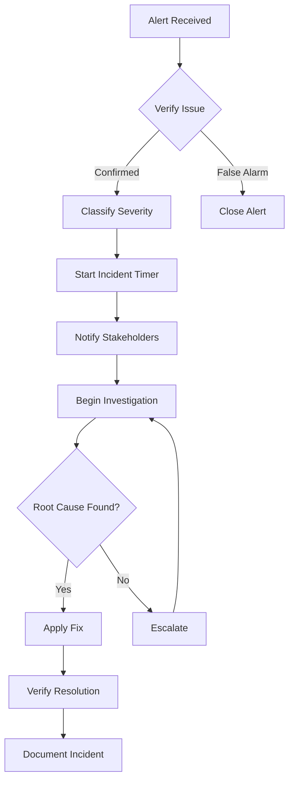

# Operations Team Training Guide - Adaptive Market Regime System

**Training Version**: 1.0  
**Duration**: 2 Days  
**Prerequisites**: Basic Linux administration, Understanding of monitoring tools  

## Training Schedule

### Day 1: System Overview & Basic Operations
- Morning: System Architecture & Components (4 hours)
- Afternoon: Daily Operations & Monitoring (4 hours)

### Day 2: Advanced Operations & Troubleshooting  
- Morning: Incident Response & Troubleshooting (4 hours)
- Afternoon: Maintenance & Hands-on Practice (4 hours)

---

## Module 1: System Architecture Overview (2 hours)

### Learning Objectives
By the end of this module, you will:
- Understand the purpose and architecture of the Adaptive Market Regime System
- Identify all major components and their interactions
- Know the data flow through the system
- Understand regime classification basics

### 1.1 What is the Adaptive Market Regime System?

The Adaptive Market Regime System is an AI-powered platform that:
- **Detects** current market conditions in real-time
- **Classifies** markets into 18 different regimes
- **Adapts** to changing market conditions
- **Provides** regime information to trading systems

#### Key Business Value
- Improves trading strategy performance
- Reduces risk during volatile markets
- Enables regime-specific position sizing
- Provides early warning of market transitions

### 1.2 System Architecture

```
┌─────────────────────────────────────────────┐
│            External Data Sources             │
│         (HeavyDB Market Data)               │
└─────────────────┬───────────────────────────┘
                  │
┌─────────────────▼───────────────────────────┐
│        Integration Orchestrator              │
│   (Manages data flow and components)        │
└─────────────────┬───────────────────────────┘
                  │
┌─────────────────▼───────────────────────────┐
│         Core Processing Pipeline             │
│  ┌──────────┐ ┌──────────┐ ┌────────────┐ │
│  │  Phase 1  │ │  Phase 2  │ │  Phase 3   │ │
│  │   Core    │ │ Adaptive  │ │Intelligence│ │
│  └────┬─────┘ └────┬─────┘ └─────┬──────┘ │
│       └─────────────┼─────────────┘        │
│                     │                       │
│              ┌──────▼──────┐                │
│              │   Phase 4   │                │
│              │Optimization │                │
│              └─────────────┘                │
└─────────────────────────────────────────────┘
```

### 1.3 The 18 Market Regimes

Market regimes are classified across three dimensions:

1. **Volatility**: Low, Medium, High
2. **Trend**: Strong Down, Down, Neutral, Up, Strong Up  
3. **Structure**: Trending, Mean-reverting

Example Regimes:
- **Regime 0**: Low Volatility + Strong Downtrend + Trending = "Calm Bear Market"
- **Regime 9**: Medium Volatility + Uptrend + Trending = "Steady Bull Market"
- **Regime 17**: High Volatility + Strong Uptrend + Mean-reverting = "Volatile Rally"

### 1.4 Component Overview

| Component | Purpose | Critical? |
|-----------|---------|-----------|
| Base Regime Detector | Core regime calculation | Yes |
| Adaptive Scoring Layer | Multi-model ensemble scoring | Yes |
| Integration Orchestrator | Pipeline management | Yes |
| Performance Feedback | Monitors and optimizes | No |
| Learning Engine | Adapts to market changes | No |

### 📝 Exercise 1.1: System Understanding
1. Draw the data flow from market data to regime decision
2. List 3 business benefits of regime detection
3. Identify which components are critical for operation

---

## Module 2: System Components Deep Dive (2 hours)

### Learning Objectives
- Understand each component's function in detail
- Know component dependencies
- Identify component health indicators
- Learn component-specific troubleshooting

### 2.1 Phase 1: Core Infrastructure

#### Base Regime Detector
- **Function**: Calculates base regime from market features
- **Inputs**: Price, volume, volatility data
- **Outputs**: Initial regime classification
- **Health Check**: 
  ```bash
  curl http://localhost:8080/api/v1/components/base_regime_detector
  ```

#### Configuration Manager
- **Function**: Manages all system configurations
- **Config Location**: `/etc/adaptive_regime/config.yaml`
- **Dynamic Updates**: Some parameters can be updated without restart
- **Validation**: Automatic schema validation on load

#### Historical Analyzer  
- **Function**: Analyzes historical patterns
- **Database**: Stores patterns in HeavyDB
- **Update Frequency**: Daily at 3 AM

### 2.2 Phase 2: Adaptive Components

#### Adaptive Scoring Layer (ASL)
- **Function**: Ensemble of 7 scoring methods
- **Adaptation**: Weights adjust based on performance
- **Critical Metric**: Ensemble agreement score
- **Monitoring**:
  ```bash
  # Check ASL performance
  curl http://localhost:8080/api/v1/asl/metrics
  ```

#### Transition Matrix Analyzer
- **Function**: Detects regime transition patterns
- **Matrix Update**: Every 1000 observations
- **Alert**: Unusual transition patterns

#### Dynamic Boundary Optimizer
- **Function**: Optimizes regime boundaries
- **Optimization**: Gradient-based method
- **Frequency**: Hourly or on-demand

### 2.3 Phase 3: Intelligence Layer

#### Intelligent Transition Manager
- **Function**: Validates and smooths transitions
- **Prevents**: False regime changes
- **Confidence Threshold**: 0.7 (configurable)

#### Regime Stability Monitor
- **Function**: Monitors regime stability
- **Alerts**: Unstable regime detection
- **Metrics**: Duration, confidence, volatility

#### Adaptive Noise Filter
- **Function**: Removes market noise
- **Methods**: Kalman, wavelet, adaptive
- **Selection**: Automatic based on market conditions

### 2.4 Phase 4: Optimization & Feedback

#### Performance Feedback System
- **Tracks**: Accuracy, precision, recall, latency
- **Frequency**: Continuous monitoring
- **Actions**: Triggers optimization tasks

#### Continuous Learning Engine
- **Models**: 5 model ensemble
- **Learning**: Online and batch modes
- **Drift Detection**: Automatic adaptation

#### Regime Optimization Scheduler
- **Manages**: All optimization tasks
- **Priority**: Based on impact and urgency
- **Resources**: CPU and memory aware

### 📝 Exercise 2.1: Component Investigation
1. Use curl to check the health of 3 different components
2. Find and examine the ASL configuration in the config file
3. Identify dependencies between components

---

## Module 3: Daily Operations (2 hours)

### Learning Objectives
- Master daily operational tasks
- Use monitoring tools effectively
- Understand key metrics and thresholds
- Perform routine health checks

### 3.1 Start of Day Procedures

#### Step 1: System Health Check (5 minutes)
```bash
# Check service is running
systemctl status adaptive_regime

# Expected output:
# ● adaptive_regime.service - Adaptive Market Regime Formation System
#   Active: active (running) since Mon 2025-06-26 06:00:00 UTC; 3h ago
```

#### Step 2: API Health Check (2 minutes)
```bash
# Check API health endpoint
curl -s http://localhost:8080/api/v1/health | jq

# Expected response:
{
  "status": "healthy",
  "version": "1.0.0",
  "uptime_seconds": 10800,
  "components": {
    "base_regime_detector": "running",
    "adaptive_scoring_layer": "running",
    ...
  }
}
```

#### Step 3: Review Overnight Alerts (10 minutes)
```bash
# Check AlertManager for any overnight issues
curl -s http://localhost:9093/api/v1/alerts | jq '.[] | select(.status.state=="active")'

# Check system logs for errors
journalctl -u adaptive_regime --since "12 hours ago" | grep -i error | tail -20
```

### 3.2 Monitoring Dashboard Review

#### Accessing Grafana
1. Open browser: http://monitoring-server:3000
2. Login: admin / regime_admin_2024
3. Navigate to "Adaptive Market Regime System" dashboard

#### Key Panels to Check

**1. Regime Detection Accuracy**
- **Target**: >85%
- **Action if low**: Check data quality, review recent changes

**2. Current Market Regime**
- **Shows**: Active regime number and name
- **Normal**: Should change gradually, not rapidly

**3. Request Latency**
- **Target**: p50 <50ms, p99 <200ms
- **Action if high**: Check system load, database queries

**4. Error Rate**
- **Target**: <1%
- **Action if high**: Check logs for error patterns

### 3.3 Key Metrics Explained

#### Business Metrics
| Metric | Description | Good | Warning | Critical |
|--------|-------------|------|---------|----------|
| Regime Accuracy | Correctness of detection | >85% | 80-85% | <80% |
| Transition Quality | Smooth transitions | >90% | 85-90% | <85% |
| Detection Latency | Time to detect | <100ms | 100-200ms | >200ms |

#### System Metrics
| Metric | Description | Good | Warning | Critical |
|--------|-------------|------|---------|----------|
| CPU Usage | Processor utilization | <60% | 60-80% | >80% |
| Memory Usage | RAM utilization | <70% | 70-85% | >85% |
| Queue Depth | Pending tasks | <100 | 100-500 | >500 |
| Error Rate | Failed requests | <1% | 1-5% | >5% |

### 3.4 Routine Tasks

#### Hourly Health Check Script
```bash
#!/bin/bash
# Location: /opt/adaptive_regime/scripts/hourly_check.sh

# Check service
if ! systemctl is-active --quiet adaptive_regime; then
    echo "ALERT: Service is not running"
    exit 1
fi

# Check API
if ! curl -sf http://localhost:8080/api/v1/health > /dev/null; then
    echo "ALERT: API not responding"
    exit 1
fi

# Check error rate
ERROR_RATE=$(curl -s http://localhost:9090/api/v1/query?query=rate\(regime_errors_total[5m]\) | jq '.data.result[0].value[1]' | tr -d '"')
if (( $(echo "$ERROR_RATE > 0.05" | bc -l) )); then
    echo "WARNING: High error rate: $ERROR_RATE"
fi

echo "All checks passed at $(date)"
```

### 📝 Exercise 3.1: Daily Operations Practice
1. Perform a complete morning health check
2. Access Grafana and identify current regime
3. Find the error rate for the last hour
4. Run the hourly health check script

---

## Module 4: Monitoring Tools (2 hours)

### Learning Objectives
- Navigate Prometheus effectively
- Create custom Grafana panels
- Understand alert rules
- Use log aggregation tools

### 4.1 Prometheus Queries

#### Basic Queries
```promql
# Current regime
regime_current

# Request rate (per second)
rate(regime_requests_total[5m])

# Error rate percentage
rate(regime_errors_total[5m]) / rate(regime_requests_total[5m]) * 100

# P99 latency
histogram_quantile(0.99, rate(regime_detection_latency_seconds_bucket[5m]))
```

#### Advanced Queries
```promql
# Regime changes in last hour
changes(regime_current[1h])

# Component availability
avg_over_time(up{job="adaptive_regime"}[5m])

# Memory usage trend
predict_linear(regime_memory_usage_bytes[1h], 3600)
```

### 4.2 Creating Custom Alerts

#### Example: Regime Stuck Alert
```yaml
- alert: RegimeStuck
  expr: changes(regime_current[30m]) == 0
  for: 30m
  labels:
    severity: warning
  annotations:
    summary: "Regime hasn't changed in 30 minutes"
    description: "The detected regime has been {{ $value }} for over 30 minutes"
```

### 4.3 Log Analysis

#### Useful Log Queries
```bash
# Find all regime changes
grep "Regime changed" /var/log/adaptive_regime/system.log

# Find slow queries
grep "Query took" /var/log/adaptive_regime/performance.log | awk '$4 > 100'

# Error patterns
grep ERROR /var/log/adaptive_regime/error.log | cut -d' ' -f5- | sort | uniq -c | sort -nr
```

### 4.4 Using the Diagnostic Tools

#### System Status Script
```bash
/opt/adaptive_regime/scripts/system_status.sh

# Output includes:
# - Service status
# - Component health
# - Resource usage  
# - Recent errors
# - Performance metrics
```

### 📝 Exercise 4.1: Monitoring Practice
1. Write a Prometheus query to find average CPU usage
2. Create an alert for queue depth > 1000
3. Find the top 3 error messages in the logs
4. Use system_status.sh and interpret the output

---

## Module 5: Incident Response (2 hours)

### Learning Objectives
- Classify incidents by severity
- Follow incident response procedures
- Use troubleshooting tools effectively
- Document incidents properly

### 5.1 Incident Classification

| Severity | Response Time | Examples | Actions |
|----------|--------------|----------|---------|
| P1 - Critical | 15 min | System down, data loss | Page on-call, executive escalation |
| P2 - High | 1 hour | Component failure, high errors | Notify team lead, immediate fix |
| P3 - Medium | 4 hours | Performance degradation | Schedule fix, monitor closely |
| P4 - Low | 24 hours | Minor issues | Log ticket, fix in next maintenance |

### 5.2 Incident Response Workflow



### 5.3 Common Incidents and Resolutions

#### Incident: Service Won't Start

**Symptoms**: 
- `systemctl start adaptive_regime` fails
- Service exits immediately after starting

**Troubleshooting Steps**:
```bash
# 1. Check logs for startup errors
journalctl -u adaptive_regime -n 50

# 2. Verify configuration syntax
python -m yaml /etc/adaptive_regime/config.yaml

# 3. Check file permissions
ls -la /opt/adaptive_regime/
ls -la /var/log/adaptive_regime/

# 4. Test database connection
python /opt/adaptive_regime/scripts/test_db_connection.py

# 5. Check port conflicts
netstat -tulpn | grep 8080
```

**Common Causes**:
- Configuration syntax error
- Database unreachable
- Port already in use
- Insufficient permissions
- Missing dependencies

#### Incident: High Memory Usage

**Symptoms**:
- Memory usage > 90%
- System becoming slow
- OOM killer activated

**Immediate Actions**:
```bash
# 1. Check current memory usage
free -h
ps aux --sort=-%mem | head -10

# 2. Identify memory growth
watch -n 5 'ps aux | grep adaptive_regime'

# 3. Emergency restart (if critical)
systemctl restart adaptive_regime

# 4. Reduce load temporarily
curl -X POST http://localhost:8080/api/v1/admin/reduce_load
```

**Investigation**:
```bash
# Generate heap dump
kill -USR1 $(pgrep -f adaptive_regime)

# Check for memory leaks
cat /var/log/adaptive_regime/memory_profile.log

# Review recent changes
git log --oneline -n 20
```

### 5.4 Incident Documentation

#### Incident Report Template
```markdown
# Incident Report - [INC-YYYY-MM-DD-XXX]

**Date**: 2025-06-26
**Time**: 14:30 UTC - 15:45 UTC
**Duration**: 1 hour 15 minutes
**Severity**: P2 - High
**Reporter**: John Doe

## Summary
Brief description of the incident

## Impact
- Services affected
- Users impacted
- Business impact

## Timeline
- 14:30 - Alert received
- 14:35 - Issue confirmed
- 14:40 - Investigation started
- 15:15 - Root cause identified
- 15:30 - Fix applied
- 15:45 - Issue resolved

## Root Cause
Detailed explanation of what caused the incident

## Resolution
Steps taken to resolve the issue

## Follow-up Actions
- [ ] Update monitoring to catch earlier
- [ ] Add automated recovery
- [ ] Update runbook

## Lessons Learned
What we learned from this incident
```

### 📝 Exercise 5.1: Incident Response Drill
1. Simulate a service down scenario
2. Follow the incident response workflow
3. Write an incident report
4. Identify 2 improvements to prevent recurrence

---

## Module 6: Troubleshooting Techniques (2 hours)

### Learning Objectives
- Master diagnostic commands
- Understand log analysis techniques
- Use performance profiling tools
- Debug complex issues

### 6.1 Diagnostic Toolkit

#### Essential Commands
```bash
# Service and Process
systemctl status adaptive_regime
ps aux | grep regime
pgrep -f adaptive_regime
lsof -p $(pgrep -f adaptive_regime)

# Network
netstat -tulpn | grep 8080
ss -tulpn | grep 8080
tcpdump -i any port 8080 -nn

# Resources
htop
iotop -p $(pgrep -f adaptive_regime)
vmstat 1 10
iostat -x 1 10

# Logs
journalctl -u adaptive_regime -f
tail -f /var/log/adaptive_regime/*.log
grep -r ERROR /var/log/adaptive_regime/
```

### 6.2 Performance Profiling

#### CPU Profiling
```bash
# Enable CPU profiling
echo "1" > /proc/sys/kernel/perf_event_paranoid
perf record -p $(pgrep -f adaptive_regime) -g -- sleep 30
perf report

# Python specific
py-spy record -o profile.svg -d 30 -p $(pgrep -f adaptive_regime)
```

#### Memory Profiling
```bash
# Track memory allocations
export PYTHONTRACEMALLOC=1
systemctl restart adaptive_regime

# Analyze memory usage
python /opt/adaptive_regime/scripts/memory_analysis.py
```

### 6.3 Advanced Debugging

#### Enable Debug Logging
```yaml
# /etc/adaptive_regime/config.yaml
logging:
  level: DEBUG
  components:
    base_regime_detector: DEBUG
    adaptive_scoring_layer: DEBUG
```

#### Component-Specific Debugging
```bash
# Enable component debug mode
curl -X POST http://localhost:8080/api/v1/debug/enable \
  -H "Content-Type: application/json" \
  -d '{"component": "adaptive_scoring_layer", "level": "DEBUG"}'

# Get component internal state
curl http://localhost:8080/api/v1/debug/state/adaptive_scoring_layer
```

### 6.4 Common Issues Reference

| Symptom | Possible Causes | Diagnostic Steps |
|---------|----------------|------------------|
| Slow API responses | High load, slow queries, resource constraints | Check CPU, analyze slow queries, review recent changes |
| Regime stuck | Bad data, component failure, configuration issue | Check data quality, component health, review thresholds |
| Memory leak | Code bug, cache growth, connection leak | Profile memory, check cache size, monitor connections |
| High error rate | External service issue, data quality, bug | Check dependencies, validate input data, review error logs |

### 📝 Exercise 6.1: Troubleshooting Practice
1. Use htop to identify top resource consumers
2. Enable debug logging for one component
3. Find the slowest API endpoint using logs
4. Create a performance profile for 1 minute

---

## Module 7: Maintenance Procedures (1 hour)

### Learning Objectives
- Perform routine maintenance tasks
- Plan and execute maintenance windows
- Update system components safely
- Manage configuration changes

### 7.1 Daily Maintenance

#### Log Management
```bash
# Check log sizes
du -sh /var/log/adaptive_regime/*

# Rotate logs manually if needed
logrotate -f /etc/logrotate.d/adaptive_regime

# Clean old logs (>30 days)
find /var/log/adaptive_regime -name "*.gz" -mtime +30 -delete
```

#### Database Maintenance
```sql
-- Daily statistics update
ANALYZE regime_history;

-- Check table bloat
SELECT 
  schemaname,
  tablename,
  pg_size_pretty(pg_total_relation_size(schemaname||'.'||tablename)) AS size
FROM pg_tables 
WHERE schemaname = 'public'
ORDER BY pg_total_relation_size(schemaname||'.'||tablename) DESC;
```

### 7.2 Weekly Maintenance Tasks

#### Performance Review
```bash
# Generate weekly report
python /opt/adaptive_regime/scripts/weekly_performance_report.py

# Review includes:
# - Accuracy trends
# - Latency percentiles
# - Error patterns
# - Resource utilization
```

#### Security Updates
```bash
# Check for security updates
apt update
apt list --upgradable | grep -i security

# Python package security
source /opt/adaptive_regime/venv/bin/activate
pip list --outdated
safety check
```

### 7.3 Configuration Management

#### Safe Configuration Updates
```bash
# 1. Backup current config
cp /etc/adaptive_regime/config.yaml /etc/adaptive_regime/config.yaml.bak

# 2. Validate new config
python /opt/adaptive_regime/scripts/validate_config.py /tmp/new_config.yaml

# 3. Test in dry-run mode
DRY_RUN=1 adaptive_regime --config /tmp/new_config.yaml

# 4. Apply configuration
cp /tmp/new_config.yaml /etc/adaptive_regime/config.yaml

# 5. Reload service
systemctl reload adaptive_regime  # For hot-reload params
# OR
systemctl restart adaptive_regime  # For full restart
```

### 7.4 Maintenance Windows

#### Planning Checklist
- [ ] Notify users 48 hours in advance
- [ ] Prepare rollback plan
- [ ] Test changes in staging
- [ ] Create backup
- [ ] Prepare maintenance page
- [ ] Schedule during low-traffic period

#### Execution Checklist
- [ ] Enable maintenance mode
- [ ] Create pre-maintenance backup
- [ ] Execute maintenance tasks
- [ ] Verify system health
- [ ] Run validation tests
- [ ] Disable maintenance mode
- [ ] Monitor for 30 minutes

### 📝 Exercise 7.1: Maintenance Practice
1. Check and rotate logs
2. Generate a performance report
3. Safely update a configuration parameter
4. Create a maintenance window plan

---

## Module 8: Hands-on Lab Sessions (2 hours)

### Lab 1: Complete Health Check (30 minutes)

**Objective**: Perform a comprehensive system health check

**Tasks**:
1. Check service status and uptime
2. Verify all components are running
3. Review current performance metrics
4. Check for any active alerts
5. Analyze recent error logs
6. Generate health report

**Success Criteria**:
- All components showing "running"
- No critical alerts active
- Error rate < 1%
- Comprehensive report generated

### Lab 2: Incident Response Simulation (45 minutes)

**Scenario**: High latency alert triggered

**Tasks**:
1. Acknowledge alert
2. Classify incident severity  
3. Begin investigation
4. Identify root cause (simulated high load)
5. Apply fix (increase workers)
6. Verify resolution
7. Document incident

**Success Criteria**:
- Incident resolved within SLA
- Proper documentation completed
- Follow-up actions identified

### Lab 3: Configuration Change (30 minutes)

**Objective**: Safely update regime detection thresholds

**Tasks**:
1. Backup current configuration
2. Modify volatility thresholds
3. Validate new configuration
4. Apply changes with hot-reload
5. Verify changes took effect
6. Monitor for issues

**Success Criteria**:
- Configuration updated without downtime
- New thresholds active
- No errors introduced

### Lab 4: Performance Troubleshooting (45 minutes)

**Scenario**: Reports of slow regime detection

**Tasks**:
1. Measure current latency
2. Enable performance profiling
3. Identify bottleneck
4. Apply optimization
5. Verify improvement
6. Document findings

**Success Criteria**:
- Root cause identified
- Latency reduced by 20%
- Solution documented

---

## Final Assessment

### Knowledge Check (30 minutes)

1. **Architecture & Components**
   - Draw system architecture from memory
   - List all critical components
   - Explain data flow

2. **Daily Operations**
   - Demonstrate morning health check
   - Navigate monitoring dashboards
   - Interpret key metrics

3. **Incident Response**
   - Classify given scenarios by severity
   - Outline response steps for P1 incident
   - Complete incident report template

4. **Troubleshooting**
   - List 5 diagnostic commands and their use
   - Identify root cause from provided logs
   - Propose solutions for common issues

### Practical Assessment (90 minutes)

**Scenario**: You are the on-call engineer. Multiple issues occur:

1. Morning: Perform daily health check
2. 10 AM: High memory usage alert
3. 2 PM: Component failure (adaptive_scoring_layer)
4. 4 PM: Performance degradation reported

**Tasks**:
- Respond to each incident appropriately
- Document all actions taken
- Escalate when necessary
- Provide end-of-day summary

### Certification Requirements

To receive operations certification:
- ✅ Score 80% on knowledge check
- ✅ Successfully handle all practical scenarios
- ✅ Demonstrate proper documentation
- ✅ Show understanding of escalation procedures

---

## Quick Reference Cards

### Card 1: Emergency Contacts
```
On-Call: +1-555-0100
Team Lead: +1-555-0101
Platform Architect: +1-555-0102
VP Engineering: +1-555-0103

HeavyDB Support: support@heavy.ai
```

### Card 2: Critical Commands
```bash
# Service Control
systemctl {start|stop|restart|status} adaptive_regime

# Health Checks
curl http://localhost:8080/api/v1/health
/opt/adaptive_regime/scripts/system_status.sh

# Logs
journalctl -u adaptive_regime -f
tail -f /var/log/adaptive_regime/error.log

# Emergency
systemctl stop adaptive_regime && systemctl start adaptive_regime
```

### Card 3: Key Metrics Thresholds
```
Latency: <100ms (warn: >150ms, crit: >200ms)
CPU: <60% (warn: >70%, crit: >85%)
Memory: <70% (warn: >80%, crit: >90%)
Error Rate: <1% (warn: >2%, crit: >5%)
Accuracy: >85% (warn: <85%, crit: <80%)
```

### Card 4: Troubleshooting Decision Tree
```
Service Down?
├─ Yes → Check logs → Restart service → Escalate if fails
└─ No → API responding?
    ├─ No → Check port 8080 → Check nginx → Restart
    └─ Yes → Check components → Check metrics → Investigate specific issue
```

---

## Additional Resources

### Documentation
- System Architecture: `/docs/architecture.md`
- API Reference: `/docs/api_reference.md`
- Configuration Guide: `/docs/configuration.md`
- Runbooks: `/docs/runbooks/`

### Tools and Scripts
- Health Check: `/opt/adaptive_regime/scripts/health_check.sh`
- Diagnostics: `/opt/adaptive_regime/scripts/collect_diagnostics.sh`
- Performance Test: `/opt/adaptive_regime/scripts/performance_test.py`

### Monitoring URLs
- Grafana: http://monitoring:3000
- Prometheus: http://monitoring:9090
- AlertManager: http://monitoring:9093
- Application: http://localhost:8080

### Training Videos (if available)
1. System Overview (30 min)
2. Daily Operations Walkthrough (45 min)
3. Incident Response Examples (60 min)
4. Troubleshooting Techniques (45 min)

---

**Training Guide Version**: 1.0  
**Last Updated**: 2025-06-26  
**Next Update**: After first training session feedback  
**Questions**: training@company.com