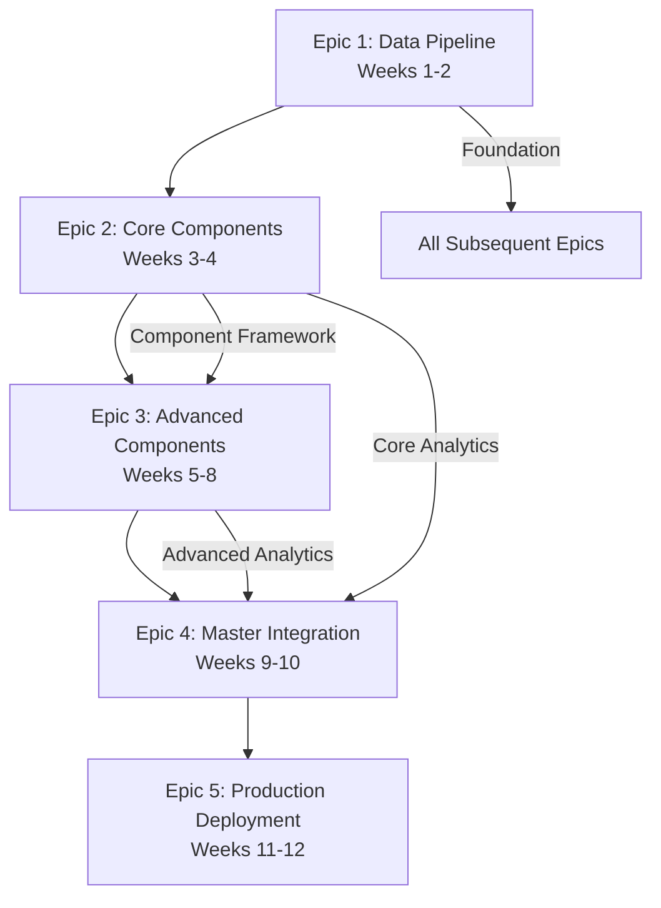

# Epic Dependency Validation Gates
**Market Regime Master Framework Enhancement**  
**Version:** 1.0  
**Date:** 2025-08-10

## Overview

This document defines the critical validation gates between epics to ensure proper sequencing, dependency management, and risk mitigation throughout the 12-week implementation timeline.

## Epic Sequence & Dependencies



## Validation Gate Specifications

### Gate 1: Epic 1 → Epic 2 (End of Week 2)

**Gate Name:** Data Pipeline Foundation Validation  
**Decision Point:** Proceed to Core Component Development  
**Risk Level:** CRITICAL - Foundation for all subsequent work

#### Go Criteria (ALL must pass)

**Technical Validation:**
- [ ] **Modern Data Pipeline Operational**
  - Parquet → Arrow → GPU processing working with real market data
  - Processing time <1500ms (interim target before optimization)
  - Memory usage <4GB (interim target)
  - Data integrity 100% validated against HeavyDB baseline

- [ ] **Cloud Infrastructure Ready**
  - Vertex AI connection established and authenticated
  - BigQuery operational for feature storage
  - Cloud Storage accessible for model artifacts
  - VPN connectivity between local and GCP verified

- [ ] **Configuration System Enhanced**
  - Excel → YAML conversion working for all 600+ parameters
  - Parameter validation and error handling functional
  - Version control and rollback capability tested

- [ ] **API Framework Extended**
  - /api/v2/ endpoints structure implemented
  - Authentication and authorization working
  - Documentation system operational
  - Backward compatibility with /api/v1/ verified

**Business Validation:**
- [ ] **Zero Regression Confirmed**
  - All existing backtester_v2 functionality working
  - Trading system integrations unaffected
  - Performance of existing features maintained

- [ ] **Risk Mitigation Verified**
  - Rollback procedures tested and validated
  - Monitoring and alerting operational
  - Database migration reversible

#### No-Go Criteria (ANY triggers hold)

**Critical Blockers:**
- [ ] Data pipeline processing time >2000ms
- [ ] Memory usage >5GB
- [ ] Any data corruption or integrity failures
- [ ] GCP connectivity or authentication failures
- [ ] Regression in existing system functionality
- [ ] Rollback procedures failing validation tests

#### Contingency Actions for No-Go

**Technical Contingencies:**
1. **Performance Issues:** Revert to HeavyDB processing, optimize Parquet pipeline
2. **Data Integrity:** Halt migration, investigate corruption, restore from backup
3. **Cloud Issues:** Use local processing only, defer cloud integration
4. **Regression:** Immediate rollback, isolate new components

### Gate 2: Epic 2 → Epic 3 (End of Week 4)

**Gate Name:** Core Component Foundation Validation  
**Decision Point:** Proceed to Advanced Component Development  
**Risk Level:** HIGH - Components 1-2 are foundation for advanced analytics

#### Go Criteria (ALL must pass)

**Component Performance:**
- [ ] **Component 1 (Triple Straddle) Operational**
  - 120 features generated within <150ms
  - Rolling straddle analysis working with real data
  - Regime detection accuracy >85% on test dataset
  - Memory usage <350MB

- [ ] **Component 2 (Greeks Sentiment) with Critical Fix**
  - Gamma weight correctly set to 1.5 (verified in code and tests)
  - Volume-weighted Greeks analysis operational
  - Pin risk detection >92% accuracy for DTE 0-3
  - 98 features generated within <120ms

**Framework Integration:**
- [ ] **Adaptive Learning Orchestrator Working**
  - Component coordination and weight management operational
  - Performance monitoring and health checks functional
  - Component failure isolation and fallback working

- [ ] **System Integration Validated**
  - Components integrate with modern data pipeline
  - API endpoints for component results operational
  - Real-time processing <300ms for both components combined

#### No-Go Criteria (ANY triggers hold)

**Performance Blockers:**
- [ ] Combined component processing >400ms
- [ ] Component accuracy <80% on validation dataset
- [ ] Memory usage >800MB for both components
- [ ] Critical gamma fix not properly implemented

### Gate 3: Epic 3 → Epic 4 (End of Week 8)

**Gate Name:** Advanced Component Integration Validation  
**Decision Point:** Proceed to Master Integration  
**Risk Level:** MEDIUM - Advanced components enhance but don't break core functionality

#### Go Criteria (ALL must pass)

**Advanced Component Performance:**
- [ ] **Components 3-6 Operational Within Targets**
  - Component 3: <200ms, 105 features, >82% accuracy
  - Component 4: <200ms, 87 features, >85% accuracy  
  - Component 5: <200ms, 94 features, >87% accuracy
  - Component 6: <180ms, 150 features, >90% accuracy

- [ ] **Component Integration Validated**
  - All 6 components working together <600ms total
  - Cross-component validation operational
  - Component agreement metrics >80%

- [ ] **30x30 Correlation Framework**
  - Progressive validation: 10x10 → 18x18 → 24x24 → 30x30
  - Correlation breakdown detection functional
  - 774 expert features properly optimized

#### No-Go Criteria (ANY triggers hold)

**Integration Blockers:**
- [ ] Combined 6-component processing >800ms
- [ ] Component agreement <70%
- [ ] Correlation framework accuracy <85%
- [ ] Memory usage >3GB for all components

### Gate 4: Epic 4 → Epic 5 (End of Week 10)

**Gate Name:** Master System Integration Validation  
**Decision Point:** Proceed to Production Deployment  
**Risk Level:** HIGH - Complete system must meet all performance targets

#### Go Criteria (ALL must pass)

**Complete System Performance:**
- [ ] **All 8 Components Integrated**
  - Total processing time <800ms achieved
  - Total memory usage <3.7GB maintained
  - System accuracy >87% validated

- [ ] **Master Integration (Component 8) Operational**
  - 8-regime classification working (LVLD/HVC/VCPE/TBVE/TBVS/SCGS/PSED/CBV)
  - DTE-adaptive optimization functional
  - Market structure change detection operational

- [ ] **Complete Vertex AI Integration**
  - Model training and serving pipeline operational
  - Adaptive learning system functional
  - ML model drift detection working

#### No-Go Criteria (ANY triggers hold)

**System-Level Blockers:**
- [ ] Total processing time >900ms
- [ ] System accuracy <85%
- [ ] Vertex AI integration failures
- [ ] Master classification accuracy <88%

### Gate 5: Epic 5 → Production (End of Week 12)

**Gate Name:** Production Readiness Validation  
**Decision Point:** Go-Live Decision  
**Risk Level:** CRITICAL - Production deployment affects live trading

#### Go Criteria (ALL must pass)

**Production Readiness:**
- [ ] **Performance Targets Achieved**
  - <800ms processing time sustained under load
  - <3.7GB memory usage maintained
  - >87% accuracy validated with live data

- [ ] **Operational Excellence**
  - Monitoring and alerting fully operational
  - Incident response procedures tested
  - Backup and recovery validated
  - User training completed

- [ ] **Business Validation**
  - User acceptance testing passed
  - Stakeholder sign-off obtained
  - Risk mitigation strategies activated

## Emergency Procedures

### Epic Hold Process

**Trigger Conditions:**
- Any Go Criteria not met at validation gate
- Critical bugs discovered during epic execution
- External dependency failures (GCP outages, etc.)
- Resource constraints (team availability, infrastructure)

**Hold Process:**
1. **Immediate Actions** (Within 2 hours)
   - Stop all development work on current epic
   - Assess impact and root cause
   - Notify all stakeholders

2. **Investigation Phase** (Within 24 hours)
   - Technical deep-dive to understand issues
   - Estimate effort required for resolution
   - Evaluate impact on timeline and subsequent epics

3. **Decision Phase** (Within 48 hours)
   - Go/No-Go decision based on investigation
   - Resource reallocation if needed
   - Timeline adjustment approved by stakeholders

### Rollback Procedures

**Epic-Level Rollback:**
- Each epic must have tested rollback procedures
- Rollback must restore system to pre-epic state within 4 hours
- Data integrity verification required post-rollback
- Performance impact assessment mandatory

**System-Level Rollback:**
- Complete system rollback to original backtester_v2 state
- HeavyDB processing restoration within 1 hour
- All existing functionality verified operational
- API endpoints restored to v1 only

## Validation Testing Framework

### Automated Validation Suite

**Performance Tests:**
```python
# Epic Validation Test Suite
class EpicValidationSuite:
    def validate_epic_1(self):
        # Data pipeline performance tests
        # Cloud connectivity tests
        # Configuration system tests
        pass
    
    def validate_epic_2(self):
        # Component 1-2 performance tests
        # Adaptive learning tests
        # Integration tests
        pass
```

**Integration Tests:**
- End-to-end workflow validation
- Cross-component communication tests
- API endpoint validation
- Database integration tests

### Manual Validation Checklists

**Business Validation:**
- [ ] Trading team validation of accuracy improvements
- [ ] Performance validation under realistic load
- [ ] User experience validation
- [ ] Documentation completeness review

**Technical Validation:**
- [ ] Code review and quality gates passed
- [ ] Security review completed
- [ ] Performance benchmarking validated
- [ ] Monitoring and alerting tested

## Success Metrics Dashboard

### Epic-Level KPIs

**Epic 1:**
- Data pipeline latency: Target <800ms
- Cloud integration uptime: Target >99.9%
- Configuration conversion accuracy: Target 100%

**Epic 2:**
- Component processing time: Target <300ms combined
- Component accuracy: Target >85% each
- Adaptive learning convergence: Target <1 week

**Epic 3:**
- Advanced component integration: Target <600ms total
- Component agreement: Target >80%
- Feature engineering completeness: Target 774 features

**Epic 4:**
- Complete system performance: Target <800ms
- Master classification accuracy: Target >87%
- Vertex AI integration latency: Target <50ms

**Epic 5:**
- Production stability: Target >99.5% uptime
- User satisfaction: Target >90%
- Business impact: Target measurable improvement

## Governance & Communication

### Validation Gate Reviews

**Participants:**
- Product Manager (John) - Decision authority
- Product Owner (Sarah) - Validation criteria
- Lead Developer - Technical assessment
- QA Lead - Quality validation
- Business Stakeholders - Acceptance validation

**Review Process:**
1. Technical presentation of validation results
2. Business impact assessment
3. Risk evaluation and mitigation review
4. Go/No-Go decision with reasoning
5. Communication to all stakeholders

### Escalation Procedures

**Level 1:** Development Team (4-hour resolution target)
**Level 2:** Project Leadership (24-hour resolution target)  
**Level 3:** Executive Stakeholders (48-hour decision target)

This validation gate framework ensures systematic risk management while enabling rapid development progress through clear decision criteria and escalation procedures.