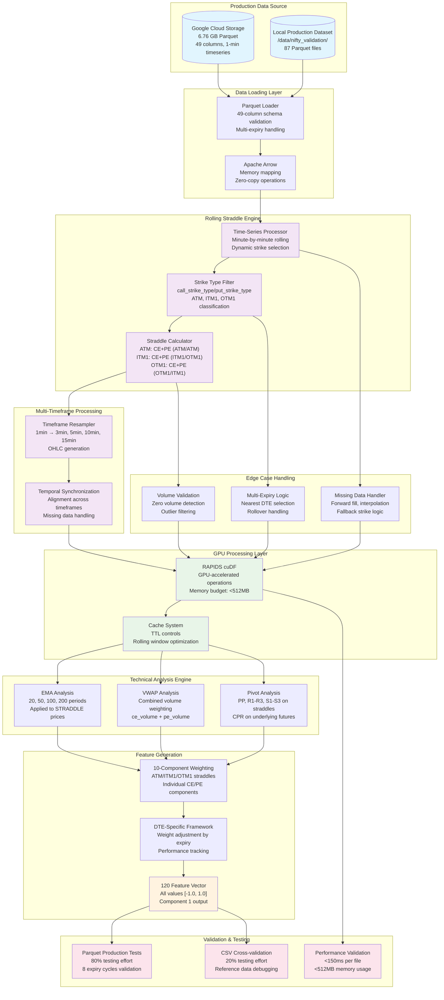

# Component 1 Production Architecture - Rolling Straddle Feature Engineering

## Architecture Overview



## Production Data Schema

### Parquet Schema (49 columns - Production Standard)
```
Core Identification:
├── trade_date (datetime64[ns])
├── trade_time (object) 
├── expiry_date (datetime64[ns])
├── index_name (object)

Market Data:
├── spot (float64)
├── atm_strike (float64) 
├── strike (int64)
├── dte (int64)

Strike Classification (KEY FOR ROLLING STRADDLE):
├── call_strike_type (object)  # ATM, ITM1-ITM32, OTM1-OTM32
├── put_strike_type (object)   # ATM, ITM1-ITM32, OTM1-OTM32

Call Options (14 columns):
├── ce_symbol, ce_open, ce_high, ce_low, ce_close
├── ce_volume, ce_oi, ce_coi, ce_iv
└── ce_delta, ce_gamma, ce_theta, ce_vega, ce_rho

Put Options (14 columns):
├── pe_symbol, pe_open, pe_high, pe_low, pe_close
├── pe_volume, pe_oi, pe_coi, pe_iv  
└── pe_delta, pe_gamma, pe_theta, pe_vega, pe_rho

Futures Data (7 columns):
├── future_open, future_high, future_low, future_close
└── future_volume, future_oi, future_coi

Metadata:
├── zone_id, zone_name
├── expiry_bucket
└── dte_bucket
```

## Rolling Straddle Implementation Logic

### Time-Series Rolling Mechanism
```python
def process_rolling_straddles(parquet_df):
    """
    Process minute-by-minute rolling straddle evolution
    """
    rolling_results = {}
    
    for timestamp in parquet_df['trade_time'].unique():
        minute_data = parquet_df[parquet_df['trade_time'] == timestamp]
        
        # Step 1: Use nearest expiry only (handle multiple expiries)
        nearest_expiry = minute_data.loc[minute_data['dte'].idxmin(), 'expiry_date']
        filtered_data = minute_data[minute_data['expiry_date'] == nearest_expiry]
        
        # Step 2: Extract rolling straddles using database classification
        straddles = {
            'atm': extract_straddle(filtered_data, 'ATM', 'ATM'),
            'itm1': extract_straddle(filtered_data, 'ITM1', 'OTM1'), 
            'otm1': extract_straddle(filtered_data, 'OTM1', 'ITM1')
        }
        
        # Step 3: Calculate combined volumes for VWAP
        for straddle_type, data in straddles.items():
            if data is not None:
                data['combined_volume'] = data['ce_volume'] + data['pe_volume']
                data['straddle_price'] = data['ce_close'] + data['pe_close']
        
        rolling_results[timestamp] = straddles
    
    return rolling_results

def extract_straddle(data, call_type, put_type):
    """Extract straddle data using strike type classification"""
    candidates = data[
        (data['call_strike_type'] == call_type) & 
        (data['put_strike_type'] == put_type)
    ]
    
    if len(candidates) > 0:
        return candidates.iloc[0].to_dict()
    else:
        # Fallback logic for missing strike types
        return handle_missing_strike_data(data, call_type, put_type)
```

## Performance Specifications

### Memory Budget
| Component | Budget | Usage |
|-----------|--------|-------|
| Parquet Loading | <128MB | Arrow memory mapping |
| Rolling Straddle Processing | <192MB | Time-series operations |
| Multi-timeframe Resampling | <96MB | OHLC generation |
| Technical Analysis | <96MB | EMA/VWAP/Pivot calculations |
| **Total Component 1** | **<512MB** | **Within 3.7GB system budget** |

### Processing Speed
| Operation | Target | Validation |
|-----------|--------|------------|
| Parquet file loading | <30ms | Per 8,537+ row file |
| Rolling straddle extraction | <50ms | Time-series processing |
| Multi-timeframe resampling | <40ms | 4 timeframes generation |
| Feature generation | <30ms | 120 features creation |
| **Total Component 1** | **<150ms** | **Per production file** |

## Testing Architecture

### Production Testing Hierarchy (Parquet Primary)
```
Production Testing (80% effort)
├── Parquet Pipeline Tests
│   ├── Multi-expiry file loading (8 expiry cycles)
│   ├── 49-column schema validation 
│   ├── Memory efficiency (<512MB)
│   └── Processing speed (<150ms per file)
├── Rolling Straddle Core Tests  
│   ├── Time-series rolling behavior
│   ├── Strike type classification usage
│   ├── Volume combination logic
│   └── Missing data edge cases
└── Feature Generation Tests
    ├── Exactly 120 features per timestamp
    ├── Value range validation [-1.0, 1.0]
    └── Multi-timeframe synchronization

Reference Testing (20% effort)  
├── CSV Cross-validation
│   ├── Parquet vs CSV consistency
│   ├── Same date result validation
│   └── 49-column vs 48-column mapping
└── Debug Support
    ├── Reference data verification
    └── Development troubleshooting
```

## Data Flow Summary

1. **Production Parquet** (87 files) → **Arrow Memory Mapping** → **GPU Processing**
2. **Time-Series Rolling** → **Strike Classification** → **Straddle Calculation** 
3. **Multi-Timeframe Resampling** → **Technical Analysis** → **Feature Generation**
4. **Edge Case Handling** → **Validation** → **120 Feature Output**
5. **Cross-Component Integration** → **Component 2 Handoff**

This architecture ensures Component 1 is optimized for the **actual production Parquet pipeline** with comprehensive validation using **real market data**.