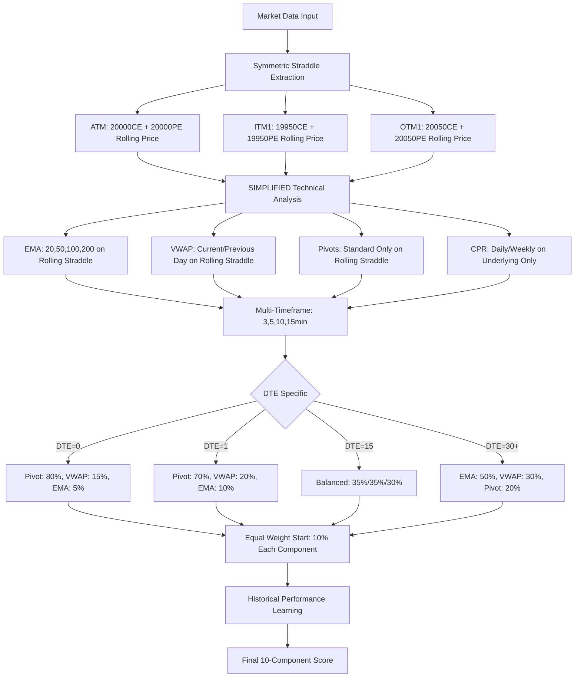
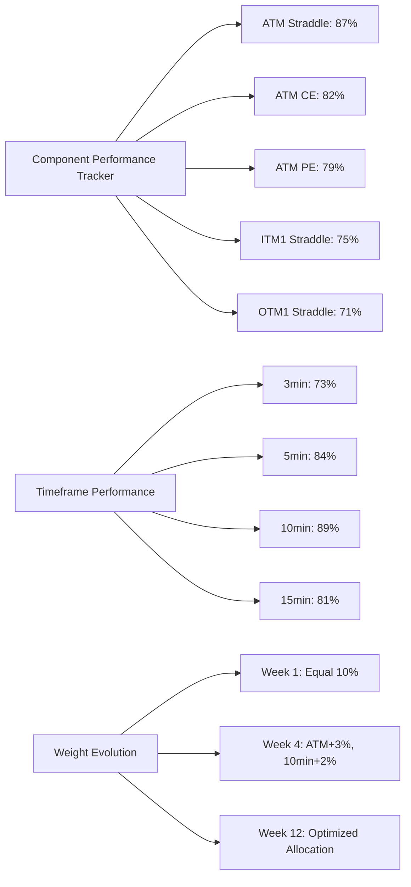
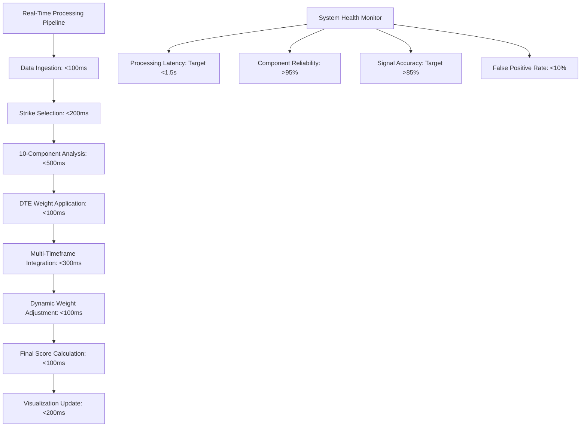

# Component 1: Enhanced 10-Component Triple Rolling Straddle System

## **🚨 CRITICAL PARADIGM SHIFT: ROLLING STRADDLE OVERLAY SYSTEM 🚨**

### **FUNDAMENTAL UNDERSTANDING - ROLLING STRADDLE ANALYSIS**

**⚡ KEY CONCEPT**: All technical indicators (EMA, VWAP, Pivots) are applied to **ROLLING STRADDLE PRICES**, not underlying prices. This is the revolutionary approach that makes this system options-specific and superior for regime detection.

```
TRADITIONAL APPROACH (Inferior):
└── EMA/VWAP/Pivots applied to underlying price (NIFTY futures)

REVOLUTIONARY APPROACH (Superior):
├── EMA/VWAP/Pivots applied to ATM Straddle Price (20000CE + 20000PE)
├── EMA/VWAP/Pivots applied to ITM1 Straddle Price (19950CE + 19950PE)  
└── EMA/VWAP/Pivots applied to OTM1 Straddle Price (20050CE + 20050PE)

EXCEPTION: CPR analysis remains on underlying (futures) for regime classification
```

### **System Architecture Overview**

The Enhanced 10-Component Triple Rolling Straddle System forms the core foundation of the 8-Regime Market Classification engine. This system analyzes symmetric straddle structures across three strike levels with **SIMPLIFIED** dynamic weight optimization and DTE-specific technical analysis integration.

---

## **1. SYMMETRIC STRADDLE STRUCTURE DEFINITION**

### **Strike Selection Logic**
```python
def get_symmetric_strikes(underlying_price, available_strikes, market_type='NIFTY'):
    """
    NIFTY Example: Underlying @ 20000
    - ATM Strike: 20000 (Closest to underlying)
    - ITM1 Strike: 19950 (One interval below ATM)  
    - OTM1 Strike: 20050 (One interval above ATM)
    
    Strike Intervals by Market:
    - NIFTY: 50 points
    - BANKNIFTY: 100 points
    - STOCKS: Variable based on price
    """
    
    strike_intervals = {
        'NIFTY': 50,
        'BANKNIFTY': 100,
        'MIDCPNIFTY': 25,
        'FINNIFTY': 50
    }
    
    interval = strike_intervals.get(market_type, 50)
    
    # Find ATM (closest to underlying)
    atm_strike = min(available_strikes, key=lambda x: abs(x - underlying_price))
    
    # Calculate symmetric strikes
    itm1_strike = atm_strike - interval
    otm1_strike = atm_strike + interval
    
    return {
        'ATM': atm_strike,      # e.g., 20000
        'ITM1': itm1_strike,    # e.g., 19950  
        'OTM1': otm1_strike     # e.g., 20050
    }
```

### **Straddle Component Definitions**
```python
# SYMMETRIC STRADDLE COMPONENTS
Straddle_Components = {
    'ATM_Straddle': {
        'strike': 20000,
        'ce_option': '20000 CE',
        'pe_option': '20000 PE', 
        'straddle_price': 'CE_Price + PE_Price',
        'moneyness': 'At-The-Money',
        'primary_role': 'Core regime detection engine'
    },
    
    'ITM1_Straddle': {
        'strike': 19950,
        'ce_option': '19950 CE (ITM)',
        'pe_option': '19950 PE (OTM)',
        'straddle_price': 'CE_Price + PE_Price',
        'moneyness': 'ITM Call + OTM Put',
        'primary_role': 'Bullish bias detection'
    },
    
    'OTM1_Straddle': {
        'strike': 20050,
        'ce_option': '20050 CE (OTM)', 
        'pe_option': '20050 PE (ITM)',
        'straddle_price': 'CE_Price + PE_Price',
        'moneyness': 'OTM Call + ITM Put',
        'primary_role': 'Bearish bias detection'
    }
}
```

---

## **2. 10-COMPONENT DYNAMIC WEIGHTING SYSTEM**

### **Initial Equal Weighting Structure**
```python
# STARTING EQUAL WEIGHTS (Auto-Adjusting Based on Performance)
Initial_Component_Weights = {
    # Primary Straddle Components (30%)
    'atm_straddle': 0.10,        # ATM combined analysis
    'itm1_straddle': 0.10,       # ITM1 combined analysis  
    'otm1_straddle': 0.10,       # OTM1 combined analysis
    
    # Individual CE Components (30%) 
    'atm_ce': 0.10,              # ATM Call individual
    'itm1_ce': 0.10,             # ITM1 Call individual
    'otm1_ce': 0.10,             # OTM1 Call individual
    
    # Individual PE Components (30%)
    'atm_pe': 0.10,              # ATM Put individual
    'itm1_pe': 0.10,             # ITM1 Put individual  
    'otm1_pe': 0.10,             # OTM1 Put individual
    
    # Cross-Component Analysis (10%)
    'correlation_factor': 0.10    # Inter-component correlation
}
```

### **DTE-Specific Historical Performance Learning Engine**
```python
class DTESpecificLearningEngine:
    """
    ADVANCED: DTE-specific performance learning with dual learning modes
    
    Learning Modes:
    1. All Previous Days: Learn from all historical data
    2. DTE-Specific: Learn only from same DTE performance (DTE=0 learns from past DTE=0 only)
    """
    
    def __init__(self):
        # Learning Configuration
        self.learning_modes = {
            'all_previous_days': True,    # Learn from all historical performance
            'dte_specific': True          # Learn from same DTE only (DTE=1 learns from past DTE=1)
        }
        
        # Learning Windows
        self.learning_windows = {
            'all_days_window': 252,       # 1 trading year for all days
            'dte_specific_window': 50,    # Last 50 instances of same DTE
            'min_dte_instances': 10       # Minimum DTE instances for learning
        }
        
        # Performance Metrics Weights
        self.performance_weights = {
            'sharpe_ratio': 0.35,       # Risk-adjusted returns
            'max_drawdown': 0.25,       # Maximum loss control
            'hit_ratio': 0.20,          # Prediction accuracy
            'profit_factor': 0.20       # Reward/Risk ratio
        }
        
        # DTE-Specific Performance Storage
        self.dte_performance_history = {}  # {dte: [performance_records]}
        self.all_days_performance = []     # All performance records
    
    def learn_dte_specific_weights(self, current_dte, current_weights, learning_mode='both'):
        """
        Learn optimal weights based on DTE-specific historical performance
        
        Args:
            current_dte: Current DTE value (0, 1, 2, 3, etc.)
            current_weights: Current component weights
            learning_mode: 'all_days', 'dte_specific', or 'both'
        """
        
        if learning_mode in ['dte_specific', 'both']:
            # DTE-Specific Learning
            dte_weights = self._learn_from_dte_history(current_dte, current_weights)
        
        if learning_mode in ['all_days', 'both']:
            # All Days Learning
            all_days_weights = self._learn_from_all_history(current_weights)
        
        if learning_mode == 'both':
            # Combine both learning approaches
            final_weights = self._combine_learning_approaches(
                dte_weights, all_days_weights, current_dte
            )
        elif learning_mode == 'dte_specific':
            final_weights = dte_weights
        else:  # all_days
            final_weights = all_days_weights
        
        return final_weights
    
    def _learn_from_dte_history(self, current_dte, current_weights):
        """
        Learn from same DTE historical performance only
        
        Example: If DTE=1, learn only from past DTE=1 performance
        """
        if current_dte not in self.dte_performance_history:
            return current_weights  # No history available
        
        dte_history = self.dte_performance_history[current_dte]
        
        if len(dte_history) < self.learning_windows['min_dte_instances']:
            return current_weights  # Insufficient DTE-specific data
        
        # Get recent DTE-specific performance
        recent_dte_performance = dte_history[-self.learning_windows['dte_specific_window']:]
        
        # Calculate DTE-specific component performance
        dte_component_performance = self._calculate_dte_component_performance(recent_dte_performance)
        
        # Update weights based on DTE-specific performance
        new_weights = self._update_weights_from_performance(current_weights, dte_component_performance)
        
        return new_weights
    
    def _learn_from_all_history(self, current_weights):
        """
        Learn from all previous days performance (traditional approach)
        """
        if len(self.all_days_performance) < self.learning_windows['min_dte_instances']:
            return current_weights
        
        # Get recent all-days performance
        recent_all_performance = self.all_days_performance[-self.learning_windows['all_days_window']:]
        
        # Calculate all-days component performance
        all_component_performance = self._calculate_dte_component_performance(recent_all_performance)
        
        # Update weights based on all-days performance
        new_weights = self._update_weights_from_performance(current_weights, all_component_performance)
        
        return new_weights
    
    def _combine_learning_approaches(self, dte_weights, all_days_weights, current_dte):
        """
        Intelligently combine DTE-specific and all-days learning
        
        Logic: 
        - Near expiry (DTE 0-3): Favor DTE-specific learning (80%)
        - Medium expiry (DTE 4-15): Balanced approach (50%/50%)
        - Far expiry (DTE 16+): Favor all-days learning (30% DTE / 70% all-days)
        """
        if current_dte <= 3:
            # Near expiry: DTE-specific behavior is very important
            dte_weight = 0.80
            all_days_weight = 0.20
        elif current_dte <= 15:
            # Medium expiry: Balanced approach
            dte_weight = 0.50
            all_days_weight = 0.50
        else:
            # Far expiry: General patterns more applicable
            dte_weight = 0.30
            all_days_weight = 0.70
        
        # Combine weights
        combined_weights = {}
        for component in dte_weights:
            combined_weights[component] = (
                dte_weights[component] * dte_weight +
                all_days_weights[component] * all_days_weight
            )
        
        # Normalize to sum to 1.0
        total_weight = sum(combined_weights.values())
        return {k: v/total_weight for k, v in combined_weights.items()}
    
    def store_dte_performance(self, dte, component_performance):
        """
        Store performance data for DTE-specific learning
        
        Args:
            dte: DTE value when performance was recorded
            component_performance: Performance metrics for each component
        """
        # Store in DTE-specific history
        if dte not in self.dte_performance_history:
            self.dte_performance_history[dte] = []
        
        performance_record = {
            'timestamp': datetime.now(),
            'dte': dte,
            'component_performance': component_performance.copy()
        }
        
        self.dte_performance_history[dte].append(performance_record)
        
        # Also store in all-days history
        self.all_days_performance.append(performance_record)
        
        # Maintain memory limits
        self._maintain_memory_limits()
    
    def _maintain_memory_limits(self):
        """
        Keep memory usage under control by limiting history size
        """
        # Limit DTE-specific histories
        for dte in self.dte_performance_history:
            max_dte_records = self.learning_windows['dte_specific_window'] * 2  # Keep 2x window
            if len(self.dte_performance_history[dte]) > max_dte_records:
                self.dte_performance_history[dte] = self.dte_performance_history[dte][-max_dte_records:]
        
        # Limit all-days history
        max_all_records = self.learning_windows['all_days_window'] * 2  # Keep 2x window
        if len(self.all_days_performance) > max_all_records:
            self.all_days_performance = self.all_days_performance[-max_all_records:]
    
    def get_dte_learning_stats(self):
        """
        Get statistics about DTE-specific learning
        """
        stats = {
            'total_dte_values': len(self.dte_performance_history),
            'total_all_days_records': len(self.all_days_performance),
            'dte_specific_records': {}
        }
        
        for dte, history in self.dte_performance_history.items():
            stats['dte_specific_records'][dte] = {
                'count': len(history),
                'sufficient_for_learning': len(history) >= self.learning_windows['min_dte_instances']
            }
        
        return stats
        
        # Anti-Overfitting Constraints
        self.constraints = {
            'max_single_weight': 0.25,   # No component > 25%
            'min_single_weight': 0.05,   # No component < 5%
            'max_weight_change': 0.02,   # 2% max adjustment per period
            'correlation_threshold': 0.85 # Prevent redundant components
        }
    
    def calculate_component_performance(self, component_returns, market_regime):
        """
        Calculate risk-adjusted performance per component per regime
        """
        performance_metrics = {}
        
        for component in component_returns:
            returns = component_returns[component]
            
            # Sharpe Ratio (annualized)
            sharpe = (returns.mean() * 252) / (returns.std() * np.sqrt(252))
            
            # Maximum Drawdown
            cumulative = (1 + returns).cumprod()
            running_max = cumulative.expanding().max()
            drawdown = (cumulative - running_max) / running_max
            max_dd = drawdown.min()
            
            # Hit Ratio (positive returns %)
            hit_ratio = (returns > 0).mean()
            
            # Profit Factor
            positive_returns = returns[returns > 0].sum()
            negative_returns = abs(returns[returns < 0].sum())
            profit_factor = positive_returns / negative_returns if negative_returns > 0 else float('inf')
            
            # Combined Performance Score
            performance_score = (
                sharpe * self.performance_weights['sharpe_ratio'] +
                (1 + max_dd) * self.performance_weights['max_drawdown'] +  # Convert DD to positive
                hit_ratio * self.performance_weights['hit_ratio'] +
                min(profit_factor, 5) / 5 * self.performance_weights['profit_factor']  # Cap at 5
            )
            
            performance_metrics[component] = {
                'score': performance_score,
                'sharpe': sharpe,
                'max_drawdown': max_dd,
                'hit_ratio': hit_ratio,
                'profit_factor': profit_factor
            }
        
        return performance_metrics
    
    def update_weights(self, current_weights, performance_metrics):
        """
        Update component weights based on performance with constraints
        """
        # Calculate performance-based weight adjustments
        total_performance = sum(metrics['score'] for metrics in performance_metrics.values())
        
        new_weights = {}
        for component in current_weights:
            if component in performance_metrics:
                # Performance-proportional weight
                performance_weight = performance_metrics[component]['score'] / total_performance
                
                # Gradual adjustment (prevent shock changes)
                weight_change = (performance_weight - current_weights[component]) * 0.1  # 10% of difference
                
                # Apply constraints
                new_weight = current_weights[component] + weight_change
                new_weight = max(self.constraints['min_single_weight'], 
                               min(self.constraints['max_single_weight'], new_weight))
                
                new_weights[component] = new_weight
            else:
                new_weights[component] = current_weights[component]
        
        # Normalize weights to sum to 1.0
        total_weight = sum(new_weights.values())
        new_weights = {k: v/total_weight for k, v in new_weights.items()}
        
        return new_weights
```

---

## **3. DTE-SPECIFIC TECHNICAL ANALYSIS FRAMEWORK**

### **Granular DTE Weight Matrix**
```python
# DTE-SPECIFIC TECHNICAL ANALYSIS WEIGHTS
def get_dte_specific_weights(dte):
    """
    Return exact DTE-specific weights for technical analysis components
    
    Logic:
    - DTE 0-3: Pivot analysis dominates (pin risk)
    - DTE 4-15: Balanced approach
    - DTE 16+: Trend analysis (EMA) increases
    """
    
    dte_weight_matrix = {
        # EXPIRY WEEK (High Pin Risk)
        0: {'ema_analysis': 0.05, 'vwap_analysis': 0.15, 'pivot_analysis': 0.80},  # Expiry day
        1: {'ema_analysis': 0.10, 'vwap_analysis': 0.20, 'pivot_analysis': 0.70},  # T-1
        2: {'ema_analysis': 0.15, 'vwap_analysis': 0.25, 'pivot_analysis': 0.60},  # T-2
        3: {'ema_analysis': 0.20, 'vwap_analysis': 0.30, 'pivot_analysis': 0.50},  # T-3
        4: {'ema_analysis': 0.22, 'vwap_analysis': 0.32, 'pivot_analysis': 0.46},  # T-4
        5: {'ema_analysis': 0.25, 'vwap_analysis': 0.33, 'pivot_analysis': 0.42},  # T-5
        
        # WEEKLY RANGE (Moderate Pin Risk)
        6: {'ema_analysis': 0.27, 'vwap_analysis': 0.34, 'pivot_analysis': 0.39},
        7: {'ema_analysis': 0.28, 'vwap_analysis': 0.35, 'pivot_analysis': 0.37},
        8: {'ema_analysis': 0.30, 'vwap_analysis': 0.35, 'pivot_analysis': 0.35},  # Balanced
        9: {'ema_analysis': 0.31, 'vwap_analysis': 0.35, 'pivot_analysis': 0.34},
        10: {'ema_analysis': 0.32, 'vwap_analysis': 0.36, 'pivot_analysis': 0.32},
        
        # BI-WEEKLY RANGE (Low Pin Risk) 
        11: {'ema_analysis': 0.33, 'vwap_analysis': 0.36, 'pivot_analysis': 0.31},
        12: {'ema_analysis': 0.34, 'vwap_analysis': 0.36, 'pivot_analysis': 0.30},
        13: {'ema_analysis': 0.35, 'vwap_analysis': 0.36, 'pivot_analysis': 0.29},
        14: {'ema_analysis': 0.36, 'vwap_analysis': 0.36, 'pivot_analysis': 0.28},
        15: {'ema_analysis': 0.37, 'vwap_analysis': 0.36, 'pivot_analysis': 0.27},
        
        # MONTHLY RANGE (Trend Following)
        21: {'ema_analysis': 0.40, 'vwap_analysis': 0.35, 'pivot_analysis': 0.25},  # 3 weeks
        30: {'ema_analysis': 0.45, 'vwap_analysis': 0.35, 'pivot_analysis': 0.20},  # 1 month
        45: {'ema_analysis': 0.50, 'vwap_analysis': 0.32, 'pivot_analysis': 0.18},  # 1.5 months
        60: {'ema_analysis': 0.55, 'vwap_analysis': 0.30, 'pivot_analysis': 0.15},  # 2 months
        90: {'ema_analysis': 0.60, 'vwap_analysis': 0.28, 'pivot_analysis': 0.12}   # 3 months
    }
    
    # For DTE not in matrix, interpolate between closest values
    if dte in dte_weight_matrix:
        return dte_weight_matrix[dte]
    else:
        # Linear interpolation for intermediate DTE values
        return interpolate_dte_weights(dte, dte_weight_matrix)

def interpolate_dte_weights(target_dte, weight_matrix):
    """Interpolate weights for DTE values not in the matrix"""
    sorted_dte = sorted(weight_matrix.keys())
    
    if target_dte <= sorted_dte[0]:
        return weight_matrix[sorted_dte[0]]
    elif target_dte >= sorted_dte[-1]:
        return weight_matrix[sorted_dte[-1]]
    else:
        # Find surrounding DTE values
        lower_dte = max([d for d in sorted_dte if d <= target_dte])
        upper_dte = min([d for d in sorted_dte if d >= target_dte])
        
        # Linear interpolation
        factor = (target_dte - lower_dte) / (upper_dte - lower_dte)
        
        interpolated_weights = {}
        for key in weight_matrix[lower_dte]:
            lower_val = weight_matrix[lower_dte][key]
            upper_val = weight_matrix[upper_dte][key]
            interpolated_weights[key] = lower_val + factor * (upper_val - lower_val)
        
        return interpolated_weights
```

---

## **4. ENHANCED EMA ANALYSIS IMPLEMENTATION**

### **Simplified Rolling Straddle EMA Framework**
```python
class RollingStraddleEMAAnalysis:
    """
    SIMPLIFIED EMA analysis for ROLLING STRADDLE PRICES ONLY
    Applied across 3min, 5min, 10min, 15min timeframes
    """
    
    def __init__(self):
        # SIMPLIFIED EMA Periods (Expert Recommendation)
        self.ema_periods = {
            'short': 20,         # Short-term straddle momentum
            'medium': 50,        # Medium-term straddle trend  
            'long': 100,         # Long-term straddle regime
            'trend_filter': 200  # Major straddle trend filter
        }
        
        # BALANCED EMA Weight Distribution
        self.ema_weights = {
            'short': 0.30,        # Primary signals
            'medium': 0.30,       # Trend confirmation
            'long': 0.25,         # Major trend
            'trend_filter': 0.15  # Directional bias
        }
    
    def calculate_rolling_straddle_ema_score(self, rolling_straddle_prices):
        """
        Calculate EMA alignment score for ROLLING STRADDLE PRICES across timeframes
        
        CRITICAL: This analyzes straddle price EMA, not underlying price EMA
        
        Returns: Score between -1.0 (Perfect Bearish) to +1.0 (Perfect Bullish)
        """
        if len(rolling_straddle_prices) < max(self.ema_periods.values()):
            return 0.0  # Insufficient data
        
        # Calculate EMAs for ROLLING STRADDLE PRICES
        emas = {}
        for period_name, period in self.ema_periods.items():
            emas[period_name] = rolling_straddle_prices.ewm(span=period).mean().iloc[-1]
        
        current_straddle_price = rolling_straddle_prices.iloc[-1]
        
        # SIMPLIFIED EMA Alignment Analysis (4 EMAs only)
        alignment_scores = {}
        
        # Short Term (20 EMA) - Straddle momentum
        if current_straddle_price > emas['short'] > emas['medium']:
            alignment_scores['short'] = 1.0
        elif current_straddle_price < emas['short'] < emas['medium']:
            alignment_scores['short'] = -1.0
        elif current_straddle_price > emas['short']:
            alignment_scores['short'] = 0.5
        elif current_straddle_price < emas['short']:
            alignment_scores['short'] = -0.5
        else:
            alignment_scores['short'] = 0.0
        
        # Medium Term (50 EMA) - Straddle trend confirmation
        if emas['short'] > emas['medium'] > emas['long']:
            alignment_scores['medium'] = 1.0
        elif emas['short'] < emas['medium'] < emas['long']:
            alignment_scores['medium'] = -1.0
        elif emas['short'] > emas['medium']:
            alignment_scores['medium'] = 0.5
        elif emas['short'] < emas['medium']:
            alignment_scores['medium'] = -0.5
        else:
            alignment_scores['medium'] = 0.0
        
        # Long Term (100 EMA) - Straddle major trend
        if emas['medium'] > emas['long'] > emas['trend_filter']:
            alignment_scores['long'] = 1.0
        elif emas['medium'] < emas['long'] < emas['trend_filter']:
            alignment_scores['long'] = -1.0
        elif emas['medium'] > emas['long']:
            alignment_scores['long'] = 0.5
        elif emas['medium'] < emas['long']:
            alignment_scores['long'] = -0.5
        else:
            alignment_scores['long'] = 0.0
        
        # Trend Filter (200 EMA) - Long-term straddle bias
        if emas['long'] > emas['trend_filter']:
            alignment_scores['trend_filter'] = 1.0
        elif emas['long'] < emas['trend_filter']:
            alignment_scores['trend_filter'] = -1.0
        else:
            alignment_scores['trend_filter'] = 0.0
        
        # Weighted Combined Score
        combined_score = sum(
            alignment_scores[period] * self.ema_weights[period]
            for period in alignment_scores
        )
        
        return combined_score
    
    def get_ema_confluence_zones(self, straddle_prices):
        """
        Identify EMA confluence zones (support/resistance areas)
        """
        emas = {}
        for period_name, period in self.ema_periods.items():
            emas[period_name] = straddle_prices.ewm(span=period).mean().iloc[-1]
        
        # Find EMA clusters (confluence zones)
        ema_values = sorted(emas.values())
        current_price = straddle_prices.iloc[-1]
        
        confluence_zones = []
        
        # Check for EMA clustering (within 1% of each other)
        for i in range(len(ema_values) - 1):
            if abs(ema_values[i+1] - ema_values[i]) / ema_values[i] < 0.01:
                confluence_zones.append({
                    'price_level': (ema_values[i] + ema_values[i+1]) / 2,
                    'strength': 2,  # Two EMAs
                    'type': 'support' if current_price > ema_values[i] else 'resistance'
                })
        
        return confluence_zones
```

---

## **5. ENHANCED VWAP ANALYSIS IMPLEMENTATION**

### **SIMPLIFIED Rolling Straddle + Underlying VWAP Framework**
```python
class CleanVWAPAnalysis:
    """
    CLEAN & SIMPLIFIED VWAP analysis for rolling straddles + underlying
    """
    
    def __init__(self):
        # SIMPLIFIED VWAP Types (Per User Requirements)
        self.rolling_straddle_vwap_types = {
            'current_day': 0.50,    # Rolling straddle current day VWAP
            'previous_day': 0.50    # Rolling straddle previous day VWAP
        }
        
        self.underlying_vwap_types = {
            'today': 0.40,          # Underlying (future) today VWAP
            'previous_day': 0.40,   # Underlying (future) previous day VWAP
            'weekly': 0.20          # Weekly underlying VWAP (trend filter)
        }
        
        # Standard deviation bands multipliers
        self.std_multipliers = [0.5, 1.0, 1.5, 2.0, 2.5]
    
    def calculate_straddle_vwap(self, straddle_data):
        """
        Calculate VWAP for straddle price with volume weighting
        
        straddle_data: DataFrame with columns ['straddle_price', 'combined_volume', 'timestamp']
        """
        if len(straddle_data) < 10:
            return None
        
        # Typical Price for straddle (using high, low, close if available, else just price)
        if all(col in straddle_data.columns for col in ['high', 'low', 'close']):
            typical_price = (straddle_data['high'] + straddle_data['low'] + straddle_data['close']) / 3
        else:
            typical_price = straddle_data['straddle_price']
        
        # Combined volume (CE volume + PE volume)
        volume = straddle_data['combined_volume']
        
        # VWAP Calculations
        vwap_data = {}
        
        # 1. Intraday VWAP (session-based)
        session_start = straddle_data.index.normalize()  # Start of trading day
        intraday_groups = straddle_data.groupby(session_start)
        
        intraday_vwap = []
        for date, group in intraday_groups:
            cumulative_pv = (group['straddle_price'] * group['combined_volume']).cumsum()
            cumulative_v = group['combined_volume'].cumsum()
            daily_vwap = cumulative_pv / cumulative_v
            intraday_vwap.extend(daily_vwap.tolist())
        
        vwap_data['intraday'] = intraday_vwap[-1] if intraday_vwap else typical_price.iloc[-1]
        
        # 2. Rolling 20-period VWAP
        rolling_pv = (typical_price * volume).rolling(window=20).sum()
        rolling_v = volume.rolling(window=20).sum()
        vwap_data['rolling_20'] = (rolling_pv / rolling_v).iloc[-1]
        
        # 3. Weekly VWAP
        weekly_groups = straddle_data.resample('W')
        weekly_pv = (typical_price * volume).resample('W').sum()
        weekly_v = volume.resample('W').sum()
        current_week_vwap = (weekly_pv / weekly_v).iloc[-1]
        vwap_data['weekly'] = current_week_vwap
        
        # 4. Monthly VWAP (if enough data)
        if len(straddle_data) > 100:  # At least 100 periods for monthly
            monthly_pv = (typical_price * volume).sum()
            monthly_v = volume.sum()
            vwap_data['monthly'] = monthly_pv / monthly_v
        else:
            vwap_data['monthly'] = vwap_data['rolling_20']  # Fallback
        
        return vwap_data
    
    def calculate_vwap_score(self, current_price, vwap_data):
        """
        Calculate VWAP-based sentiment score
        
        Returns: Score between -1.0 (Strong Bearish) to +1.0 (Strong Bullish)
        """
        if not vwap_data:
            return 0.0
        
        # Calculate deviation from each VWAP type
        vwap_deviations = {}
        for vwap_type, vwap_value in vwap_data.items():
            deviation_pct = (current_price - vwap_value) / vwap_value
            
            # Convert deviation to score
            if deviation_pct > 0.03:        # > 3% above VWAP
                score = 1.0
            elif deviation_pct > 0.015:     # > 1.5% above VWAP
                score = 0.7
            elif deviation_pct > 0.005:     # > 0.5% above VWAP
                score = 0.3
            elif deviation_pct > -0.005:    # Within 0.5% of VWAP
                score = 0.0
            elif deviation_pct > -0.015:    # < 1.5% below VWAP
                score = -0.3
            elif deviation_pct > -0.03:     # < 3% below VWAP
                score = -0.7
            else:                           # < -3% below VWAP
                score = -1.0
            
            vwap_deviations[vwap_type] = score
        
        # Weighted combined score
        combined_score = sum(
            vwap_deviations[vwap_type] * self.vwap_types[vwap_type]
            for vwap_type in vwap_deviations
        )
        
        return combined_score
    
    def get_vwap_bands(self, straddle_data, vwap_value):
        """
        Calculate VWAP standard deviation bands
        """
        if len(straddle_data) < 20:
            return {}
        
        # Calculate standard deviation of price from VWAP
        price_deviation = straddle_data['straddle_price'] - vwap_value
        std_dev = price_deviation.rolling(window=20).std().iloc[-1]
        
        # Create bands
        bands = {}
        for multiplier in self.std_multipliers:
            bands[f'upper_{multiplier}'] = vwap_value + (std_dev * multiplier)
            bands[f'lower_{multiplier}'] = vwap_value - (std_dev * multiplier)
        
        return bands
```

---

## **6. ENHANCED PIVOT ANALYSIS FOR ROLLING STRADDLES**

### **SIMPLIFIED Rolling Straddle Pivot Framework**
```python
class CleanRollingStraddlePivotAnalysis:
    """
    CLEAN pivot analysis for rolling straddle prices across 3,5,10,15min timeframes
    ONLY Standard pivots to avoid overwhelming complexity
    """
    
    def __init__(self):
        # SIMPLIFIED: Only Standard Pivots (Expert Recommendation)
        self.pivot_methods = {
            'standard': self.calculate_standard_pivots_rolling_straddle
        }
        
        # CPR Analysis Configuration
        self.cpr_config = {
            'underlying_cpr': {
                'daily': True,
                'weekly': True
            },
            'atm_straddle_cpr': {
                'daily': True,
                'weekly': False  # Keep it simple
            }
        }
    
    def analyze_rolling_straddle_pivots(self, rolling_straddle_data, timeframe, straddle_type='ATM'):
        """
        SIMPLIFIED pivot analysis for ROLLING STRADDLE PRICES
        Across 3min, 5min, 10min, 15min timeframes
        
        rolling_straddle_data: DataFrame with OHLC data for the ROLLING STRADDLE
        """
        if len(rolling_straddle_data) < 2:
            return self.get_default_pivot_result()
        
        # Extract rolling straddle current and previous day data
        current_straddle_price = rolling_straddle_data['close'].iloc[-1]
        
        # COMPLETE ROLLING STRADDLE Previous Day Data (As Requested)
        previous_day_straddle = {
            'open': rolling_straddle_data['open'].iloc[-2] if len(rolling_straddle_data) >= 2 and 'open' in rolling_straddle_data.columns else rolling_straddle_data['close'].iloc[-2],
            'high': rolling_straddle_data['high'].iloc[-2] if len(rolling_straddle_data) >= 2 else rolling_straddle_data['high'].iloc[-1],
            'low': rolling_straddle_data['low'].iloc[-2] if len(rolling_straddle_data) >= 2 else rolling_straddle_data['low'].iloc[-1],
            'close': rolling_straddle_data['close'].iloc[-2] if len(rolling_straddle_data) >= 2 else rolling_straddle_data['close'].iloc[-1]
        }
        
        # COMPLETE ROLLING STRADDLE Current Day Data (As Requested)  
        current_day_straddle = {
            'open': rolling_straddle_data['open'].iloc[-1] if 'open' in rolling_straddle_data.columns else rolling_straddle_data['close'].iloc[0],
            'high': rolling_straddle_data['high'].iloc[-1],
            'low': rolling_straddle_data['low'].iloc[-1], 
            'close': current_straddle_price
        }
        
        # Calculate ONLY Standard Pivots for Rolling Straddle
        standard_pivots = self.calculate_standard_pivots_rolling_straddle(
            previous_day_straddle, current_day_straddle
        )
        
        # Calculate pivot score
        pivot_score = self.calculate_rolling_straddle_pivot_score(
            current_straddle_price, standard_pivots
        )
        
        return {
            'straddle_type': straddle_type,
            'timeframe': timeframe,
            'pivot_score': pivot_score,
            'pivot_levels': standard_pivots,
            'current_straddle_price': current_straddle_price,
            'previous_day_data': previous_day_straddle
        }
    
    def calculate_standard_pivots_rolling_straddle(self, previous_day_straddle, current_day_straddle):
        """
        Standard pivot point calculations for ROLLING STRADDLE PRICES
        CRITICAL: Uses straddle high/low/close, not underlying prices
        """
        # Pivot Point calculation using ROLLING STRADDLE prices
        pp = (previous_day_straddle['high'] + previous_day_straddle['low'] + previous_day_straddle['close']) / 3
        
        return {
            'PP': pp,  # Straddle Pivot Point
            'R1': 2 * pp - previous_day_straddle['low'],    # Straddle Resistance 1
            'R2': pp + (previous_day_straddle['high'] - previous_day_straddle['low']),  # Straddle Resistance 2
            'R3': previous_day_straddle['high'] + 2 * (pp - previous_day_straddle['low']),  # Straddle Resistance 3
            'S1': 2 * pp - previous_day_straddle['high'],   # Straddle Support 1
            'S2': pp - (previous_day_straddle['high'] - previous_day_straddle['low']),  # Straddle Support 2
            'S3': previous_day_straddle['low'] - 2 * (previous_day_straddle['high'] - pp)   # Straddle Support 3
        }
    
    def calculate_underlying_cpr(self, underlying_data):
        """
        CPR Analysis for UNDERLYING (Future) prices only
        Daily + Weekly CPR for regime classification
        """
        if len(underlying_data) < 2:
            return {}
        
        # Previous day underlying data
        prev_underlying = {
            'high': underlying_data['high'].iloc[-2],
            'low': underlying_data['low'].iloc[-2],
            'close': underlying_data['close'].iloc[-2]
        }
        
        current_underlying_price = underlying_data['close'].iloc[-1]
        
        # Daily CPR for underlying
        daily_tc = (prev_underlying['high'] + prev_underlying['low']) / 2
        daily_pp = (prev_underlying['high'] + prev_underlying['low'] + prev_underlying['close']) / 3
        daily_bc = (prev_underlying['close'] + prev_underlying['low']) / 2
        
        daily_cpr_width = daily_tc - daily_bc
        daily_cpr_width_pct = (daily_cpr_width / daily_pp) * 100
        
        # CPR Classification
        if daily_cpr_width_pct < 0.35:
            cpr_type = 'Narrow'      # Consolidation/Breakout expected
        elif daily_cpr_width_pct > 1.0:
            cpr_type = 'Wide'        # Trending day expected
        else:
            cpr_type = 'Medium'      # Normal trading range
        
        # Price position relative to CPR
        if current_underlying_price > daily_tc:
            position = 'Above_CPR'   # Bullish
        elif current_underlying_price < daily_bc:
            position = 'Below_CPR'   # Bearish
        else:
            position = 'Inside_CPR'  # Neutral
        
        return {
            'daily_tc': daily_tc,
            'daily_pp': daily_pp,
            'daily_bc': daily_bc,
            'daily_cpr_width_pct': daily_cpr_width_pct,
            'daily_cpr_type': cpr_type,
            'price_position': position,
            'underlying_cpr_score': self.calculate_underlying_cpr_score(
                current_underlying_price, daily_tc, daily_pp, daily_bc, cpr_type
            )
        }
    
    
    def calculate_cpr_analysis(self, previous_day, current_price):
        """Central Pivot Range analysis"""
        tc = (previous_day['high'] + previous_day['low']) / 2  # Top Central
        pp = (previous_day['high'] + previous_day['low'] + previous_day['close']) / 3  # Pivot
        bc = (previous_day['close'] + previous_day['low']) / 2  # Bottom Central
        
        cpr_width = tc - bc
        cpr_width_pct = (cpr_width / pp) * 100
        
        # CPR Classification
        if cpr_width_pct < 0.35:
            cpr_type = 'Narrow'      # Consolidation/Breakout expected
        elif cpr_width_pct > 1.0:
            cpr_type = 'Wide'        # Trending day expected
        else:
            cpr_type = 'Medium'      # Normal trading range
        
        # Price position relative to CPR
        if current_price > tc:
            position = 'Above_CPR'   # Bullish
        elif current_price < bc:
            position = 'Below_CPR'   # Bearish
        else:
            position = 'Inside_CPR'  # Neutral
        
        return {
            'tc': tc,
            'pp': pp, 
            'bc': bc,
            'cpr_width': cpr_width,
            'cpr_width_pct': cpr_width_pct,
            'cpr_type': cpr_type,
            'price_position': position,
            'cpr_score': self.calculate_cpr_score(current_price, tc, pp, bc, cpr_type)
        }
    
    def calculate_cpr_score(self, current_price, tc, pp, bc, cpr_type):
        """Calculate CPR-based sentiment score"""
        if current_price > tc:
            if cpr_type == 'Narrow':
                return 0.8  # Strong bullish breakout expected
            else:
                return 0.5  # Mild bullish
        elif current_price < bc:
            if cpr_type == 'Narrow':
                return -0.8  # Strong bearish breakdown expected
            else:
                return -0.5  # Mild bearish
        else:  # Inside CPR
            if cpr_type == 'Narrow':
                return 0.0  # Neutral, awaiting breakout
            elif cpr_type == 'Wide':
                return 0.0  # Neutral, range-bound day
            else:
                return 0.0  # Neutral
    
    def calculate_pivot_score(self, current_price, pivots):
        """Calculate score based on price position relative to pivot levels"""
        pp = pivots['PP']
        
        # Determine position relative to key levels
        if 'R3' in pivots and current_price > pivots['R3']:
            return 1.0      # Extremely bullish
        elif 'R2' in pivots and current_price > pivots['R2']:
            return 0.8      # Very bullish
        elif 'R1' in pivots and current_price > pivots['R1']:
            return 0.6      # Bullish
        elif current_price > pp:
            return 0.3      # Mildly bullish
        elif 'S1' in pivots and current_price > pivots['S1']:
            return -0.3     # Mildly bearish
        elif 'S2' in pivots and current_price > pivots['S2']:
            return -0.6     # Bearish
        elif 'S3' in pivots and current_price > pivots['S3']:
            return -0.8     # Very bearish
        else:
            return -1.0     # Extremely bearish
    
    def get_previous_session_data(self, straddle_data):
        """Extract previous trading session data"""
        # Assuming daily data or session-based data
        if len(straddle_data) >= 2:
            previous_day = straddle_data.iloc[-2]
            return {
                'high': previous_day['high'],
                'low': previous_day['low'], 
                'close': previous_day['close'],
                'open': previous_day['open'] if 'open' in straddle_data.columns else previous_day['close']
            }
        else:
            # Fallback to current day data
            current = straddle_data.iloc[-1]
            return {
                'high': current['high'],
                'low': current['low'],
                'close': current['close'],
                'open': current['open'] if 'open' in straddle_data.columns else current['close']
            }
```

---

## **7. MULTI-TIMEFRAME INTEGRATION ENGINE**

### **Dynamic Timeframe Weighting**
```python
class MultiTimeframeIntegration:
    """
    Comprehensive multi-timeframe analysis with dynamic weight optimization
    """
    
    def __init__(self):
        # Initial equal timeframe weights (auto-adjusting)
        self.timeframe_weights = {
            '3min': 0.25,   # Equal start - high frequency signals
            '5min': 0.25,   # Equal start - primary analysis
            '10min': 0.25,  # Equal start - trend confirmation  
            '15min': 0.25   # Equal start - major trend filter
        }
        
        # Timeframe characteristics
        self.timeframe_properties = {
            '3min': {
                'sensitivity': 'High',
                'noise_level': 'High',
                'signal_speed': 'Very Fast',
                'primary_use': 'Scalping entries'
            },
            '5min': {
                'sensitivity': 'Medium-High',
                'noise_level': 'Medium',
                'signal_speed': 'Fast',
                'primary_use': 'Primary trading signals'
            },
            '10min': {
                'sensitivity': 'Medium',
                'noise_level': 'Low',
                'signal_speed': 'Medium',
                'primary_use': 'Trend confirmation'
            },
            '15min': {
                'sensitivity': 'Low',
                'noise_level': 'Very Low',
                'signal_speed': 'Slow',
                'primary_use': 'Major trend filtering'
            }
        }
        
        # Performance tracking for weight optimization
        self.timeframe_performance = {}
    
    def analyze_multi_timeframe(self, straddle_data_dict, component_type):
        """
        Analyze straddle component across all timeframes
        
        straddle_data_dict: {
            '3min': straddle_3min_data,
            '5min': straddle_5min_data,
            '10min': straddle_10min_data,
            '15min': straddle_15min_data
        }
        """
        timeframe_results = {}
        
        for timeframe in self.timeframe_weights.keys():
            if timeframe in straddle_data_dict:
                data = straddle_data_dict[timeframe]
                
                # Initialize analysis components
                ema_analyzer = StraddleEMAAnalysis()
                vwap_analyzer = StraddleVWAPAnalysis()
                pivot_analyzer = RollingStraddlePivotAnalysis()
                
                # Get DTE for this component
                dte = self.extract_dte_from_data(data)
                dte_weights = get_dte_specific_weights(dte)
                
                # Calculate individual scores
                ema_score = ema_analyzer.calculate_ema_alignment_score(data['close'])
                
                vwap_data = vwap_analyzer.calculate_straddle_vwap(data)
                vwap_score = vwap_analyzer.calculate_vwap_score(data['close'].iloc[-1], vwap_data)
                
                pivot_result = pivot_analyzer.analyze_straddle_pivots(data, component_type)
                pivot_score = pivot_result['combined_score']
                
                # Apply DTE-specific weighting
                timeframe_score = (
                    ema_score * dte_weights['ema_analysis'] +
                    vwap_score * dte_weights['vwap_analysis'] +
                    pivot_score * dte_weights['pivot_analysis']
                )
                
                # Store detailed results
                timeframe_results[timeframe] = {
                    'combined_score': timeframe_score,
                    'ema_score': ema_score,
                    'vwap_score': vwap_score,
                    'pivot_score': pivot_score,
                    'dte_weights': dte_weights,
                    'data_quality': self.assess_data_quality(data)
                }
        
        # Calculate overall weighted score
        overall_score = self.calculate_weighted_timeframe_score(timeframe_results)
        
        # Calculate confidence based on timeframe agreement
        confidence = self.calculate_timeframe_confidence(timeframe_results)
        
        return {
            'overall_score': overall_score,
            'confidence': confidence,
            'timeframe_results': timeframe_results,
            'weights_used': self.timeframe_weights.copy()
        }
    
    def calculate_weighted_timeframe_score(self, timeframe_results):
        """Calculate overall score weighted by timeframe importance"""
        if not timeframe_results:
            return 0.0
        
        weighted_sum = 0.0
        total_weight = 0.0
        
        for timeframe, result in timeframe_results.items():
            weight = self.timeframe_weights[timeframe]
            score = result['combined_score']
            data_quality = result['data_quality']
            
            # Adjust weight by data quality
            adjusted_weight = weight * data_quality
            weighted_sum += score * adjusted_weight
            total_weight += adjusted_weight
        
        return weighted_sum / total_weight if total_weight > 0 else 0.0
    
    def calculate_timeframe_confidence(self, timeframe_results):
        """Calculate confidence based on timeframe agreement"""
        if len(timeframe_results) < 2:
            return 0.5
        
        scores = [result['combined_score'] for result in timeframe_results.values()]
        
        # Calculate standard deviation of scores
        score_std = np.std(scores)
        
        # Lower standard deviation = higher agreement = higher confidence
        max_std = 2.0  # Maximum expected standard deviation
        confidence = max(0.1, 1.0 - (score_std / max_std))
        
        return min(1.0, confidence)
    
    def update_timeframe_weights(self, performance_data):
        """
        Update timeframe weights based on historical performance
        """
        if not performance_data:
            return
        
        # Calculate performance metrics per timeframe
        timeframe_metrics = {}
        for timeframe in self.timeframe_weights.keys():
            if timeframe in performance_data:
                metrics = self.calculate_timeframe_performance_metrics(
                    performance_data[timeframe]
                )
                timeframe_metrics[timeframe] = metrics
        
        # Adjust weights based on performance
        self.timeframe_weights = self.optimize_timeframe_weights(timeframe_metrics)
    
    def calculate_timeframe_performance_metrics(self, timeframe_data):
        """Calculate performance metrics for a specific timeframe"""
        # This would include metrics like:
        # - Signal accuracy
        # - False positive rate
        # - Signal timing quality
        # - Drawdown characteristics
        
        return {
            'accuracy': 0.75,           # Placeholder
            'false_positive_rate': 0.15, # Placeholder
            'signal_quality': 0.80,     # Placeholder
            'consistency': 0.70         # Placeholder
        }
    
    def optimize_timeframe_weights(self, timeframe_metrics):
        """
        Optimize timeframe weights based on performance metrics
        """
        # Calculate composite performance score for each timeframe
        performance_scores = {}
        for timeframe, metrics in timeframe_metrics.items():
            score = (
                metrics['accuracy'] * 0.35 +
                (1 - metrics['false_positive_rate']) * 0.25 +
                metrics['signal_quality'] * 0.25 +
                metrics['consistency'] * 0.15
            )
            performance_scores[timeframe] = score
        
        # Convert to weights (with constraints)
        total_performance = sum(performance_scores.values())
        new_weights = {}
        
        for timeframe in self.timeframe_weights.keys():
            if timeframe in performance_scores:
                # Performance-based weight
                performance_weight = performance_scores[timeframe] / total_performance
                
                # Gradual adjustment (prevent shock changes)
                current_weight = self.timeframe_weights[timeframe]
                weight_change = (performance_weight - current_weight) * 0.1
                
                # Apply constraints
                new_weight = current_weight + weight_change
                new_weight = max(0.15, min(0.40, new_weight))  # 15% min, 40% max
                
                new_weights[timeframe] = new_weight
        
        # Normalize to sum to 1.0
        total_weight = sum(new_weights.values())
        return {k: v/total_weight for k, v in new_weights.items()}
    
    def assess_data_quality(self, data):
        """Assess quality of timeframe data"""
        if len(data) < 10:
            return 0.3  # Poor quality - insufficient data
        
        # Check for missing values
        missing_ratio = data.isnull().sum().sum() / (len(data) * len(data.columns))
        
        # Check for price consistency (no extreme outliers)
        price_cv = data['close'].std() / data['close'].mean()  # Coefficient of variation
        
        # Check for volume consistency (if available)
        volume_quality = 1.0
        if 'volume' in data.columns:
            zero_volume_ratio = (data['volume'] == 0).sum() / len(data)
            volume_quality = 1.0 - zero_volume_ratio
        
        # Combined quality score
        quality_score = (
            (1.0 - missing_ratio) * 0.4 +
            min(1.0, 1.0 / (1.0 + price_cv)) * 0.3 +
            volume_quality * 0.3
        )
        
        return max(0.1, min(1.0, quality_score))
```

---

## **8. SYSTEM VISUALIZATION FRAMEWORK**

### **Simple Mermaid Diagrams**



### **Performance Monitoring Dashboard**



### **Real-Time System Monitor**



---

## **9. IMPLEMENTATION CHECKLIST**

### **Phase 1: Core System Setup**
- [ ] Implement symmetric straddle extraction logic
- [ ] Set up dynamic equal weighting framework  
- [ ] Create DTE-specific weight matrix
- [ ] Implement basic EMA/VWAP/Pivot analysis

### **Phase 2: Advanced Features**
- [ ] Deploy historical performance learning engine
- [ ] Implement multi-timeframe integration
- [ ] Add CPR analysis for all straddle components
- [ ] Create correlation monitoring system

### **Phase 3: Optimization & Monitoring**
- [ ] Deploy anti-overfitting protection mechanisms
- [ ] Implement real-time performance tracking
- [ ] Create visualization dashboard
- [ ] Add system health monitoring

### **Phase 4: Production Deployment**
- [ ] Performance testing (<3 second requirement)
- [ ] Integration with HeavyDB/GCS data pipeline
- [ ] Deployment to Google Cloud/Vertex AI
- [ ] Live trading system integration

---

This completes the detailed documentation for Component 1. The system is designed to be institutional-grade with comprehensive analysis across all 10 components, dynamic weight optimization, and robust performance monitoring.

**Ready for your review and feedback before proceeding to Component 2 (Greeks Sentiment Analysis).**