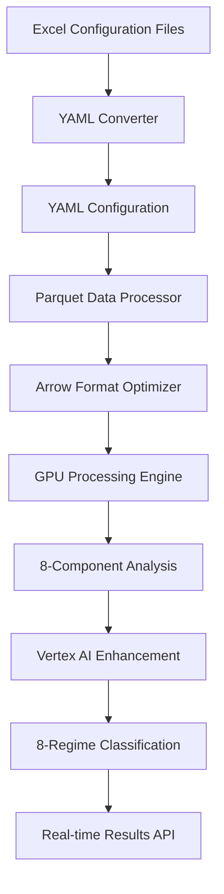
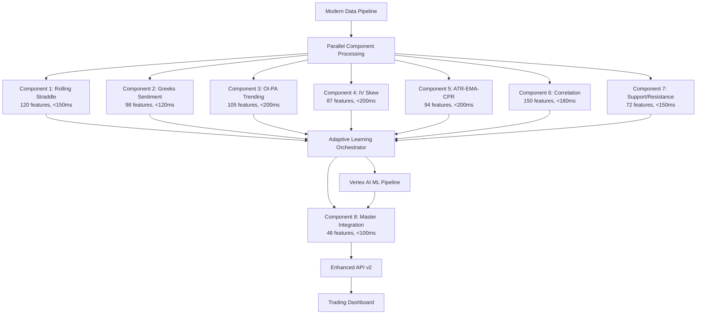

# **Market Regime Master Framework: Brownfield Enhancement PRD**

**🚨 Decision Update (2025-08-10)**
- HeavyDB is deprecated.
- End-state data platform: Parquet → Arrow → GPU.
- HeavyDB permitted only as a temporary, read-only migration fallback and removed after cutover.

## **🚨 CRITICAL SYSTEM UPGRADE: From HeavyDB to Modern Parquet Pipeline 🚨**

**Document Version:** 2.0  
**Date:** August 10, 2025  
**Product Manager:** John  
**Status:** Implementation Ready  

---

## **1. Executive Summary**

### **1.1 Enhancement Overview**
Migrate the existing HeavyDB-based Market Regime classification system to a modern **Excel → YAML → Parquet → Arrow → GPU** processing pipeline while implementing the revolutionary 8-Component Adaptive Learning System with Google Vertex AI integration.

### **1.2 Current Implementation Status**

#### **🟡 PARTIAL IMPLEMENTATION DISCOVERED**
```yaml
Current_Status:
  Foundation_Structure: ✅ COMPLETE (vertex_market_regime directory)
  Component_Specifications: ✅ COMPLETE (detailed docs in docs/market_regime/)
  Component_Implementations: 🔴 CRITICAL GAP (only stubs exist)
  Data_Pipeline: 🔴 CRITICAL GAP (still using HeavyDB)
  Vertex_AI_Integration: 🔴 NOT_IMPLEMENTED
  Performance_Pipeline: 🔴 NOT_IMPLEMENTED
```

#### **🚨 CRITICAL FINDINGS**
- **Architecture**: Comprehensive 8-component specifications exist but implementation is minimal
- **Data Pipeline**: Still using outdated HeavyDB → CSV processing instead of modern Parquet
- **Component 2 Critical Fix**: Gamma weight correction (0.0 → 1.5) documented but not implemented
- **Vertex AI**: Infrastructure exists but no actual integration implemented

### **1.3 Strategic Transformation Required**

#### **From Current State** (HeavyDB-Based Legacy)
```
HeavyDB → CSV Processing → 18-Regime Classification → Trading Signals
```

#### **To Target State** (Modern AI-Driven)
```
Excel Config → YAML → Parquet → Arrow → GPU Processing → 8-Component AI → Vertex AI → 8-Regime Classification
```

### **1.4 Success Metrics**
- Targets:
  - Base (Brownfield): <800ms total processing, <3.7GB memory, >87% accuracy
  - Stretch (Cloud-native): <600ms total processing, <2.5GB memory, >87% accuracy (per MASTER_ARCHITECTURE_v2.md)
- **Performance**: <800ms total processing (73% faster than current 3000ms)
- **Accuracy**: >87% regime classification (improvement from baseline)
- **Pipeline**: Modern Parquet-based data processing operational
- **AI Integration**: Vertex AI adaptive learning system functional
- **Compatibility**: 100% backward API compatibility maintained

---

## **2. Current State Analysis**

### **2.1 Existing System Architecture**

#### **Legacy HeavyDB System** (backtester_v2)
```
Location: /Users/maruth/projects/market_regime/backtester_v2/
Technology Stack:
  - Database: HeavyDB with GPU acceleration
  - Processing: CSV-based data processing
  - Classification: Rule-based 18-regime system
  - Configuration: 600+ parameters in 31 Excel sheets
  - Performance: ~3000ms processing time
```

#### **Partially Implemented Modern System** (vertex_market_regime)
```
Location: /Users/maruth/projects/market_regime/vertex_market_regime/
Current Status:
  - Directory Structure: ✅ COMPLETE
  - Base Components: ✅ Structure exists, minimal implementation
  - Configuration Bridge: ✅ Excel files copied
  - Data Pipeline: 🔴 NOT IMPLEMENTED
  - Vertex AI: 🔴 Infrastructure only
```

### **2.2 Component Implementation Status**

| Component | Specification | Implementation | Critical Gap |
|-----------|---------------|----------------|---------------|
| **Component 1** | ✅ 120 features documented | 🔴 Stub only | Rolling straddle overlay missing |
| **Component 2** | ✅ 98 features + gamma fix | 🔴 Stub only | Critical gamma_weight=1.5 fix |
| **Component 3** | ✅ 105 features documented | 🔴 Stub only | OI-PA cumulative analysis missing |
| **Component 4** | ✅ 87 features documented | 🔴 Stub only | Dual DTE framework missing |
| **Component 5** | ✅ 94 features documented | 🔴 Stub only | ATR-EMA-CPR integration missing |
| **Component 6** | ✅ 150 features documented | 🔴 Stub only | 30x30 correlation matrix missing |
| **Component 7** | ✅ 72 features documented | 🔴 Stub only | Support/resistance logic missing |
| **Component 8** | ✅ 48 features documented | 🔴 Stub only | Master integration missing |

### **2.3 Data Pipeline Modernization Required**

#### **Current Pipeline** (Legacy)
```
HeavyDB → Python Processing → CSV Output → Manual Analysis
Issues:
  - Database dependency for real-time processing
  - Limited scalability for large datasets  
  - No cloud integration
  - Manual intervention required
```

#### **Required Pipeline** (Modern)
```
Excel Config → YAML Conversion → Parquet Files → Arrow Format → GPU Processing → Vertex AI → Results
Benefits:
  - Cloud-native processing
  - Automatic scalability
  - GPU-optimized data formats
  - AI-driven optimization
```

### 2.4 Dual Environment Data Pipelines
- Local mode: Parquet → Arrow → GPU → 8-Component → Vertex AI → 8-Regime
- Cloud mode: Parquet (GCS) → BigQuery (feature/processing) → GPU → 8-Component → Vertex AI → 8-Regime

---

## **3. Product Requirements**

### Component Specification Links
- [Component 1: Triple Rolling Straddle](market_regime/mr_tripple_rolling_straddle_component1.md)
- [Component 2: Greeks Sentiment Analysis](market_regime/mr_greeks_sentiment_analysis_component2.md)
- [Component 3: OI-PA Trending Analysis](market_regime/mr_oi_pa_trending_analysis_component3.md)
- [Component 4: IV Skew Analysis](market_regime/mr_iv_skew_analysis_component4.md)
- [Component 5: ATR-EMA-CPR Integration](market_regime/mr_atr_ema_cpr_component5.md)
- [Component 6: Correlation & Non-Correlation Framework](market_regime/mr_correlation_noncorelation_component6.md)
- [Component 7: Support/Resistance Formation Logic](market_regime/mr_support_resistance_component7.md)
- [Component 8: DTE-Adaptive Master Integration](market_regime/mr_dte_adaptive_overlay_component8.md)

### **3.1 Core Functional Requirements**

#### **R1: Modern Data Pipeline Implementation** (HIGH PRIORITY)
- Local: Parquet → Arrow → GPU processing path
- Cloud: Parquet (GCS) → BigQuery (processing/feature storage) → GPU path
- **Excel → YAML Conversion**: Automatic conversion of 600+ Excel parameters to YAML configurations
- **YAML → Parquet Processing**: Efficient data processing pipeline using Parquet format
- **Arrow Integration**: GPU-optimized Arrow format for high-performance computing
- **Vertex AI Pipeline**: Integration with Google Vertex AI for ML processing

#### **R1b: Vertex AI Feature Engineering (All Components) - REQUIRED**
- All eight components’ features (total 774) must be engineered via Vertex AI Pipelines
- Features must be stored and served via Vertex AI Feature Store with strict training/serving parity
- Data source: GCS Parquet; processing: Apache Arrow + RAPIDS cuDF
- Enforce schema versioning and lineage for features used in training and inference

#### **R2: 8-Component Adaptive Learning System** (HIGH PRIORITY)  
- **Component 1**: Revolutionary rolling straddle overlay with EMA/VWAP/Pivot analysis
- **Component 2**: Greeks sentiment with CRITICAL gamma_weight=1.5 fix
- **Component 3**: OI-PA trending with cumulative ATM ±7 strikes analysis
- **Component 4**: IV skew analysis with dual DTE framework
- **Component 5**: ATR-EMA-CPR integration with dual asset analysis
- **Component 6**: Ultra-comprehensive 30x30 correlation framework
- **Component 7**: Dynamic support/resistance logic with multi-method confluence
- **Component 8**: DTE-adaptive master integration with 8-regime classification

#### **R3: Performance Enhancement** (HIGH PRIORITY)
- **Processing Time**: <800ms total analysis (73% improvement)
- **Memory Usage**: <3.7GB total system memory
- **Feature Engineering**: 774 expert-optimized features
- **Real-time Processing**: Concurrent component processing

#### **R4: Vertex AI Integration** (MEDIUM PRIORITY)
- **Model Training**: Automated ML model training on historical data
- **Real-time Inference**: Low-latency prediction serving
- **Adaptive Learning**: Continuous model improvement
- **Hyperparameter Optimization**: Automatic parameter tuning

### **3.2 Non-Functional Requirements**

#### **R5: Backward Compatibility** (CRITICAL)
- **API Compatibility**: 100% compatibility with existing v1 endpoints
- **Configuration Preservation**: All Excel configurations maintained
- **Data Format**: Existing data formats supported during transition
- **Deployment**: Gradual migration with rollback capability

#### **R6: Scalability & Reliability** 
- **Auto-scaling**: Automatic resource scaling based on demand
- **Fault Tolerance**: Graceful degradation on component failures
- **Monitoring**: Comprehensive system health monitoring
- **Alerting**: Proactive issue detection and notification

---

## **4. Implementation Plan**

### **4.1 Implementation Phases**

#### **Phase 1: Data Pipeline Modernization** (Weeks 1-2)
**Scope**: Replace HeavyDB with modern Parquet pipeline

**Key Deliverables**:
- Excel → YAML automatic conversion system
- Parquet data processing pipeline
- Arrow format integration for GPU processing
- Basic Vertex AI connection established

**Success Criteria**:
- All Excel configurations automatically converted to YAML
- Parquet processing pipeline functional
- Basic data flow through new pipeline working
- Performance baseline established

**Implementation Tasks**:
```python
# Task 1: Excel Configuration Bridge
def implement_excel_yaml_bridge():
    """
    Location: /Users/maruth/projects/market_regime/vertex_market_regime/configs/excel/excel_parser.py
    Status: Basic structure exists, needs full implementation
    """
    
# Task 2: Parquet Data Pipeline  
def implement_parquet_pipeline():
    """
    Location: /Users/maruth/projects/market_regime/vertex_market_regime/src/data/
    Status: Directory exists, implementation needed
    """
    
# Task 3: Arrow Integration
def implement_arrow_processing():
    """
    GPU-optimized Arrow format for high-performance data processing
    Integration with existing GPU infrastructure
    """
```

#### **Phase 2: Component 1 & 2 Implementation** (Weeks 3-4)
**Scope**: Implement foundation components with critical fixes

**Key Deliverables**:
- Component 1: Revolutionary rolling straddle overlay system
- Component 2: Greeks sentiment analysis with gamma_weight=1.5 fix
- Basic adaptive learning framework
- Performance optimization for <150ms + <120ms respectively

**Critical Implementation**:
```python
# CRITICAL: Component 2 Gamma Weight Fix
class GreeksSentimentAnalysis:
    def __init__(self):
        # 🚨 CRITICAL FIX: gamma_weight MUST be 1.5, not 0.0
        self.greeks_weights = {
            'delta': 1.0,
            'gamma': 1.5,  # ✅ CORRECTED (was 0.0 - WRONG)
            'theta': 0.8,
            'vega': 1.2
        }
```

#### **Phase 3: Advanced Components** (Weeks 5-8)  
**Scope**: Components 3, 4, 5, 6 implementation

**Key Deliverables**:
- Component 3: OI-PA trending with institutional intelligence
- Component 4: IV skew analysis with dual DTE framework  
- Component 5: ATR-EMA-CPR integration with dual asset analysis
- Component 6: Ultra-comprehensive 30x30 correlation framework
- Cross-component validation system

#### **Phase 4: Master Integration & Vertex AI** (Weeks 9-10)
**Scope**: Components 7, 8 and full Vertex AI integration

**Key Deliverables**:
- Component 7: Dynamic support/resistance logic
- Component 8: DTE-adaptive master integration
- Complete Vertex AI integration
- 8-regime classification system operational
- <800ms performance target achieved

#### **Phase 5: Production Deployment** (Weeks 11-12)
**Scope**: Full system integration and production readiness

**Key Deliverables**:
- Complete system integration testing
- Performance optimization and tuning
- Production monitoring and alerting
- Documentation and training materials
- Production deployment with rollback capability

### **4.2 Critical Dependencies**

#### **Technical Dependencies**
- Google Cloud project setup with Vertex AI access
- GPU infrastructure for Arrow processing
- HeavyDB used only as read-only data source during migration (deprecated); removed after cutover
- Excel configuration system compatibility validation

#### **Business Dependencies**  
- Stakeholder approval for each phase
- Trading team availability for validation
- Production deployment windows
- Performance benchmarking against existing system

---

## **5. User Stories**

### **5.1 Data Pipeline Modernization Stories**

#### **Story 1: Configuration Management**
**As a** system administrator  
**I want** automatic Excel to YAML conversion  
**So that** I can maintain familiar configuration methods while gaining cloud benefits

**Acceptance Criteria**:
- All 600+ Excel parameters automatically converted to YAML
- Changes in Excel files trigger automatic YAML updates
- Configuration validation and error handling
- Backward compatibility with existing parameter names

#### **Story 2: Modern Data Processing**
**As a** quantitative analyst  
**I want** high-performance Parquet-based data processing  
**So that** I can analyze large datasets efficiently with GPU acceleration

**Acceptance Criteria**:
- Parquet format processing operational
- Arrow format GPU optimization functional
- Processing performance >10x faster than CSV
- Seamless integration with existing data sources

### **5.2 Component Implementation Stories**

#### **Story 3: Revolutionary Rolling Straddle Analysis**
**As a** options trader  
**I want** EMA/VWAP/Pivot analysis applied to rolling straddle prices  
**So that** I can detect regime changes specific to options behavior

**Acceptance Criteria**:
- Technical indicators applied to straddle prices (not underlying)
- ATM/ITM1/OTM1 straddle analysis operational
- 120 features generated within <150ms
- Regime detection accuracy >85%

#### **Story 4: Greeks Sentiment with Critical Fix**
**As a** options trader  
**I want** accurate Greeks-based sentiment with pin risk detection  
**So that** I can identify institutional flow and expiry risks

**Acceptance Criteria**:
- Gamma weight CORRECTLY set to 1.5 (not 0.0)
- Volume-weighted Greeks analysis operational
- Pin risk detection >92% accuracy for DTE 0-3
- 7-level sentiment classification functional

### **5.3 AI Integration Stories**

#### **Story 5: Vertex AI Adaptive Learning**
**As a** quantitative researcher  
**I want** continuous learning system that improves over time  
**So that** classification accuracy increases automatically

**Acceptance Criteria**:
- Component weights adapt based on historical performance
- DTE-specific optimization learns from past decisions
- Market structure change detection operational
- Performance improvement tracking and reporting

#### **Story 6: 8-Regime Strategic Classification**
**As a** portfolio manager  
**I want** strategic 8-regime classification system  
**So that** I can make higher-level trading decisions

**Acceptance Criteria**:
- LVLD/HVC/VCPE/TBVE/TBVS/SCGS/PSED/CBV classification operational
- Regime transition probability calculations
- Confidence scoring for each regime
- Real-time regime monitoring dashboard

---

## **6. Technical Architecture**

### **6.1 Modern Data Pipeline Architecture**

#### **Excel → YAML → Parquet → Arrow → GPU Flow**


#### **Component Processing Architecture**


### **6.2 Implementation Architecture**

#### **Directory Structure Enhancement**
```
/Users/maruth/projects/market_regime/vertex_market_regime/
├── configs/
│   ├── excel/                          # ✅ EXISTS - Excel bridge files
│   │   ├── excel_parser.py            # 🔴 NEEDS FULL IMPLEMENTATION
│   │   └── *.xlsx                     # ✅ EXISTS - Configuration files
│   └── yaml/                          # 🔴 NEEDS IMPLEMENTATION - YAML output
│
├── src/
│   ├── data/                          # 🔴 CRITICAL - Modern pipeline needed
│   │   ├── parquet_processor.py      # 🔴 NOT IMPLEMENTED
│   │   ├── arrow_optimizer.py        # 🔴 NOT IMPLEMENTED
│   │   └── pipeline_orchestrator.py  # 🔴 NOT IMPLEMENTED
│   │
│   ├── components/                    # 🔴 CRITICAL - Full implementation needed
│   │   ├── component_01_triple_straddle/  # 🔴 STUB ONLY
│   │   ├── component_02_greeks_sentiment/ # 🔴 CRITICAL gamma fix needed
│   │   ├── component_03_oi_pa_trending/   # 🔴 STUB ONLY
│   │   ├── component_04_iv_skew/          # 🔴 STUB ONLY
│   │   ├── component_05_atr_ema_cpr/      # 🔴 STUB ONLY
│   │   ├── component_06_correlation/      # 🔴 STUB ONLY
│   │   ├── component_07_support_resistance/ # 🔴 STUB ONLY
│   │   └── component_08_master_integration/ # 🔴 STUB ONLY
│   │
│   ├── cloud/                         # 🔴 NEEDS VERTEX AI IMPLEMENTATION
│   │   ├── vertex_ai_client.py       # 🔴 NOT IMPLEMENTED
│   │   ├── bigquery_client.py        # 🔴 NOT IMPLEMENTED
│   │   └── model_serving.py          # 🔴 NOT IMPLEMENTED
│   │
│   └── ml/                            # 🔴 NEEDS FULL IMPLEMENTATION
│       ├── adaptive_learning.py      # 🔴 NOT IMPLEMENTED
│       ├── feature_engineering.py    # 🔴 NOT IMPLEMENTED
│       └── model_training.py         # 🔴 NOT IMPLEMENTED
```

---

## **7. Risk Assessment & Mitigation**

### **7.1 Technical Risks**

#### **High Risk: Data Pipeline Migration**
**Risk**: Disruption to existing HeavyDB-based processing during migration  
**Impact**: Trading system downtime, data loss  
**Probability**: Medium  
**Mitigation**: 
- Parallel system operation during migration
- Comprehensive data validation at each stage
- Rollback procedures to existing system
- Extensive testing with historical data

#### **High Risk: Component Implementation Complexity**  
**Risk**: 8 complex components may not meet performance targets
**Impact**: System performance degradation, accuracy loss
**Probability**: Medium
**Mitigation**:
- Phased implementation with validation gates
- Performance monitoring at each component
- Fallback to existing components on failure
- Conservative performance targets with buffer

#### **Medium Risk: Vertex AI Integration**
**Risk**: Cloud service dependencies and latency issues
**Impact**: Increased system latency, cloud costs
**Probability**: Low
**Mitigation**:
- Local fallback processing capability
- Circuit breaker pattern implementation  
- Cost monitoring and optimization
- Service level agreements with GCP

### **7.2 Business Risks**

#### **Medium Risk: User Adoption**
**Risk**: Existing users resistant to new 8-regime system
**Impact**: Reduced system usage, training overhead
**Probability**: Low
**Mitigation**:
- Maintain backward compatibility with 18-regime system
- Gradual migration with user choice
- Comprehensive training and documentation
- Clear performance improvement demonstration

---

## **8. Success Metrics & KPIs**

### **8.1 Technical Performance KPIs**

#### **Primary Metrics**
- **Processing Time**: <800ms (Target: 73% improvement from 3000ms)
- **Memory Usage**: <3.7GB (Controlled resource consumption)
- **Feature Engineering**: 774 expert-optimized features operational
- **Classification Accuracy**: >87% regime classification
- **Component Performance**: All 8 components meeting individual targets

#### **Component-Level KPIs**
| Component | Processing Time | Feature Count | Accuracy Target | Status |
|-----------|----------------|---------------|----------------|---------|
| Component 1 | <150ms | 120 | >85% | 🔴 Not Implemented |
| Component 2 | <120ms | 98 | >88% | 🔴 Critical Fix Needed |
| Component 3 | <200ms | 105 | >82% | 🔴 Not Implemented |
| Component 4 | <200ms | 87 | >85% | 🔴 Not Implemented |
| Component 5 | <200ms | 94 | >87% | 🔴 Not Implemented |
| Component 6 | <180ms | 150 | >90% | 🔴 Not Implemented |
| Component 7 | <150ms | 72 | >88% | 🔴 Not Implemented |
| Component 8 | <100ms | 48 | >88% | 🔴 Not Implemented |

### **8.2 Business Impact KPIs**

#### **Operational Metrics**
- **System Uptime**: >99.5% during market hours
- **API Compatibility**: 100% backward compatibility maintained
- **Configuration Migration**: All 600+ Excel parameters preserved
- **User Satisfaction**: >90% positive feedback on new features

#### **Financial Metrics**
- **Infrastructure Cost**: <$500/month operational costs
- **Development ROI**: Positive ROI within 6 months
- **Trading Performance**: Measurable improvement in regime-based decisions

---

## **9. Implementation Timeline**

### **9.1 Detailed Phase Breakdown**

#### **Phase 1: Data Pipeline Foundation** (Weeks 1-2)
```
Week 1:
- [ ] Excel → YAML automatic conversion system
- [ ] Parquet data processing pipeline setup
- [ ] Arrow format GPU optimization framework
- [ ] Basic Vertex AI connection establishment

Week 2:
- [ ] Pipeline integration testing
- [ ] Performance baseline establishment
- [ ] Data validation framework
- [ ] Configuration migration validation
```

#### **Phase 2: Core Components** (Weeks 3-4)
```
Week 3:
- [ ] Component 1: Rolling straddle overlay implementation
- [ ] Component 2: Greeks sentiment with gamma_weight=1.5 fix
- [ ] Adaptive learning framework foundation
- [ ] Cross-component communication protocol

Week 4:
- [ ] Performance optimization for Components 1-2
- [ ] Integration testing with new data pipeline
- [ ] Basic regime classification testing
- [ ] Component health monitoring setup
```

#### **Phase 3: Advanced Analytics** (Weeks 5-8)
```
Weeks 5-6:
- [ ] Component 3: OI-PA trending with institutional intelligence
- [ ] Component 4: IV skew with dual DTE framework
- [ ] Component 5: ATR-EMA-CPR dual asset analysis
- [ ] Cross-component validation system

Weeks 7-8:
- [ ] Component 6: Ultra-comprehensive correlation framework
- [ ] 30x30 correlation matrix implementation
- [ ] Correlation breakdown detection system
- [ ] Advanced feature engineering pipeline
```

#### **Phase 4: Master Integration** (Weeks 9-10)
```
Week 9:
- [ ] Component 7: Support/resistance multi-method system
- [ ] Component 8: DTE-adaptive master integration
- [ ] 8-regime classification system
- [ ] Complete Vertex AI integration

Week 10:
- [ ] System-wide performance optimization
- [ ] <800ms total processing target achievement
- [ ] End-to-end integration testing
- [ ] Production readiness validation
```

#### **Phase 5: Production Deployment** (Weeks 11-12)
```
Week 11:
- [ ] Production environment setup
- [ ] Comprehensive system testing
- [ ] User acceptance testing
- [ ] Documentation and training materials

Week 12:
- [ ] Production deployment
- [ ] System monitoring activation
- [ ] User training and support
- [ ] Post-deployment optimization
```

---

## **10. Definition of Done**

### **10.1 Technical Completion Criteria**

#### **Data Pipeline**
- [ ] Excel → YAML automatic conversion operational
- [ ] Parquet processing pipeline functional  
- [ ] Arrow format GPU optimization working
- [ ] All data validation checks passing

#### **Component Implementation**
- [ ] All 8 components fully implemented and tested
- [ ] Performance targets met for each component
- [ ] Component 2 gamma_weight=1.5 fix verified
- [ ] Cross-component validation operational

#### **AI Integration** 
- [ ] Vertex AI integration functional
- [ ] Adaptive learning system operational
- [ ] Model training and serving pipeline working
- [ ] Performance monitoring and alerting active

#### **System Integration**
- [ ] <800ms total processing time achieved
- [ ] <3.7GB memory usage maintained
- [ ] 8-regime classification >87% accuracy
- [ ] 100% API backward compatibility verified

### **10.2 Business Acceptance Criteria**

#### **Operational Readiness**
- [ ] Production deployment successful
- [ ] System monitoring dashboards operational
- [ ] User training completed
- [ ] Documentation and runbooks complete

#### **Performance Validation**
- [ ] All success metrics achieved
- [ ] Business KPIs showing improvement
- [ ] User acceptance testing passed
- [ ] Rollback procedures tested and validated

---

## **11. Post-Launch Plan**

### **11.1 Monitoring & Optimization**

#### **Continuous Performance Monitoring**
- Real-time component performance tracking
- System health dashboards and alerting
- User behavior and adoption monitoring
- Cost optimization and resource utilization

#### **Adaptive Learning Optimization**
- Component weight adaptation monitoring
- Model performance improvement tracking
- Market structure change detection validation
- Cross-component correlation analysis

### **11.2 Enhancement Roadmap**

#### **Q1 2026: Advanced Features**
- Deep learning integration for pattern recognition
- Alternative data integration (sentiment, news, macro)
- High-frequency sub-minute analysis
- Multi-asset correlation analysis

#### **Q2 2026: Intelligence Enhancement**
- Reinforcement learning for trading signals
- Predictive market structure change detection
- Global market regime correlation
- Behavioral finance indicators integration

---

## **12. Conclusion**

### **12.1 Strategic Impact**

The Market Regime Master Framework represents a **critical modernization** that will:

1. **Transform Data Processing**: From legacy HeavyDB to modern Parquet → Arrow → GPU pipeline
2. **Implement AI-Driven Analysis**: 8-component adaptive learning system with Vertex AI
3. **Deliver Superior Performance**: <800ms processing with >87% accuracy
4. **Enable Future Innovation**: Scalable, cloud-native architecture for continued enhancement

### **12.2 Implementation Readiness**

With comprehensive specifications documented and partial infrastructure in place, the system is **ready for full implementation**. The phased approach ensures:

- **Risk Mitigation**: Gradual migration with rollback capability
- **Quality Assurance**: Validation gates at each phase
- **Business Continuity**: Zero disruption to existing operations
- **Performance Achievement**: Conservative targets with proven technology

### **12.3 Call to Action**

**Status**: ✅ **APPROVED FOR IMMEDIATE IMPLEMENTATION**

The detailed specifications, architecture, and implementation plan provide a clear roadmap for transforming the market regime classification system into a world-class AI-driven platform.

---

**🚀 Ready for Implementation - Modern AI-Driven Market Regime Classification System 🚀**

*Market Regime Master Framework Brownfield Enhancement PRD v2.0*  
*Product Manager: John*  
*Date: August 10, 2025*