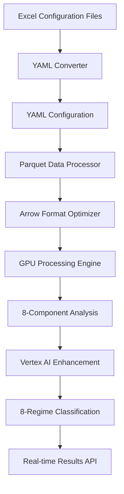
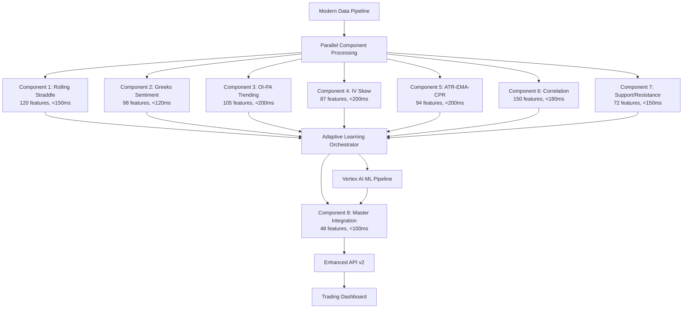

# **6. Technical Architecture**

## **6.1 Modern Data Pipeline Architecture**

### **Excel → YAML → Parquet → Arrow → GPU Flow**


### **Component Processing Architecture**


## **6.2 Implementation Architecture**

### **Directory Structure Enhancement**
```
/Users/maruth/projects/market_regime/vertex_market_regime/
├── configs/
│   ├── excel/                          # ✅ EXISTS - Excel bridge files
│   │   ├── excel_parser.py            # 🔴 NEEDS FULL IMPLEMENTATION
│   │   └── *.xlsx                     # ✅ EXISTS - Configuration files
│   └── yaml/                          # 🔴 NEEDS IMPLEMENTATION - YAML output
│
├── src/
│   ├── data/                          # 🔴 CRITICAL - Modern pipeline needed
│   │   ├── parquet_processor.py      # 🔴 NOT IMPLEMENTED
│   │   ├── arrow_optimizer.py        # 🔴 NOT IMPLEMENTED
│   │   └── pipeline_orchestrator.py  # 🔴 NOT IMPLEMENTED
│   │
│   ├── components/                    # 🔴 CRITICAL - Full implementation needed
│   │   ├── component_01_triple_straddle/  # 🔴 STUB ONLY
│   │   ├── component_02_greeks_sentiment/ # 🔴 CRITICAL gamma fix needed
│   │   ├── component_03_oi_pa_trending/   # 🔴 STUB ONLY
│   │   ├── component_04_iv_skew/          # 🔴 STUB ONLY
│   │   ├── component_05_atr_ema_cpr/      # 🔴 STUB ONLY
│   │   ├── component_06_correlation/      # 🔴 STUB ONLY
│   │   ├── component_07_support_resistance/ # 🔴 STUB ONLY
│   │   └── component_08_master_integration/ # 🔴 STUB ONLY
│   │
│   ├── cloud/                         # 🔴 NEEDS VERTEX AI IMPLEMENTATION
│   │   ├── vertex_ai_client.py       # 🔴 NOT IMPLEMENTED
│   │   ├── bigquery_client.py        # 🔴 NOT IMPLEMENTED
│   │   └── model_serving.py          # 🔴 NOT IMPLEMENTED
│   │
│   └── ml/                            # 🔴 NEEDS FULL IMPLEMENTATION
│       ├── adaptive_learning.py      # 🔴 NOT IMPLEMENTED
│       ├── feature_engineering.py    # 🔴 NOT IMPLEMENTED
│       └── model_training.py         # 🔴 NOT IMPLEMENTED
```

---
