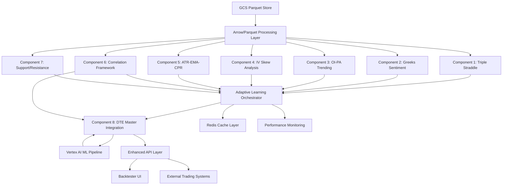

# Component Architecture

## Component Specification Links
- [Component 1: Triple Rolling Straddle](market_regime/mr_tripple_rolling_straddle_component1.md)
- [Component 2: Greeks Sentiment Analysis](market_regime/mr_greeks_sentiment_analysis_component2.md)
- [Component 3: OI-PA Trending Analysis](market_regime/mr_oi_pa_trending_analysis_component3.md)
- [Component 4: IV Skew Analysis](market_regime/mr_iv_skew_analysis_component4.md)
- [Component 5: ATR-EMA-CPR Integration](market_regime/mr_atr_ema_cpr_component5.md)
- [Component 6: Correlation & Non-Correlation Framework](market_regime/mr_correlation_noncorelation_component6.md)
- [Component 7: Support/Resistance Formation Logic](market_regime/mr_support_resistance_component7.md)
- [Component 8: DTE-Adaptive Master Integration](market_regime/mr_dte_adaptive_overlay_component8.md)

### Vertex AI Feature Engineering (All Components) - REQUIRED
- Engineer all 774 features via Vertex AI Pipelines
- Store/serve features via Vertex AI Feature Store with strict training/serving parity
- Data source: GCS Parquet; processing: Apache Arrow + RAPIDS cuDF
- Maintain feature schema versioning and lineage for training and inference

## New Components

### **AdaptiveLearningOrchestrator**
**Responsibility:** Coordinates the 8-component analysis pipeline, manages adaptive weight updates, and ensures performance targets are met
**Integration Points:** Integrates with existing market_regime_strategy.py and HeavyDB data pipeline

**Key Interfaces:**
- `analyze_market_regime(market_data) -> MasterRegimeResult`
- `update_component_weights(performance_feedback) -> WeightUpdateResult` 
- `get_system_health_metrics() -> SystemHealthMetrics`

**Dependencies:**
- **Existing Components:** HeavyDB connection, market data pipeline, existing regime classification
- **New Components:** All 8 adaptive components, Vertex AI integration layer

**Technology Stack:** Python 3.8+, asyncio for concurrent component processing, Redis for caching

### **Component 1: Enhanced 10-Component Triple Rolling Straddle System** 
**Responsibility:** Advanced symmetric straddle analysis (ATM/ITM1/OTM1) with rolling straddle overlay technical analysis and DTE-specific historical learning
**Integration Points:** Revolutionary application of EMA/VWAP/Pivot analysis to ROLLING STRADDLE PRICES (not underlying prices)

**Key Features:**
- **🚨 CRITICAL PARADIGM SHIFT**: EMA/VWAP/Pivots applied to ROLLING STRADDLE PRICES, not underlying
- **10-Component Dynamic Weighting**: ATM/ITM1/OTM1 straddles + individual CE/PE + correlation analysis
- **DTE-Specific Historical Learning**: Separate optimization for each DTE (0-90) with dual learning modes
- **Multi-Timeframe Integration**: 3min/5min/10min/15min analysis with dynamic weight optimization
- **120 Expert Features**: Comprehensive technical analysis applied to options pricing

**Key Interfaces:**
- `analyze_symmetric_straddles(market_data, dte) -> TripleStraddleResult`
- `apply_rolling_straddle_technical_analysis(straddle_prices) -> TechnicalScores`
- `learn_dte_specific_weights(dte, performance_history) -> OptimalWeights`
- `integrate_multi_timeframe_analysis(timeframe_data) -> WeightedScore`

**Performance Targets:**
- Processing Time: <150ms
- Memory Usage: <350MB
- Feature Count: 120 features
- Accuracy Target: >85% regime classification contribution

**Technology Stack:** Rolling straddle price extraction, EMA/VWAP/Pivot analysis on straddle prices, DTE-specific weight learning, multi-timeframe correlation

### **Component 2: Advanced Greeks Sentiment Analysis System**
**Responsibility:** Volume-weighted Greeks analysis with second-order Greeks integration and adaptive sentiment threshold learning
**Integration Points:** Revolutionary Greeks behavioral fingerprint analysis for institutional sentiment detection

**🚨 CRITICAL FIX IMPLEMENTED**: 
- **Gamma Weight CORRECTED**: From 0.0 (WRONG) → 1.5 (CORRECT) - Highest priority for pin risk detection
- **Second-Order Greeks**: Vanna, Charm, Volga integration for institutional-grade analysis
- **Volume-Weighted Analysis**: Symbol-specific volume threshold learning (NIFTY: 15k+, BANKNIFTY: 22k+)
- **DTE-Specific Adjustments**: Granular DTE=0,1,2... specific multipliers for precise regime detection

**Key Features:**
- **Adaptive Greeks Weight Learning**: Historical performance-based weight optimization
- **Symbol-Specific Calibration**: Different behavior patterns for NIFTY vs BANKNIFTY vs Stocks
- **7-Level Sentiment Classification**: Complete sentiment spectrum with adaptive thresholds
- **Institutional Flow Detection**: Volume-weighted Greeks for large player identification
- **98 Expert Features**: Comprehensive first and second-order Greeks analysis

**Key Interfaces:**
- `analyze_volume_weighted_greeks(options_data, straddle_strikes) -> GreeksAnalysis`
- `learn_optimal_greeks_weights(symbol, dte, learning_mode) -> AdaptiveWeights`
- `classify_sentiment_with_adaptive_thresholds(greeks_score) -> SentimentLevel`
- `detect_institutional_flow(volume_data, oi_data) -> FlowAnalysis`

**Performance Targets:**
- Processing Time: <120ms  
- Memory Usage: <250MB
- Feature Count: 98 features
- Sentiment Accuracy: >88%
- Pin Risk Detection: >92% (DTE 0-3)

**Technology Stack:** Advanced Greeks calculations, volume weighting algorithms, adaptive threshold learning, second-order Greeks estimation

### **Component 3: OI-PA Trending Analysis with Institutional Intelligence**
**Responsibility:** Cumulative ATM ±7 strikes analysis with rolling timeframe institutional flow detection and adaptive threshold learning
**Integration Points:** Revolutionary multi-strike cumulative analysis for institutional position detection

**Key Features:**
- **Cumulative ATM ±7 Analysis**: ATM, ±1, ±2, ±3, ±4, ±5, ±6, ±7 strikes cumulative OI/Volume tracking
- **Rolling Timeframe Analysis**: 5min (35%) + 15min (20%) + other timeframes with adaptive weighting
- **Institutional Flow Detection**: CE vs PE flow patterns with learned thresholds
- **Strike Range Expansion**: Dynamic expansion from ±7 to ±15 based on volatility and performance
- **5 Divergence Types**: Bull/Bear/Hidden/Regular/Extreme divergence classification
- **105 Expert Features**: Comprehensive OI and PA pattern recognition

**Key Interfaces:**
- `analyze_cumulative_atm_strikes(oi_data, strike_range=7) -> CumulativeAnalysis`
- `detect_institutional_flow(ce_flow, pe_flow, timeframes) -> FlowSignal`
- `classify_divergence_patterns(oi_trends, price_trends) -> DivergenceTypes`
- `adapt_strike_range(volatility, performance) -> OptimalRange`

**Performance Targets:**
- Processing Time: <200ms
- Memory Usage: <400MB 
- Feature Count: 105 features
- Institutional Detection: >82%
- Flow Prediction Accuracy: >85%

**Technology Stack:** Multi-strike cumulative analysis, rolling timeframe processing, institutional flow algorithms, adaptive range optimization

### **Component 4: IV Skew Analysis with Dual DTE Framework**
**Responsibility:** Advanced IV skew analysis with specific DTE + DTE range learning and 7-level volatility regime classification
**Integration Points:** Dual DTE framework combining granular and categorical volatility analysis

**Key Features:**
- **Dual DTE Framework**: Specific DTE (dte=0,1,2...) AND DTE ranges (weekly/monthly/far) analysis
- **7-Level IV Regime Classification**: Complete volatility regime spectrum with adaptive thresholds
- **Put/Call Skew Analysis**: Separate analysis of put skew vs call skew patterns
- **Term Structure Intelligence**: Cross-DTE volatility structure analysis
- **Percentile Optimization**: Dynamic percentile thresholds based on market conditions
- **87 Expert Features**: Comprehensive volatility pattern recognition

**Key Interfaces:**
- `analyze_dual_dte_iv_skew(iv_surface, specific_dte, dte_range) -> SkewAnalysis`
- `classify_iv_regime_7_levels(skew_data) -> IVRegimeLevel`
- `calculate_put_call_skew_differential(put_iv, call_iv) -> SkewDifferential`
- `optimize_percentile_thresholds(market_condition) -> AdaptiveThresholds`

**Performance Targets:**
- Processing Time: <200ms
- Memory Usage: <300MB
- Feature Count: 87 features  
- IV Pattern Recognition: >85%
- Regime Classification: >88%

**Technology Stack:** IV surface analysis, dual DTE learning, skew differential calculations, percentile optimization algorithms

### **Component 5: ATR-EMA-CPR Integration with Dual Asset Analysis**
**Responsibility:** Revolutionary dual asset technical analysis comparing straddle prices vs underlying with adaptive period optimization
**Integration Points:** Advanced technical indicator integration with options-specific enhancements

**Key Features:**
- **Dual Asset Analysis**: Parallel analysis of straddle prices AND underlying prices
- **ATR Period Optimization**: Dynamic 14/21/50 period weighting based on performance
- **EMA Timeframe Intelligence**: Daily/weekly/monthly EMA importance adaptation
- **CPR Method Selection**: Standard/Fibonacci/Camarilla pivot method optimization
- **Multi-Timeframe Coordination**: Synchronized analysis across multiple timeframes
- **94 Expert Features**: Comprehensive dual asset technical analysis

**Key Interfaces:**
- `analyze_dual_asset_atr_ema(straddle_data, underlying_data) -> DualAnalysis`
- `optimize_atr_periods(volatility_regime) -> OptimalPeriods`
- `calculate_ema_confluence_zones(price_data) -> ConfluenceZones`
- `select_optimal_cpr_method(market_condition) -> CPRMethod`

**Performance Targets:**
- Processing Time: <200ms
- Memory Usage: <500MB
- Feature Count: 94 features
- Trend Detection: >87%
- Volatility Accuracy: >85%

**Technology Stack:** Dual asset processing, ATR optimization, EMA confluence analysis, CPR method selection algorithms

### **Component 6: Ultra-Comprehensive Correlation Framework (30x30 Matrix)**
**Responsibility:** Advanced 30x30 correlation matrix with 774 expert-optimized features and intelligent breakdown detection
**Integration Points:** Cross-component validation system with correlation breakdown alert system

**Key Features:**
- **30x30 Correlation Matrix**: Comprehensive cross-component correlation analysis
- **774 Expert-Optimized Features**: Intelligently reduced from 940 naive implementation
- **Hierarchical Implementation**: 10x10 → 18x18 → 24x24 → 30x30 progressive validation
- **Correlation Breakdown Detection**: Early warning system for regime instability
- **Graph Neural Networks**: Advanced relationship modeling architecture
- **Reinforcement Learning**: PPO-based regime classification optimization
- **150 Expert Features**: Ultra-comprehensive correlation intelligence

**Performance Phases:**
- **Phase 1 (18x18)**: 80-82% accuracy, 464 features
- **Phase 2 (24x24)**: 82-85% accuracy, 656 features
- **Phase 3 (30x30)**: 85-88% accuracy, 774 features
- **Phase 4 (RL)**: 88-92% accuracy, reinforcement learning optimized

**Key Interfaces:**
- `calculate_progressive_correlation_matrix(phase) -> CorrelationMatrix`
- `detect_correlation_breakdowns(threshold) -> BreakdownAlerts`
- `validate_cross_component_agreement() -> ValidationScore`
- `optimize_with_reinforcement_learning() -> RLOptimizedWeights`

**Performance Targets:**
- Processing Time: <180ms
- Memory Usage: <350MB
- Feature Count: 150 features (774 total correlation features)
- Breakdown Detection: >90%
- Cross-Validation Accuracy: >92%

**Technology Stack:** Graph neural networks, hierarchical clustering, transformer attention, reinforcement learning (PPO), Vertex AI integration

### **Component 7: Dynamic Support/Resistance Logic with Multi-Method Confluence**
**Responsibility:** Advanced level detection using 5 proven methods with dual asset analysis and multi-timeframe confluence
**Integration Points:** Dynamic level detection for both straddle prices and underlying with strength scoring

**Key Features:**
- **5 Proven Detection Methods**: Pivot/Volume/Psychological/Fibonacci/Technical confluence
- **Dual Asset Level Analysis**: Support/resistance for both straddle prices AND underlying
- **Multi-Timeframe Confluence**: Daily/weekly/monthly level significance analysis
- **Dynamic Level Strength**: Touch count, hold success, volume confirmation scoring
- **Breakout Probability**: Advanced breakout prediction with confidence scoring
- **72 Expert Features**: Comprehensive level detection and strength analysis

**Key Interfaces:**
- `detect_multi_method_levels(price_data, methods) -> LevelAnalysis`
- `calculate_dual_asset_confluence(straddle_levels, underlying_levels) -> ConfluenceScore`
- `predict_breakout_probability(level, current_price, volume) -> BreakoutPrediction`
- `score_level_strength(touch_count, hold_success, volume) -> StrengthScore`

**Performance Targets:**
- Processing Time: <150ms
- Memory Usage: <600MB
- Feature Count: 72 features
- Level Prediction: >88%
- Breakout Accuracy: >85%

**Technology Stack:** Multi-method level detection, dual asset analysis, confluence scoring, breakout prediction algorithms

### **Component 8: DTE-Adaptive Master Integration with Regime Classification**
**Responsibility:** Master orchestration of all 7 components with DTE-specific optimization and final 8-regime classification
**Integration Points:** Intelligent component integration with market structure change detection and regime mapping

**Key Features:**
- **Master Component Integration**: Intelligent weighting of all 7 components based on performance
- **DTE-Specific Optimization**: Different component importance by expiry proximity
- **8-Regime Classification**: Final classification into LVLD/HVC/VCPE/TBVE/TBVS/SCGS/PSED/CBV
- **Market Structure Detection**: Automatic adaptation when market conditions change
- **18→8 Regime Mapping**: Advanced mapping from detailed to strategic classifications
- **48 Expert Features**: Master integration and regime classification features

**8-Regime Strategic Classification:**
- **LVLD**: Low Volatility Low Delta - Stable market conditions
- **HVC**: High Volatility Contraction - Volatility declining from high levels
- **VCPE**: Volatility Contraction Price Expansion - Low vol with strong directional moves
- **TBVE**: Trend Breaking Volatility Expansion - Trend reversal with increasing volatility
- **TBVS**: Trend Breaking Volatility Suppression - Trend change with controlled volatility
- **SCGS**: Strong Correlation Good Sentiment - High component agreement with positive sentiment
- **PSED**: Poor Sentiment Elevated Divergence - Negative sentiment with component disagreement
- **CBV**: Choppy Breakout Volatility - Sideways market with periodic volatility spikes

**Key Interfaces:**
- `integrate_all_components(component_results) -> MasterIntegration`
- `classify_8_regime_system(integrated_score) -> RegimeClassification`
- `adapt_dte_specific_component_weights(dte) -> ComponentWeights`
- `detect_market_structure_changes(performance_history) -> StructureAlert`

**Performance Targets:**
- Processing Time: <100ms
- Memory Usage: <1000MB
- Feature Count: 48 features
- Regime Classification: >88%
- Market Structure Detection: <24 hours response

**Technology Stack:** Ensemble modeling, regime classification algorithms, market structure detection, DTE-specific optimization

## Component Interaction Diagram

